:scrollbar:
:toc2:

= Migration Toolkit for Virtualization

== Introduction

This lab uses the https://access.redhat.com/documentation/en-us/migration_toolkit_for_virtualization/[Migration Toolkit for Virtualization] (MTV) to import a virtual machine from VMware vSphere to OpenShift. The migration toolkit supports two "modes" of import:

* Cold migration turns off the source virtual machine before starting the migration. This is the default migration type.
* Warm migration copies data while the source virtual machine continues to run. Once the bulk of data has been migrated, the VM is shutdown and the final data is copied to the destination. The new VM can then be started, resulting in a much shorter period of downtime for the VM-hosted application.

The migration toolkit has already been deployed to your cluster using the Operator. Documentation for how to install and configure the Operator can be found https://access.redhat.com/documentation/en-us/migration_toolkit_for_virtualization/[here].

If you would like to learn more about how to configure the Migration Toolkit for Virtualization, please see https://access.redhat.com/documentation/en-us/migration_toolkit_for_virtualization/2.4/html/installing_and_using_the_migration_toolkit_for_virtualization/prerequisites#rhv-prerequisites_mtv[here] for documentation with Red Hat Virtualization or https://access.redhat.com/documentation/en-us/migration_toolkit_for_virtualization/2.4/html/installing_and_using_the_migration_toolkit_for_virtualization/prerequisites#vmware-prerequisites_mtv[here] for VMware vSphere.

== Prerequisites for the VMware Provider

////
The firewalls must enable traffic over the following ports:

. Network ports required for migrating from VMware vSphere
+
[cols="1,1,1,1,1"]
|===
|*Port*|*Protocol*|*Source*|*Destination*|*Purpose*
|443|TCP|OpenShift nodes|VMware vCenter|VMware provider inventory
Disk transfer authentication
|443|TCP|OpenShift nodes|VMware ESXi hosts|Disk transfer authentication
|902|TCP|OpenShift nodes|VMware ESXi hosts|Disk transfer data copy
|===
////

The following prerequisites apply to all migrations:

* ISO/CD-ROM disks must be unmounted.
* Each NIC must contain one IPv4 and/or one IPv6 address.
* The VM operating system must be certified and supported for use as a link:https://access.redhat.com/articles/973163#ocpvirt[guest operating system with OpenShift Virtualization].
* VM names must contain only lowercase letters (a-z), numbers (0-9), or hyphens (-), up to a maximum of 253 characters. The first and last characters must be alphanumeric. The name must not contain uppercase letters, spaces, periods (.), or special characters.
* VM names must not duplicate the name of an existing VM in the OpenShift Virtualization environment.

The *Migration Toolkit for Virtualization* will automatically assign a new name to a VM that does not comply with the rules. If this happens, MTV will automatically generate a new VM name to allow the migration to proceed smoothly.

== Migrating Virtual Machines from VMware

A three-tier application has been deployed on VMware for you to migrate to OpenShift.

The application consists of the following four virtual machines:

* One HAproxy system that redirects traffic to the web servers
* Two Microsoft Windows servers with IIS hosting a PHP application connecting to the database
* One Linux system running a MariaDB database

// WKTBD: Replace with actual link for each student
The application is accessible from the following link: http://webapp.vc.opentlc.com/

You will migrate three of the four virtual machines - you will not need to migrate the HAproxy (load balancer) VM because OpenShift handles network traffic and load balancing natively for VMs connected to the SDN using a `Service`.

=== Review the VMware environment

To help understand the process of mapping resources, such as datastores and port groups, from vSphere into OpenShift's equivalents, network attachment definitions and storage classes, let's begin by reviewing the source environment for the migrations.

// WKTBD: Replace with link to student's individual account
. Navigate to vCenter via link:https://portal.vc.opentlc.com/ui/app/folder;nav=v/urn:vmomi:Folder:group-d1:ee1bef3e-6179-4c1f-9d2a-004c7b0df4e5/vms/vms[https://portal.vc.opentlc.com^]

// WKTBD: replace with student's credentials
. Login with the user `%vcenter_user%@vc.opentlc.com` and the password `%vcenter_password%`

. By default you'll see the VMs and Folders view, where you can see the four VMs representing the application.
+
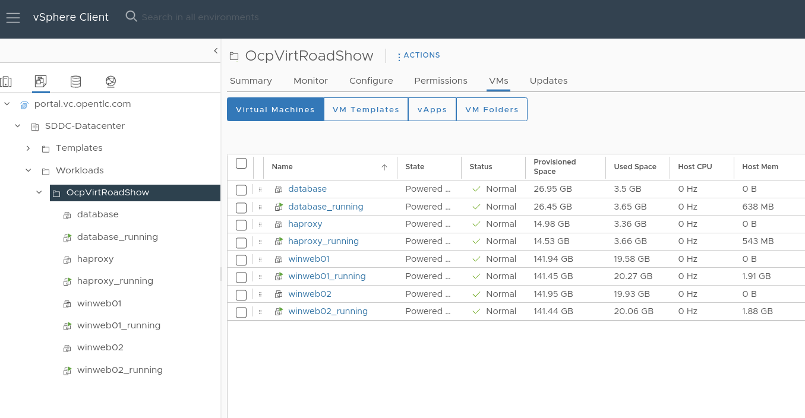
+
[NOTE]
The VMs with the suffix `_running` are the active ones. As for the migration have to be stopped, a clone of the VMs were created for the migration. Those VMs are the ones without that suffix.

. Change to the networks view (or click link:https://portal.vc.opentlc.com/ui/app/dvportgroup;nav=n/urn:vmomi:DistributedVirtualPortgroup:dvportgroup-1916:ee1bef3e-6179-4c1f-9d2a-004c7b0df4e5/ports[ this link^]), then expand the tree to view the port group used by the virtual machines. Note that the name is `segment-migrating-to-ocpvirt`.
+
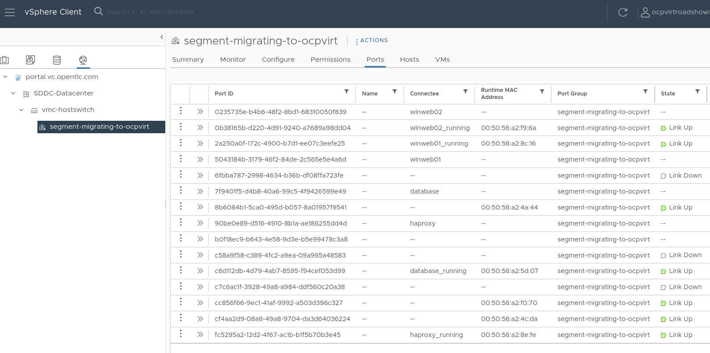

. Finally, review the datastore by browsing to the datastores view (or using link:https://portal.vc.opentlc.com/ui/app/datastore;nav=s/urn:vmomi:Datastore:datastore-48:ee1bef3e-6179-4c1f-9d2a-004c7b0df4e5/vms/vms[this link^]). Expand the tree to see the name of the datastore, `WorkloadDatastore`, and optionally browse to the *VMs* sub-tab to view the capacity used by each virtual machine.
+
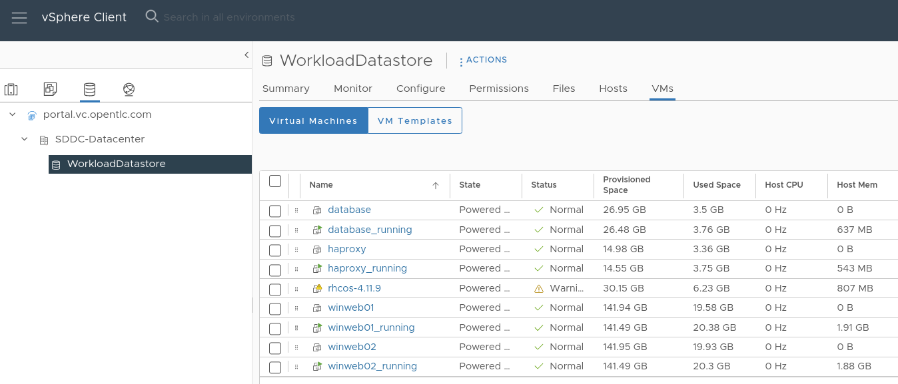

=== Review the VMware provider to the migration toolkit

The *Migration Toolkit for Virtualization* (*MTV*) uses the VMware Virtual Disk Development Kit (*VDDK*) SDK to transfer virtual disks from VMware vSphere. This VDDK has already been set up for you in this environment.

. Navigate in the left menu to *Migration* -> *Providers for virtualization*
. Select project `openshift-mtv`
+
image::images/MTV/91_MTV_Providers.png[]
+
[TIP]
MTV 2.4 and later are project/namespace aware and do not require administrator privileges. You can delegate VM imports to application teams and VM users so that they can self-serve and migrate at their own pace!

. By default, there is a provider called `host` which represents the *OpenShift Virtualization* as a target platform
+
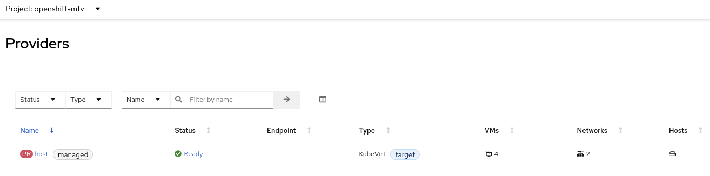

. The lab is already configured with the VMWare provider named `vmware`.

////
However, you will need to register the source vCenter system to the Migration Toolkit for Virtualization as a new provider.

. By default, there is a provider called `host` which represents *OpenShift Virtualization* as a target platform
+

. Press *Create Provider* button in the top right. A dialog it will appear.
+
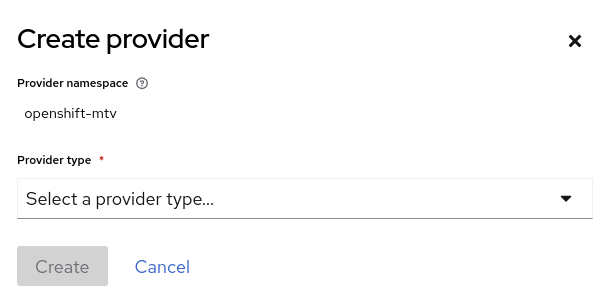
+
// WKTBD: replace with student's credentials
. Select *VMware* on the *Provider type* dropdown and fill the following data:
.. *Name*: `vmware`
.. *vCenter host name or IP address*: `portal.vc.opentlc.com`
.. *vCenter user name*: `%vcenter_user%@vc.opentlc.com`
.. *vCenter password*: `%vcenter_password%`
.. *VDDK init image*: `image-registry.openshift-image-registry.svc:5000/openshift/vddk:latest`
.. *SHA-1 fingerprint*: `70:2D:52:D2:D1:A5:A2:75:58:8F:3D:07:D5:7E:E9:73:81:BC:88:A2`
+
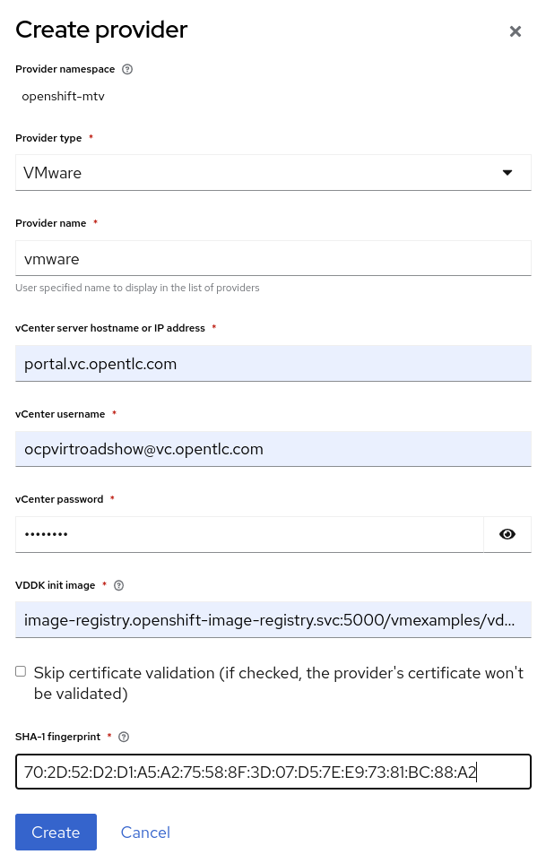
.  Press *Create* and wait till the *Status* column is changed to `Ready`
+
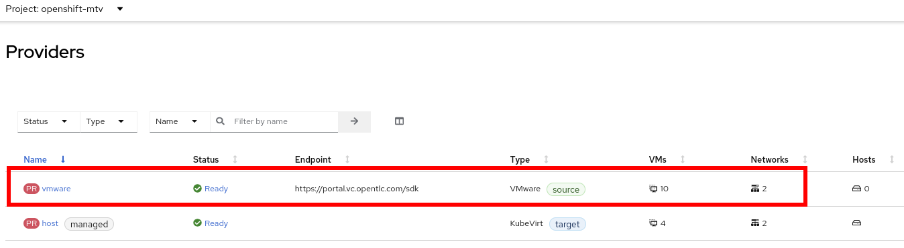

Now MTV knows about your VMware vSphere environment and can connect to it.
////

=== Create storage and network mappings

Storage and networking are managed differently in VMware vSphere and Red Hat OpenShift. Therefore it is necessary to maps from the source datastores and networks in VMware vSphere to the equivalent in OpenShift so that the migration toolkit understands how to connect and place virtual machines after importing.

These only need to be configured once and are then reused in subsequent VM Migration Plans.

. Navigate in the left menu to *Migration* -> *NetworkMaps for virtualization* and press *Create NetworkMap*
+
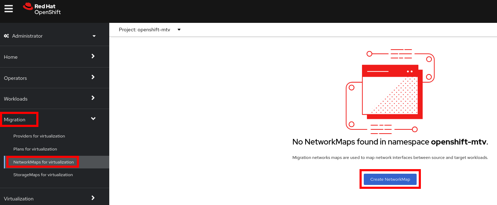

. Fill in the following information in the appeared dialog. Press *Create*.
.. *Name*: `mapping-segment`
.. *Source provider*: `vmware`
.. *Target provider*: `host`
.. *Source networks*: `segment-migrating-to-ocpvirt`
.. *Target network*: `Pod network (default)`
+
image::images/MTV/97_Add_VMWARE_Mapping_Network.png[]

. Ensure the created mapping has the *Status* `Ready`
+
image::images/MTV/98_List_VMWARE_Mapping_Network.png[]

. Navigate in the left menu to *Migration* -> *StorageMaps for virtualization* and press *Create StorageMap*
+
image::images/MTV/99_MTV_StorageMaps.png[]

. Fill in the following information. Press *Create*.
.. *Name*: `mapping-datastore`
.. *Source provider*: `vmware`
.. *Target provider*: `host`
.. *Source storage*: `WorkloadDatastore`
.. *Target storage classs*: `ocs-storagecluster-ceph-rbd (default)`
+
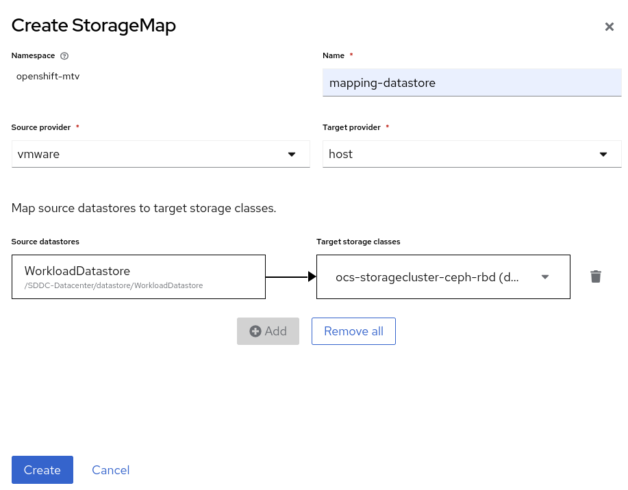

. Ensure the created mapping has the *Status* `Ready`
+
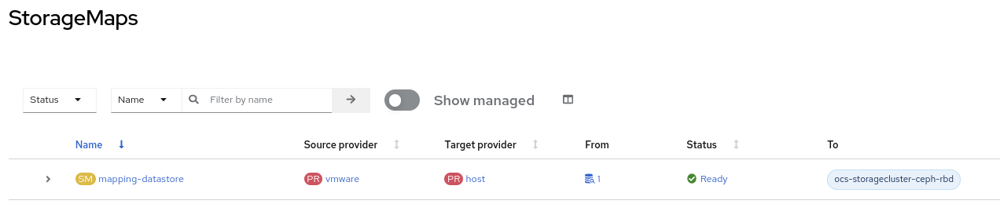

=== Create a Migration Plan

Now that you have the virtualization provider and the two mappings (network & storage) you can create a Migration Plan - this plan selects which VMs to migrate from VMware vSphere to Red Hat OpenShift Virtualization and how to execute the migration (cold/warm, network mapping, storage mapping, pre-/post-hooks, etc.).

. Navigate in the left menu to *Migration* -> *Plans for virtualization* and press *Create plan*
+
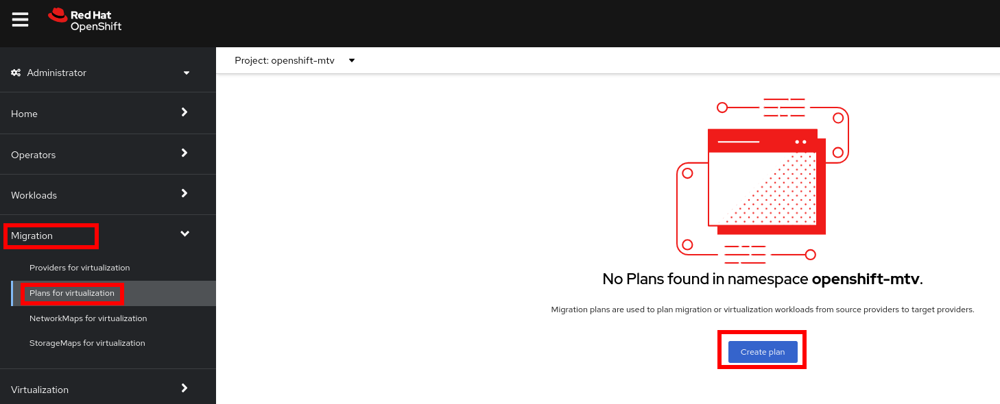

. On the wizard fill the following information on the *General settings* step. Press *Next* when done.
.. *Plan name*: `move-webapp-vmware`
.. *Source provider*: `vmware`
.. *Target provider*: `host`
.. *Target namespace*: `vmexamples`
+
image::images/MTV/52_General_VMWARE_Plan.png[]

. On the next step, select `All datacenters`  and press *Next*
+
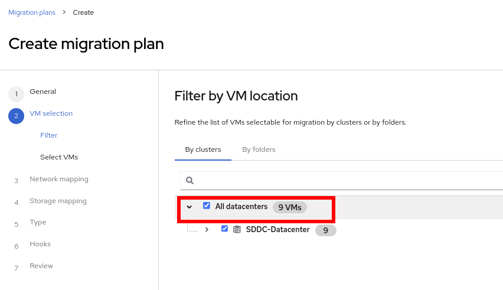

. On the next step select the three VMs: database, winweb01 and winweb02. Press *Next*:
+
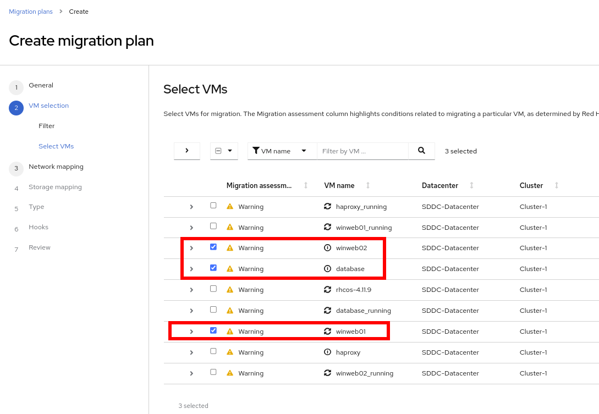

. On the *Network mapping* step select `mapping-segment` and press *Next*
+
image::images/MTV/55_Network_VMWARE_Plan.png[]

. On the *Storage mapping* step select `mapping-datastore` and press *Next*
+
image::images/MTV/56_Storage_VMWARE_Plan.png[]

. Press *Next* on the steps *Type* and *Hooks*

. Review the configuration specified and press *Finish*
+
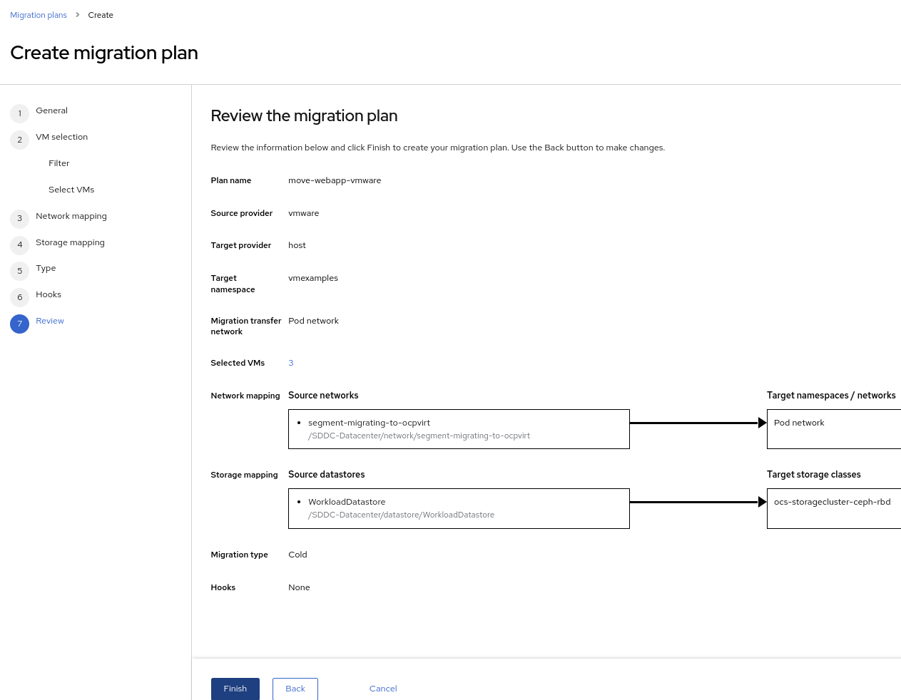

. Ensure the status of the plan is *Ready*
+
image::images/MTV/58_Ready_VMWARE_Plan.png[]

. Press *Start* to begin the migration of the three VMs

. After around 10 minutes the migration is completed
+
image::images/MTV/59_Completed_VMWARE_Plan.png[]
+
[IMPORTANT]
====
Having many participants performing the same task in parallel can cause this task to perform slower than in a real environment. Please be patient.
====

=== Review and configure migrated Virtual Machines

Your VMs have now been migrated and can be started on OpenShift Virtualization. You could connect to the VM consoles and interact with them as you would in VMware vCenter.

If you want to learn more about how to use OpenShift and Kubernetes features with the application hosted in the imported virtual machines, complete the optional module "Exposing apps using a Route".

== Summary

In addition to the Migration Toolkit for Virtualization, there are three other migration toolkits. The combination of these can be used to move many workloads into and within OpenShift clusters depending on your organization's needs. 

* https://developers.redhat.com/products/mtr/overview[Migration Toolkit for Runtimes] - Assist and accelerate Java application modernization and migration.
* https://access.redhat.com/documentation/en-us/migration_toolkit_for_applications/[Migration Toolkit for Applications] - Accelerate large-scale application modernization efforts to containers and Kubernetes.
* https://docs.openshift.com/container-platform/4.12/migration_toolkit_for_containers/about-mtc.html[Migration Toolkit for Containers] - Migrate stateful application workloads between OpenShift clusters.

For more information about these, please reach out to your Red Hat account team.