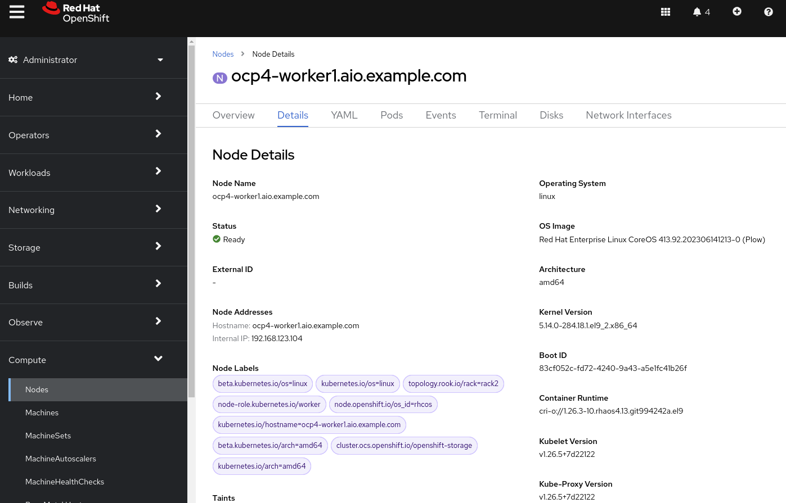
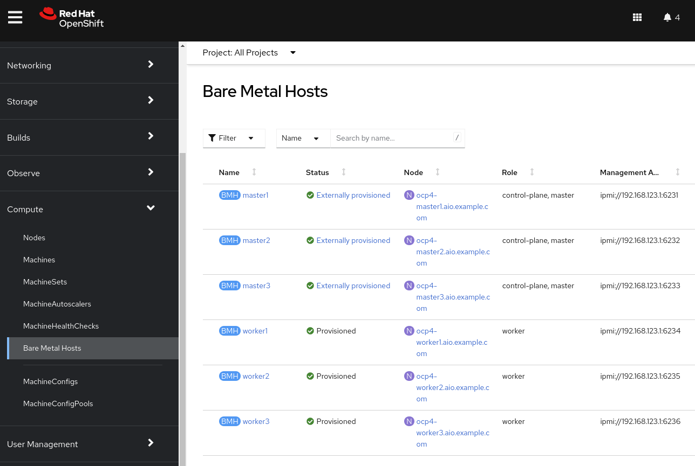
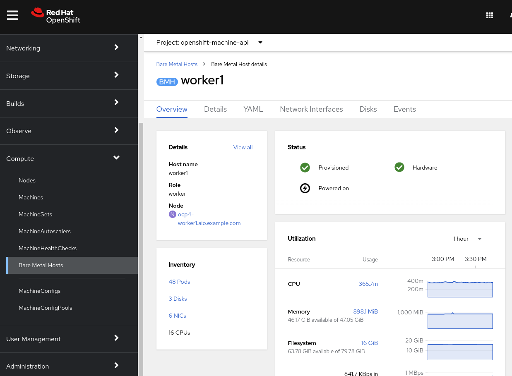
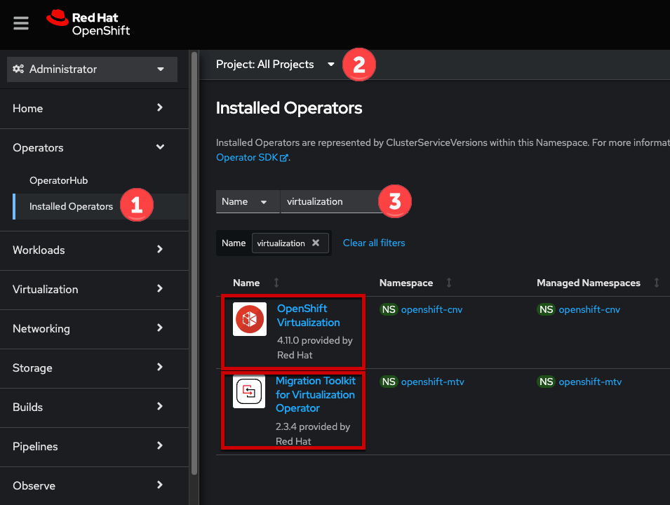
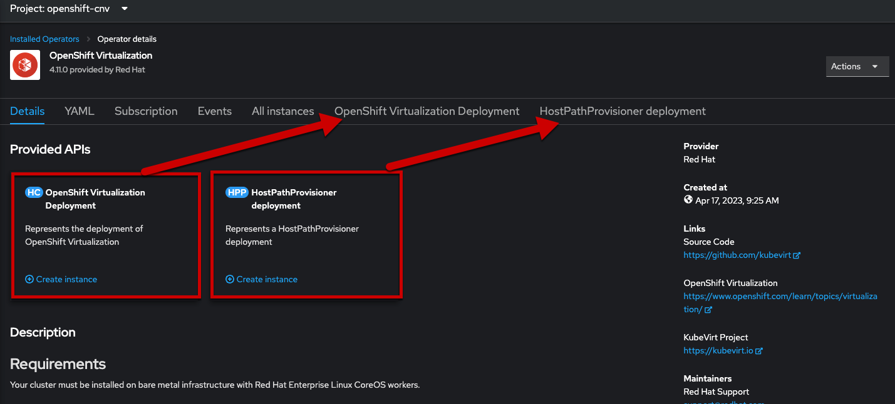
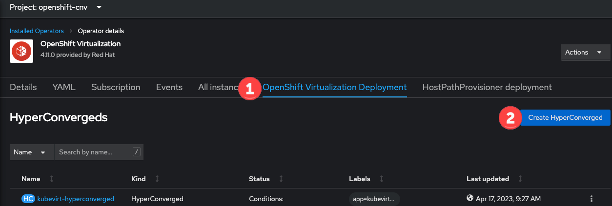

:scrollbar:
:toc2: 

:numbered:

== Introduction

In this lab, you will review the environment used during this workshop, including an overview of OpenShift deployed to bare metal hosts.

.Goals
* Explore the nodes and machines in your *Red Hat OpenShift Container Platform* cluster

In this section, you will explore the Red Hat OpenShift environment provided for you. This environment runs on bare metal hosts in the Equinix cloud. You will understand how the nodes in this cluster are configured and which hardware capabilities they have.

=== Supported Platforms

* Today OpenShift Virtualization is fully supported with self-managed _bare metal servers_ on-premises or at a similar location, such as a co-lo. The lab you're using today is an OpenShift cluster deployed to Equinix.

* Amazon Web Services (AWS) bare metal instances are tech preview. See link:https://access.redhat.com/articles/6409731[Deploy OpenShift Virtualization on AWS Bare Metal Nodes for details]. 

* IBM Cloud Bare Metal Servers are tech preview. See link:https://access.redhat.com/articles/6738731[Deploy OpenShift Virtualization on IBM Cloud Bare Metal Nodes for details].

[NOTE]
Installing OpenShift Virtualization on AWS bare metal instances or on IBM Cloud Bare Metal Servers is a Technology Preview feature only. Technology Preview features are not supported with Red Hat production service level agreements (SLAs) and might not be functionally complete. Red Hat does not recommend using them in production. These features provide early access to upcoming product features, enabling customers to test functionality and provide feedback during the development process.

=== Requirements for OpenShift Virtualization

Before you install OpenShift Virtualization for Red Hat OpenShift Container Platform, make sure that your Red Hat OpenShift Container Platform cluster meets the following requirements.

* CPU requirements
** Supported by Red Hat Enterprise Linux (RHEL) 8
** Support for Intel 64 or AMD64 CPU extensions
** Intel VT or AMD-V hardware virtualization extensions enabled
** NX (no execute) flag enabled

* Storage requirements
** Supported by OpenShift
** A CSI provisioner is strongly encouraged
** `ReadWriteMany` (RWX) PVCs are required for live migration
** A CSI provisioner that supports accelerated volume creation via CSI clones or snapshots makes creating VMs from templates much faster. If one is not available, OpenShift Virtualization will fallback to using a host copy

* OpenShift cluster node requirements
** Red Hat Enterprise Linux CoreOS (RHCOS) installed on worker nodes
** CPU, memory, and network capacity sufficient to host your virtual machine workload

Review https://docs.openshift.com/container-platform/4.12/virt/install/preparing-cluster-for-virt.html[the documentation] for specific requirements and guidance on hardware for OpenShift Virtualization.

[NOTE]
If your cluster uses worker nodes with different CPUs, e.g. Intel and AMD, live migration failures can occur because different CPUs have different capabilities. 

== Review Red Hat OpenShift Cluster

When deployed using the installer provisioned infrastructure (IPI) method, OpenShift uses https://metal3.io/[Metal3] to manage the hardware using the out-of-band management controller. This results in the hardware being represented in three different ways in the cluster:

. https://docs.openshift.com/container-platform/4.13/nodes/index.html[`Node`] - The node is viewed and used by the Kubernetes scheduler. This is the object which represents the usable resources in the cluster.
. https://docs.openshift.com/container-platform/4.13/machine_management/index.html[`Machine`] - An object managed by an infrastructure provider. In this lab, and when using OpenShift Virtualization, this is a physical server that is abstracted by the Metal3 Operator. These are grouped and managed as a set via the `MachineSet` paradigm.
. `BareMetalHost` - This is the lowest level and direct interaction with the management of the physical server.

=== Review Nodes and Machines

Almost every interaction with Red Hat OpenShift can be done in the OpenShift Console. The console is a full-featured web application that allows administrators and users alike to use the platform in a guided manner. Wizards are provided for most tasks which makes it easy to administer the system.

// WKTBD: Replace with actual password from variable
. Navigate to %ocp_url% and login with user `admin` and the password `%ocp_password%`.

. From the navigation menu, select *Compute* -> *Nodes*:
+
image::images/Install/Compute_Nodes.png[]
+
There are three control plane nodes and three worker nodes in the OpenShift 4 Cluster. In addition, the `ipmi` (Intelligent Platform Management Interface) is being used to manage the bare metal nodes.
+
A node is a virtual or bare metal machine in an OpenShift cluster. Worker nodes host virtual machines and other workloads. The control plane nodes run services that are required to control and manage the OpenShift cluster.

. Click on one of the worker nodes to obtain resource information about the node:
+
image::images/Install/Worker0_Information.png[]
+
The *Overview* tab is showing useful information about the utilization of the resources, such as CPU and memory. It also shows all the applications (*Pods*) that are running inside on this node.

[NOTE]
At least one physical node is required for OpenShift Virtualization, "nesting" and emulation are not supported. However, other nodes in the cluster can be virtual machines, for example control plane and infrastructure nodes.

. Navigate to the tab *Details* to obtain more information about the operating system.
+

=== Review Bare Metal hosts

When using `Baseboard Management Console (BMC)` it is possible to manage the nodes using the *Red Hat OpenShift* console. 

. Select *Compute* -> *Bare Metal Hosts*:
+

+
During installation, the *Control Plane* nodes are provisioned by the OpenShift Container Platform installation program (that is why the status is `Externally provisioned`) and when the control plane is ready, the *Worker* nodes are provisioned by cluster itself (hence the status `Provisioned`) and joined to the cluster. While not a part of this lab, it is possible to scale up the cluster by adding new hosts using the *Add Host* button.

. Click on any of the worker nodes to obtain information about the physical (bare metal) node:
+

+
The information shown is similar to the *Nodes* one, with the exception is providing information related to the hardware and the physical status of the bare metal node. Using the *Actions* menu, it is possible to manage aspects of the bare metal host, such as restarting or stopping the system using `BMC`.

. Explore the other tabs in the interface to see more details about the hosts, including the network interfaces and disks. Additionally, the host can be *Deprovisioned*, which will result in it being removed from the cluster, RHCOS removed, and the machine marked as ready to configure.

////
== The OpenShift Virtualization Operator

Due to the time constraints of this session, the OpenShift Virtualization Operator has been preinstalled for you. You can navigate to *Operators* -> *Installed Operators* to get the list of the operators installed to the cluster. Ensure *All Projects* is selected to list Operators across all namespaces and type `virtualization` in the search box to filter the list.

For this workshop we'll be focusing on two Operators: OpenShift Virtualization and the Migration Toolkit for Virtualization.

=== Examine the OpenShift Virtualization Operator

. Click on *OpenShift Virtualization* from the operator installed list.

. Click the *Details* tab to view information about the Operator:
+

+
The Operator provides two custom resource definitions (CRDs) to extend the Kubernetes API: the OpenShift Virtualization deployment and the Host Path Provisioner. Installing the Operator is only the first step to deploying OpenShift Virtualization, an instance of the OpenShift Virtualization Deployment must also be created.

. Click the *OpenShift Virtualization Deployment* tab, then click the *Create HyperConverged* button:
+

+
[NOTE]
OpenShift Virtuailzation, even when deployed to a cluster with OpenShift Data Foundation or another Kubernetes-native storage solution, is not a hyperconverged product, which makes the Kubernetes object name misleading. This naming is the result of the history of the upstream KubeVirt project and it's origins as a part of the "Kubernetes-native Infrastructure" meta-project.

. Explore the configuration options for OpenShift Virtualization
+
This screen represents global configuration options for OpenShift Virtualization and can be used to enable/disable features of OpenShift Virtualization and VM capabilities. For example, scroll down then expand the menu item for *featureGates*. The *withHostPassthroughCPU* option is not enabled by default, however if you wanted to allow virtual machines to inhert the exact CPU features and capabilities of the physical node it's being hosted on then you would need to check this box.
+
image::images/Install/environment_operator_create.png[]
+
*IMPORTANT:* Do not click *Create* at the bottom of the form. This is unnecessary, OpenShift Virtualization has already been deployed to the lab cluster.
////

== Summary

In this lab, you became familiar with your Red Hat OpenShift Container Platform cluster and the hardware that makes up this environment.
