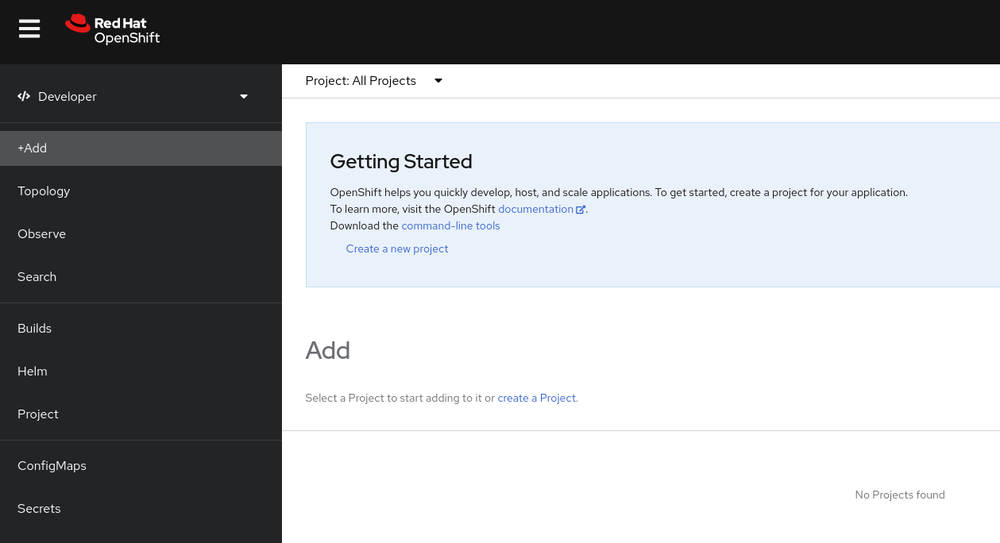
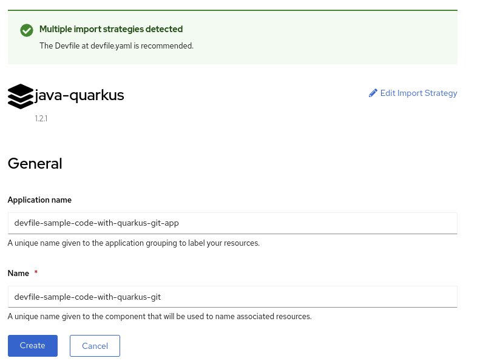
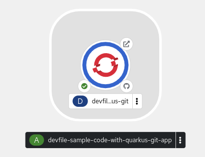
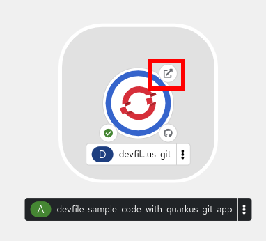
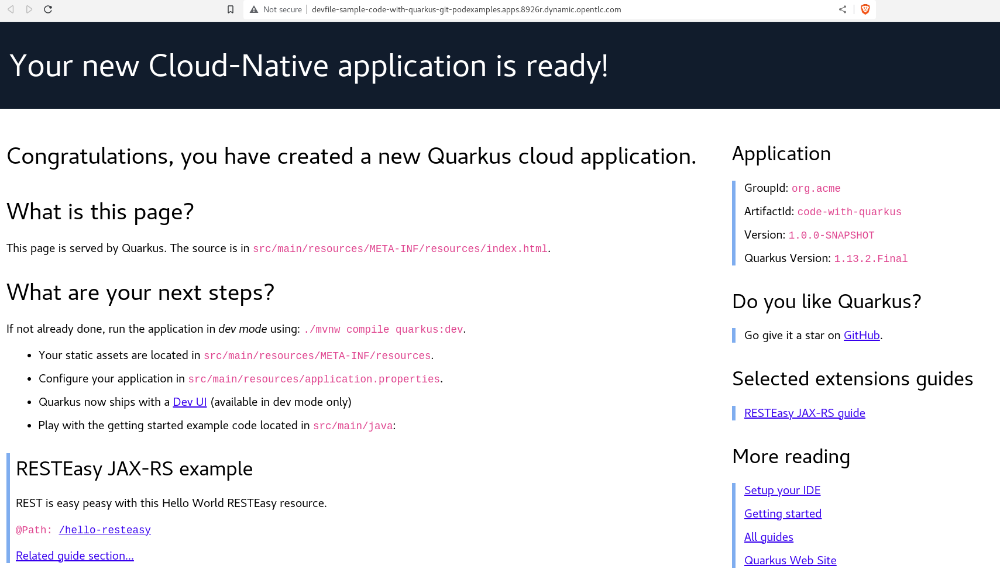

:scrollbar:

:toc2:
:preinstall_operators: %preinstall_operators%

= Environment Review 

:numbered:

== Introduction
In this lab, you will review the environment to be used during the this Workshop and learn the basics of *Red Hat OpenShift Container Platform*

.Goals
* Become familiar with the cluster requirements for *Red Hat OpenShift Virtualization*
* Explore the nodes and machines in your *Red Hat OpenShift Container Platform* cluster
* Learn the basic concepts of *Red Hat OpenShift Container Platform*

== Review Red Hat OpenShift Container Platform Cluster

=== Supported Platforms for OpenShift Virtualization

* On-premise bare metal servers

* Amazon Web Services bare metal instances. See link:https://access.redhat.com/articles/6409731[Deploy OpenShift Virtualization on AWS Bare Metal Nodes for details].

* IBM Cloud Bare Metal Servers. See link:https://access.redhat.com/articles/6738731[Deploy OpenShift Virtualization on IBM Cloud Bare Metal Nodes for details].

[NOTE]
Installing OpenShift Virtualization on AWS bare metal instances or on IBM Cloud Bare Metal Servers is a Technology Preview feature only. Technology Preview features are not supported with Red Hat production service level agreements (SLAs) and might not be functionally complete. Red Hat does not recommend using them in production. These features provide early access to upcoming product features, enabling customers to test functionality and provide feedback during the development process.

=== Verify Requirements

Before you install OpenShift Virtualization for Red Hat OpenShift Container Platform 4, make sure that your Red Hat OpenShift Container Platform cluster meets the following requirements:

* CPU requirements
** Supported by Red Hat Enterprise Linux (RHEL) 9
** Support for Intel 64 or AMD64 CPU extensions
** Intel VT or AMD-V hardware virtualization extensions enabled
** NX (no execute) flag enabled
* Storage requirements
** Supported by OpenShift Container Platform

* Operating system requirements
** Red Hat Enterprise Linux CoreOS (RHCOS) installed on worker nodes
+
[NOTE]
If your cluster uses worker nodes with different CPUs, live migration failures can occur because different CPUs have different capabilities. 

=== Review Nodes and Machines

. Navigate to %ocp_url% and login with user `admin` and password received in the mail.

. From the navigation menu, select *Compute* -> *Nodes*:
+
image::images/Install/Compute_Nodes.png[]
+
There are three control planes and three workers in the OpenShift 4 Cluster. In addition, the `ipmi` (Intelligent Platform Management Interface) is being used to manage the bare-metal nodes.
+
A node is a virtual or bare-metal machine in a Kubernetes cluster. Worker nodes host your application containers, grouped as pods. The control plane nodes run services that are required to control the Kubernetes cluster. In *OpenShift Container Platform*, the control plane nodes contain more than just the Kubernetes services for managing the *OpenShift Container Platform* cluster.

. Click in one of the worker nodes to obtain resource information about the node:
+
image::images/Install/Worker0_Information.png[]
+
The *Overview* tab is showing useful information about the utilization of the resources, such as CPU or memory. As well is indicating the *Pods* what are running inside of this node. 
+
A *Pod* is one or more containers deployed together on a node. A *Pod* runs as long as the containers are running. You cannot change a *Pod* once it is defined and is running. You can navigate to the tab *Pods* to obtain a list and the information of the running ones.

. Navigate to the tab *Details* to obtain more information about the operating system and the Kubernetes used in the node. 
+
image::images/Install/Worker0_Details.png[]

=== Review Bare Metal hosts

In a installation using `Baseboard Management Console (BMC)` it is possible to manage the nodes using the *Red Hat OpenShift Platform* console. 

. Select *Compute* -> *Bare Metal Hosts*:
+
image::images/Install/BMHosts.png[]
+
During the installation the *Control Plane* nodes are provisioned (that is why the status is `Externally privioned`) and when the cluster is ready, the *Worker* nodes are provisioned (status `Provisioned`). It is possible scale up easily the cluster with new hosts through the button *Add Host*.

. Click in any of the worker nodes to obtain information about the physical (bare-metal) node:
+
image::images/Install/Worker0_BMhost.png[]
+
The information shown is simillar to the *Nodes* one, with the exception is providing information related to the hardware and the physical status of the baremetal node. Using the *Actions* menu is possible to operate with the baremetal host, being possible to restart or stop the system using `BMC`.

== Running an application on *Red Hat OpenShift Platform*

*OpenShift Container Platform* enables you to do the following:

* Provide developers and IT organizations with cloud application platforms that can be used for deploying applications on secure and scalable resources.

* Require minimal configuration and management overhead.

* Bring the Kubernetes platform to customer data centers and cloud.

* Meet security, privacy, compliance, and governance requirements.

=== Glossary of basic common terms for OpenShift Container Platform

This glossary defines common Kubernetes and OpenShift Container Platform terms.

* *Kubernetes*: Kubernetes is an open source container orchestration engine for automating deployment, scaling, and management of containerized applications.

* *Containers*: Containers are application instances and components that run in OCI-compliant containers on the worker nodes. A container is the runtime of an Open Container Initiative (OCI)-compliant image. An image is a binary application. A worker node can run many containers. A node capacity is related to memory and CPU capabilities of the underlying resources whether they are cloud, hardware, or virtualized.

* *Pod*: A pod is one or more containers deployed together on one host. It consists of a colocated group of containers with shared resources such as volumes and IP addresses. A pod is also the smallest compute unit defined, deployed, and managed.
+
In OpenShift Container Platform, pods replace individual application containers as the smallest deployable unit.
+
Pods are the orchestrated unit in OpenShift Container Platform. OpenShift Container Platform schedules and runs all containers in a pod on the same node. Complex applications are made up of many pods, each with their own containers. They interact externally and also with another inside the OpenShift Container Platform environment.

* *Service*:  A service defines a logical set of pods and access policies. It provides permanent internal IP addresses and hostnames for other applications to use as pods are created and destroyed.
+
Service layers connect application components together. For example, a front-end web service connects to a database instance by communicating with its service. Services allow for simple internal load balancing across application components. OpenShift Container Platform automatically injects service information into running containers for ease of discovery.

* *Route*: A route is a way to expose a service by giving it an externally reachable hostname, such as www.example.com. Each route consists of a route name, a service selector, and optionally a security configuration. A router can consume a defined route and the endpoints identified by its service to provide a name that lets external clients reach your applications. While it is easy to deploy a complete multi-tier application, traffic from anywhere outside the OpenShift Container Platform environment cannot reach the application without the routing layer.

* *Build*: A build is the process of transforming input parameters into a resulting object. Most often, the process is used to transform input parameters or source code into a runnable image. A BuildConfig object is the definition of the entire build process. OpenShift Container Platform leverages Kubernetes by creating containers from build images and pushing them to the integrated registry.

* *Project*: *OpenShift Container Platform* uses projects to allow groups of users or developers to work together, serving as the unit of isolation and collaboration. It defines the scope of resources, allows project administrators and collaborators to manage resources, and restricts and tracks the user's resources with quotas and limits.
+
A project is a Kubernetes namespace with additional annotations. It is the central vehicle for managing access to resources for regular users. A project lets a community of users organize and manage their content in isolation from other communities. Users must receive access to projects from administrators. But cluster administrators can allow developers to create their own projects, in which case users automatically have access to their own projects.
+
Each project has its own set of objects, policies, constraints, and service accounts.
+
*Projects* are also known as *namespaces*.

=== Running and expose an application

In the next task you will run an Quarkus application and expose it to be accessible from anyone outside of the cluster. Quarkus is a Java framework tailored for deployment on Kubernetes.

. Logout from `admin` user, clicking right-top and pressing *Log out*
+
image::images/Install/Logout.png[]

. Login with the user `developer` and the password received in the mail.
+

+
Notice the user `developer` has a different dashboard and options than the `admin` user.

. The first common task for a regular user is to create a new project. Press in the link `Create a new Project` or select *All Projects* dropdown menu and press *Create Project*. Use the name `podexamples` as project name.
+
ifeval::["{preinstall_operators}" == "False"]
image::images/Install/newproject.png[]
endif::[]
ifeval::["{preinstall_operators}" == "True"]
image::images/Install/newproject2.png[]
endif::[]

. After the project is created, it is possible to add resources to the cluster. The dashboard is shows useful information about the possibilities available:
+
image::images/Install/getting_started.png[]

. For the first application to be executed, the option *Import from Git* will be used. A wizard to indicate the repository will appear.
+
image::images/Install/import_from_git.png[]

. Specify the repository: https://github.com/devfile-samples/devfile-sample-code-with-quarkus.git
. A validation process will start, and after a seconds the wizard will detect the type of the application and it will fill automatically the required parameters.
+

+
* The application is called `devfile-sample-code-with-quarkus-git-app`
* The name for the component grouping resources is  `devfile-sample-code-with-quarkus-git`. An application can contain different components.

. Review and keep the parameters detected, and press the button *Create*.
. The process is the following
.. A new *Deployment* starts.
.. A new *Build* will be started based on the `Dockerfile` in the git repository
.. A new *Image* will be stored on the internal local registry.
.. A new *Pod* will be executed, exposing the application to the port 8080.
.. A new *Service* will be created to access to the *Pod*
.. A new *Route* will be created to access to the application from outside.
. After a few minutes, the dashboard will show the green tick indicating the process finished correctly:
+

. Press in the top-right icon to open the application.
+

. The application will open in a new tab, notice the URL is autogenerated based on the application name and the project name.
+

== Summary

In this lab, you became familiar with requirements that must be met in your Red Hat OpenShift Container Platform cluster to install Red Hat OpenShift Virtualization and review the environment to be used. As well you have created your first project and deploy an application.