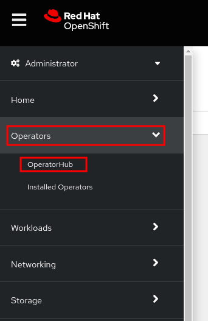
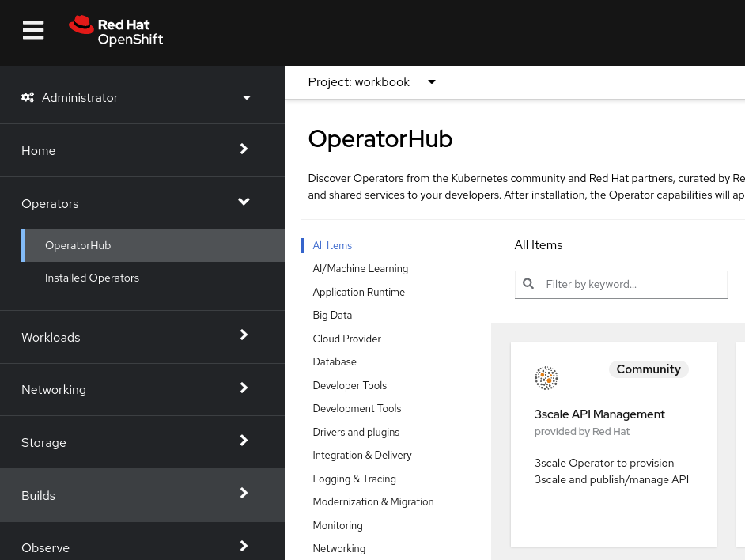
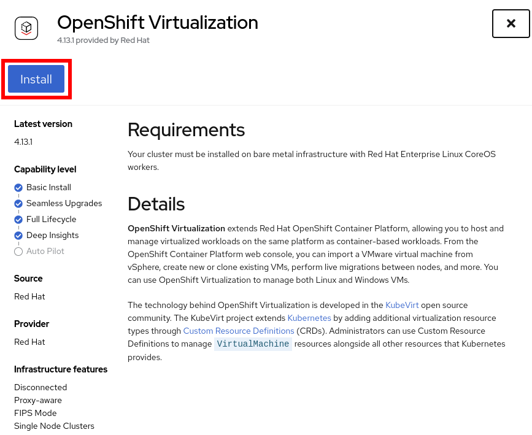
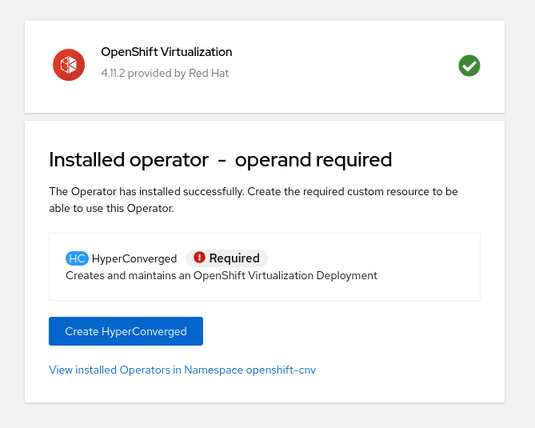
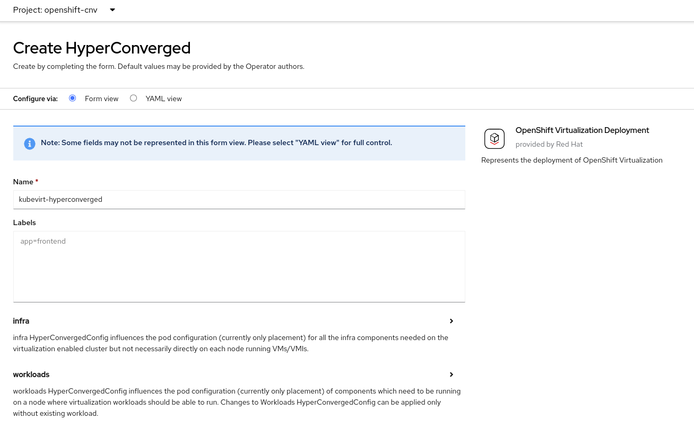
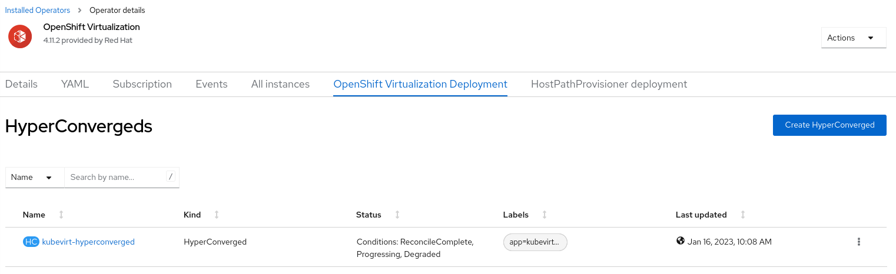
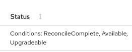
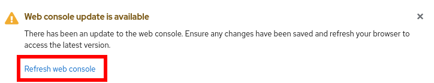
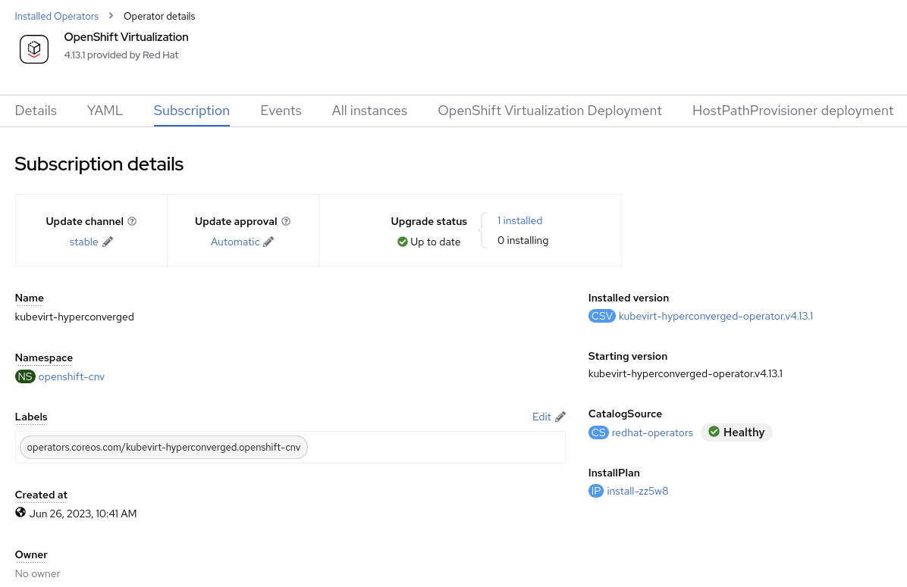
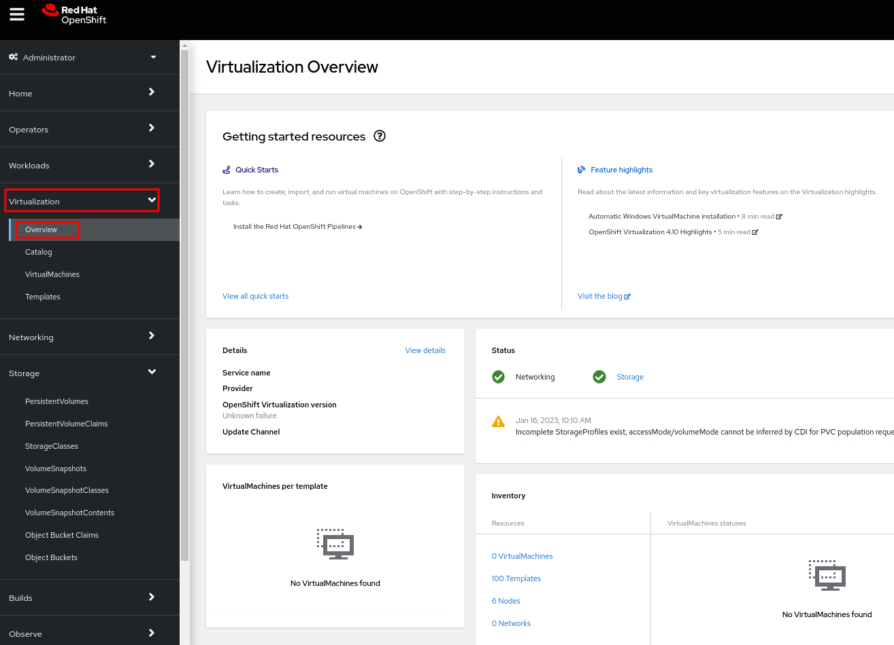

:scrollbar:
:toc2:
:preinstall_operators: %preinstall_operators%

= OpenShift Virtualization Basics

:numbered:

== Operators

*Operators*: An Operator is a Kubernetes-native application. The goal of an Operator is to put operational knowledge into software. Previously this knowledge only resided in the minds of administrators, various combinations or shell scripts or automation software such as Ansible. It was outside your Kubernetes cluster and hard to integrate. With *Operators*, all of this changes.

*Operators* are purpose-built for your applications. They implement and automate common Day 1 activities such as installation and configuration as well as Day 2 activities such as scaling up and down, reconfiguration, updates, backups, fail overs, and restores in a piece of software running inside your Kubernetes cluster by integrating natively with Kubernetes concepts and APIs. This is called a Kubernetes-native application.

With *Operators*, applications must not be treated as a collection of primitives, such as pods, deployments, services, or config maps. Instead, *Operators* should be treated as a single object that exposes the options that make sense for the application.

ifeval::["{preinstall_operators}" == "False"]
=== Install Operator

In this section, you install an Operator from the *OperatorHub* page. You manage *Operators* from the Administrator perspective in the web console.

. Logout from `developer` user and login again to `admin` user.

. From the navigation menu, select *Operators* -> *OperatorHub*:
+

. Explore the *OperatorHub* page and note that all of the currently available Operators are displayed:
+

+
The dashboard lists the Operators that can be installed and various ways to filter the list.

. In the *Filter by keyword...* field, type `OpenShift Virtualization` and select the OpenShift Virtualization tile:
+
image::images/Install/03_OperatorHub_Search.png[]
+
You can also filter by category, installation state, provider, provider type, capability level, or infrastructure features.

. Click *Install*:
+

. On the *Install Operator* wizard page that opens with the default options selected, click  *Install*:
+
image::images/Install/05_OperatorHub_Install_Wizard.png[]
+
The wizard allows you to specify the update channel, the installation mode, the installed Namespace, and the update approval strategy options.
+
As the installation progresses, the status is shown.

. After the operator is installed, is required to create the _Custom Resources_ (Resources required to create _Virtual Machines_). For that, click *Create HyperConverged* to complete the installation:
+

. Review the *Create HyperConverged* wizard options:
+

. You can review the available options. Without changing the default values, scroll down and click *Create*. It will open the *OpenShift Virtualization Deployment* tab in the *OpenShift Virtualization* Operator:
+

+
[NOTE]
These options allows to specify advanced options, such as which nodes are going to be used to run _Virtual Machines_, _live migration_ configurations, default CPU model, among other options.

. Watch the *Status* column until the status changes to `Available`:
+

. Refresh the web console when this popup appears.
+

endif::[]

=== Examine OpenShift Virtualization Operator

ifeval::["{preinstall_operators}" == "True"]

. Logout from `developer` user and login again to `admin` user.

. Navigate to *Operators* -> *Installed Operators* in the left menu
+
image::images/Install/01_Installed_Operators_Menu.png[]

. Click on the OpenShift Virtualization to view information about the Operator
+
endif::[]

ifeval::["{preinstall_operators}" == "False"]

. Click the *Details* tab to view information about the Operator:
endif::[]
+
image::images/Install/11_Details_1.png[]

. Scroll down to the *ClusterServiceVersion details* section and review the details:
+
image::images/Install/11_Details_2.png[]
+
You can see the Namespace where the Operator was installed, the status, the different Operator deployments created during the installation, the Operator ServiceAccounts created, and the OperatorGroup.

. Scroll up and click the *Subscription* tab to view the subscription details:
+

+
[NOTE]
Subscribing an Operator to one or more namespaces makes the Operator available to developers on your cluster.

== Introduction to Creation and Administration of VMs

In this lab, you become familiar with running virtual machines (VMs) on Red Hat^(R)^ OpenShift^(R)^ Container Platform. You create a new virtual machine based on a bootable operating system PVC provided by the Operator.

.Goals
* Create a new virtual machine
* Access the VM console
* Gain experience using the VM console

=== Overview

OpenShift Virtualization includes an overview dashboard to review the status and he inventory information.

. From the left menu, navigate to *Virtualization* -> *Overview*:
+

=== Create a Linux Virtual Machine

. From the left menu, navigate to *Virtualization* -> *VirtualMachines*:
+
image::images/Create_VM_PVC/01_Left_Menu.png[]
+
[NOTE]
====
The *Virtualization* tab is available only when Red Hat OpenShift Virtualization is installed and properly configured.
====

. Examine the *Virtual Machines* dashboard that appears, currently empty because no VMs exists:
+
image::images/Create_VM_PVC/02_OCP_Virt_Dashboard.png[]

. Before you create a VM, create a new project:
.. Click *Project: All Projects* and then click *Create Project*.
.. In the *Name* field, type `vmexamples` to name the project, then click *Create*.
+
image::images/Create_VM_PVC/03_Create_Project.png[]

. Click *Create VirtualMachine*, and expect a dashboard to appear showing the available pre-defined templates:
+
image::images/Create_VM_PVC/04_Create_VM_Templates.png[]
+
The templates with an already configured disks are marked in blue with `Source available`.

. Select the *Fedora VM* tile and a dialog opens.
+
image::images/Create_VM_PVC/05_Create_VM_Quick.png[]

. Change the name to `fedora01` and press *Quick create VirtualMachine*:
+
image::images/Create_VM_PVC/05_Create_VM_Quick_Name.png[]

+
. After a few seconds, expect to see that the VM is `Running`.
+
image::images/Create_VM_PVC/06_Fedora_Running.png[]

. After the VM is created, examine the *Events* tabs:
+
image::images/Create_VM_PVC/09_Fedora_Events.png[]
+
* A _DataVolume_ is created. _DataVolumes_ are a way to automate importing virtual machine disks onto _PVCs_ during the virtual machine's launch flow.
* The _VM_ is started.

. Click the *Details* tab to obtain information related to the VM:
+
image::images/Create_VM_PVC/10_Fedora_Details.png[]

. As with other resources in Kubernetes, a VM is defined using a YAML manifest. Click the *YAML* tab to show the definition:
+
image::images/Create_VM_PVC/11_Fedora_YAML.png[]

==== Access Virtual Machine Console

. Click the *Console* tab to access the VM's console:
+
image::images/Create_VM_PVC/13_Fedora_Console.png[]

. Click *Guest login credentials* to see the password generated for the `fedora` user:
+
image::images/Create_VM_PVC/14_Fedora_Console_Show_Password.png[]

. Log in to the VM using the `fedora` user and the indicated password.
+
[IMPORTANT]
You can click on `Paste` to paste the password after copy it.
+
[IMPORTANT]
If the `Paste` functionality is not working, take in consideration that the console input is using US keymap. One small trick is to write in the login the password to ensure you are writing the prope characters (specially the `-` is correct).

. After you log in, run the `ip a` command to display the interfaces and IP addresses:
+
image::images/Create_VM_PVC/15_Fedora_Network.png[]
+
The IP address assigned is an internal IP address used by the _KVM hypervisor_ and is not the accessible IP.

. Run `lsblk` to display the list of disks and their capacities and free space:
+
image::images/Create_VM_PVC/16_Fedora_Disk.png[]
+
* `/dev/vda` is the disk created during the VM creation and the size specified at creation time.
* `/dev/vdb` is used for `cloud-init` required data (for example, to configure the `fedora` user password).

. Examine the number of CPUs and amount of memory associated with the VM (which match the `flavor` specified during creation), using the `nproc` and `free -m` commands:
+
image::images/Create_VM_PVC/17_Fedora_CPU_Memory.png[]

. Mount the `cloud-init` disk:
+
image::images/Create_VM_PVC/21_Fedora01_Cloud_Init.png[]

. The instance is running the guest agent to collect information for the hypervisor.
+
image::images/Create_VM_PVC/19_Fedora_Agent.png[]
. Click the *Overview* tab to show the information obtained from the guest VM:
+
image::images/Create_VM_PVC/19_Fedora_Agent_Details.png[]
+
* Hostname
* Operating system version and timezone information
* Active users
* Utilization: CPU, Memory, Storage and Network.

. You can navigate to the tab *Metrics* to obtain more information about the usage, being able to specify the time rage.
+
image::images/Create_VM_PVC/19_Fedora_Metrics.png[]

==== Examine Resources Associated with the Virtual Machime

The tab *Configuration* it is the entry point to obtain information about the resources of the Virtual Machine. It includes five subtabs:

* *Scheduling*: It includes advanced configuration indicating where the VM should run and the strategy to follow for eviction.
* *Environment*: It is possible attach _ConfigMaps_, _Secrets_ and _Service Accounts_ as extra disks.
* *Network interfaces*: It shows the current network interfaces configured for the VM and add new ones.
* *Disks*: It lists the disks attached to the system and allows to add new disks to the system. if the guest is configured with the agent, it lists the filesystems and the utilization.
* *Scripts*: It allows to configure _Cloud Init_, setting the commands to be executed in the first boot, the injection of SSH keys and netwrk configuration.

. Examine the network interfaces attached to the VM clicking on the subtab *Network interfaces:
+
image::images/Create_VM_PVC/20_Network_Tab.png[]
+
When a VM is created, an interface in the `PodNetworking` network of type `masquerade` is created by default. This provides access from the VM to outside the OpenShift Cluster and allows the other VMs and Pods from the same namespace to access the VM.

. List the disks associated with the VM:
+
image::images/Create_VM_PVC/21_Disks_Tab.png[]
+
In this environment, the default StorageClass is called `ocs-storagecluster-ceph-rbd`.

=== Creating a Windows Machine

. From the left menu, navigate to *Virtualization* -> *VirtualMachines*:
+
image::images/Create_VM_PVC/01_Left_Menu.png[]
. It will list the VMs running in the current project.
+
image::images/Create_VM_PVC/25_List_VMs.png[]
. Press on the top-right the button *Create* and select *From template*
+
image::images/Create_VM_PVC/26_From_Template.png[]
. Scroll down and select *Microsoft Windows Server 2019 VM* tile.
+
image::images/Create_VM_PVC/27_Windows_2k9_Tile.png[]

. A dialog will appear showing the default configuration related to the template.
+
image::images/Create_VM_PVC/28_Windows_2k9_Dialog.png[]

. Press *Customize VirtualMachine* to specify the parameters to be used for the provisioning.
+
image::images/Create_VM_PVC/29_Windows_2k9_Parameters.png[]

. In this dialog:
.. Specify the name `windows`
.. Enable the checkbox *Boot from CD* and specify the url: http://192.168.123.100:81/Windows2019.iso
. Reduce the disk size to *5 GiB*.
. Ensure the `Mount Windows drivers disk` is enabled. This is required to install Windows systems, which will provide the drivers for VirtIO.

. Press *Next* after filling the parameters.
+
image::images/Create_VM_PVC/30_Windows_2k9_Parameters_Filled.png[]

. Switch to the tab *Scripts* and press *Edit* on the `Sysprep` section
+
image::images/Create_VM_PVC/30_Windows_2k9_Scripts.png[]

. Fill the autounattend.xml form with the following code
+
[source,xml]
----
<?xml version="1.0" encoding="utf-8"?>
<unattend xmlns="urn:schemas-microsoft-com:unattend" xmlns:wcm="http://schemas.microsoft.com/WMIConfig/2002/State" xmlns:xsi="http://www.w3.org/2001/XMLSchema-instance" xsi:schemaLocation="urn:schemas-microsoft-com:unattend">
  <settings pass="windowsPE">
    <component name="Microsoft-Windows-Setup" processorArchitecture="amd64" publicKeyToken="31bf3856ad364e35" language="neutral" versionScope="nonSxS">
      <DiskConfiguration>
        <Disk wcm:action="add">
          <CreatePartitions>
            <CreatePartition wcm:action="add">
              <Order>1</Order>
              <Extend>true</Extend>
              <Type>Primary</Type>
            </CreatePartition>
          </CreatePartitions>
          <ModifyPartitions>
            <ModifyPartition wcm:action="add">
              <Active>true</Active>
              <Format>NTFS</Format>
              <Label>System</Label>
              <Order>1</Order>
              <PartitionID>1</PartitionID>
            </ModifyPartition>
          </ModifyPartitions>
          <DiskID>0</DiskID>
          <WillWipeDisk>true</WillWipeDisk>
        </Disk>
      </DiskConfiguration>
      <ImageInstall>
        <OSImage>
          <InstallFrom>
            <MetaData wcm:action="add">
              <Key>/IMAGE/NAME</Key>
              <Value>Windows Server 2019 SERVERSTANDARD</Value>
            </MetaData>
          </InstallFrom>
          <InstallTo>
            <DiskID>0</DiskID>
            <PartitionID>1</PartitionID>
          </InstallTo>
        </OSImage>
      </ImageInstall>
      <UserData>
        <AcceptEula>true</AcceptEula>
        <FullName>Administrator</FullName>
        <Organization>My Organization</Organization>
      </UserData>
      <EnableFirewall>false</EnableFirewall>
    </component>
    <component name="Microsoft-Windows-International-Core-WinPE" processorArchitecture="amd64" publicKeyToken="31bf3856ad364e35" language="neutral" versionScope="nonSxS">
      <SetupUILanguage>
        <UILanguage>en-US</UILanguage>
      </SetupUILanguage>
      <InputLocale>en-US</InputLocale>
      <SystemLocale>en-US</SystemLocale>
      <UILanguage>en-US</UILanguage>
      <UserLocale>en-US</UserLocale>
    </component>
  </settings>
  <settings pass="offlineServicing">
    <component name="Microsoft-Windows-LUA-Settings" processorArchitecture="amd64" publicKeyToken="31bf3856ad364e35" language="neutral" versionScope="nonSxS">
      <EnableLUA>false</EnableLUA>
    </component>
  </settings>
  <settings pass="specialize">
    <component name="Microsoft-Windows-Shell-Setup" processorArchitecture="amd64" publicKeyToken="31bf3856ad364e35" language="neutral" versionScope="nonSxS">
      <AutoLogon>
        <Password>
          <Value>R3dh4t1!</Value>
          <PlainText>true</PlainText>
        </Password>
        <Enabled>true</Enabled>
        <LogonCount>999</LogonCount>
        <Username>Administrator</Username>
      </AutoLogon>
      <OOBE>
        <HideEULAPage>true</HideEULAPage>
        <HideLocalAccountScreen>true</HideLocalAccountScreen>
        <HideOnlineAccountScreens>true</HideOnlineAccountScreens>
        <HideWirelessSetupInOOBE>true</HideWirelessSetupInOOBE>
        <NetworkLocation>Work</NetworkLocation>
        <ProtectYourPC>3</ProtectYourPC>
        <SkipMachineOOBE>true</SkipMachineOOBE>
      </OOBE>
      <UserAccounts>
        <LocalAccounts>
          <LocalAccount wcm:action="add">
            <Description>Local Administrator Account</Description>
            <DisplayName>Administrator</DisplayName>
            <Group>Administrators</Group>
            <Name>Administrator</Name>
          </LocalAccount>
        </LocalAccounts>
      </UserAccounts>
      <TimeZone>Eastern Standard Time</TimeZone>
    </component>
  </settings>
  <settings pass="oobeSystem">
    <component name="Microsoft-Windows-International-Core" processorArchitecture="amd64" publicKeyToken="31bf3856ad364e35" language="neutral" versionScope="nonSxS">
      <InputLocale>en-US</InputLocale>
      <SystemLocale>en-US</SystemLocale>
      <UILanguage>en-US</UILanguage>
      <UserLocale>en-US</UserLocale>
    </component>
    <component name="Microsoft-Windows-Shell-Setup" processorArchitecture="amd64" publicKeyToken="31bf3856ad364e35" language="neutral" versionScope="nonSxS">
      <AutoLogon>
        <Password>
          <Value>R3dh4t1!</Value>
          <PlainText>true</PlainText>
        </Password>
        <Enabled>true</Enabled>
        <LogonCount>999</LogonCount>
        <Username>Administrator</Username>
      </AutoLogon>
      <OOBE>
        <HideEULAPage>true</HideEULAPage>
        <HideLocalAccountScreen>true</HideLocalAccountScreen>
        <HideOnlineAccountScreens>true</HideOnlineAccountScreens>
        <HideWirelessSetupInOOBE>true</HideWirelessSetupInOOBE>
        <NetworkLocation>Work</NetworkLocation>
        <ProtectYourPC>3</ProtectYourPC>
        <SkipMachineOOBE>true</SkipMachineOOBE>
      </OOBE>
      <UserAccounts>
        <LocalAccounts>
          <LocalAccount wcm:action="add">
            <Description>Local Administrator Account</Description>
            <DisplayName>Administrator</DisplayName>
            <Group>Administrators</Group>
            <Name>Administrator</Name>
          </LocalAccount>
        </LocalAccounts>
      </UserAccounts>
      <TimeZone>Eastern Standard Time</TimeZone>
    </component>
  </settings>
</unattend>
----

. Click *Save* on the dialog
+
image::images/Create_VM_PVC/30_Windows_2k9_Sysprep.png[]

. Press *Create VirtualMachine*
+
image::images/Create_VM_PVC/31_Windows_2k9_Create.png[]

. The Virtual Machine will start the provisioning, downloading the ISO image, and starting the instance.
+
image::images/Create_VM_PVC/32_Windows_2k9_Provisioning.png[]

. After a few minutes, the Virtual VM will be in `Running` status. Switch to the *Console* tab:
+
image::images/Create_VM_PVC/33_Windows_2k9_Console.png[]
+
[NOTE]
It is not needed for this workshop to wait for the installation. You can continue to the next module.
+
[IMPORTANT]
The VM is marked as "Not migratable" because a CD-ROM disk is attached. 

== Summary

In this lab, you have installed the *OpenShift Virtualization* operator and you have created a VM using a pre-configured PVC provided by the Operator. As well you have a new Windows VM using a ISO image.

You may continue to the next lab, _Virtual Machine Customization Lab_, where you will customize the VM during creation and you will manage the VM.