:scrollbar:
:toc2:
:numbered:

= OpenShift Virtualization Basics

This lab will introduce you to the basics of creating and managing VMs in OpenShift Virtualization. You will see how the web console guides you through the whole process and how easy it is to review VM properties and do some basic customization. In the next lab you will customize the VMs a little bit further.

Among other things, this lab will show two methods for provisioning virtual machines, however, there are many different ways, and they are not limited to just what is shown here. All VM provisioning methods work with all supported operating systems.

Creating virtual machines is one of the most frequently accomplished tasks for a virtualization administrator. This section will walk through the process of creating a new virtual machine using a pre-created template. As the virtualization administrator, you have the ability to create your own templates that use guest operating system disks with your organization's customizations, preferred VM sizing options, and additional customization options using cloud-init or sysprep.

In this lab, you become familiar with running virtual machines (VMs) on Red Hat^(R)^ OpenShift^(R)^ Container Platform. You create a new virtual machine based on a bootable operating system disk image provided in the default configuration of OpenShift Virtualization.

.Goals
* Create a new virtual machine
* Access the VM console
* Gain experience using the VM console

== Create a new Project

Like other objects in OpenShift, Projects, which are an abstraction for Kubnernetes namespaces, are the boundaries for permissions and other aspects of using and manaing the resources. Creating a Project is an important first step for any deployment.

. Browse to *Virtualization* -> *VirtualMachines* using the left navigation menu:
+
image::images/Create_VM_PVC/01_Left_Menu.png[Navigation Menu,136,266]
+
[NOTE]
====
The *Virtualization* tab is available only when Red Hat OpenShift Virtualization is installed and properly configured.
====

. Examine the *VirtualMachines* dashboard that appears. There are currently several VMs listed, but are not turned on:
+
image::images/Create_VM_PVC/51_vm_list.png[]

. Before creating a VM we need to create a new project. Virtual machines are deployed to a specific project, or namespace, where, by default, users without permission to the namespace cannot access, manage, or control them. Administrators can access all projects, and therefore view all virtual machines, however regular users must be given access to projects as needed.
+
.. Click *Project: All Projects* and then click *Create Project*.
+
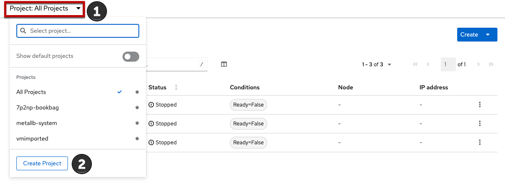
.. In the *Name* field, type `vmexamples` to name the project, then click *Create*.
+
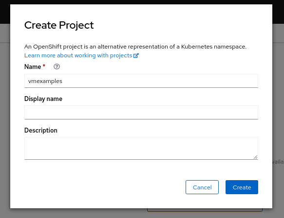

== Create a Linux virtual machine

. From the Virtual Machines inventory, click *Create VirtualMachine*
+
image::images/Create_VM_PVC/53_create_vm_button.png[]

. The wizard will appear showing the available pre-defined VM templates. 
+
Reviewing the list of available templates you’ll notice that some have a blue badge which indicates "Source available". These are templates which are using the automatically downloaded and stored template disks reviewed in the previous page. If you were deploying in your own environment, you have the option of preventing these from being created and/or removing those source disks, followed by creating and uploading custom disks for your organization.
+
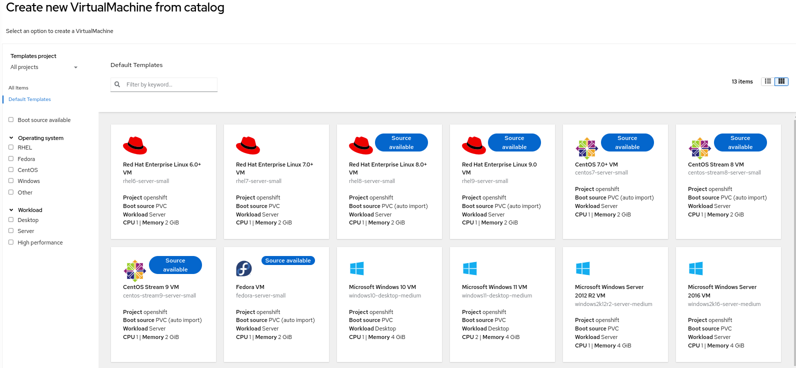

. Select the *Fedora VM* tile, and a dialog opens.
+
image::images/Create_VM_PVC/05_Create_VM_Quick.png[]

. Change the name to `fedora01` and press *Quick create VirtualMachine*:
+
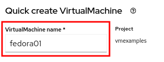

+
. After a few seconds, expect to see the VM is `Running`. During this time, the storage provider has cloned the template disk so that it can be used by the newly created virtual machine. The amount of time this takes will depend on the storage provider.
+
image::images/Create_VM_PVC/06_Fedora_Running.png[]

. After the VM is created, examine the *Events* tab to see some details of the process. If there are any issues with the creation of the VM, they will show up on this tab as well.
+
image::images/Create_VM_PVC/09_Fedora_Events.png[]
+
* A _DataVolume_ is created. _DataVolumes_ are used to manage the creation of a VM disk, abstracting the clone or import process onto OpenShift native storage during the virtual machine's creation flow.
* The _VM_ is started.

. Click the *Details* tab to obtain information related to the VM. Note that for this template, the default is 1 CPU and 2 GiB of memory. As the administrator, you can create templates that customize the default configuration of virtual machines.
+
The IP address of the virtual machine on the software-defined network (SDN) is also displayed here, along with information about the boot order, workload profile, the cluster node hosting the virtual machine, and more.
+
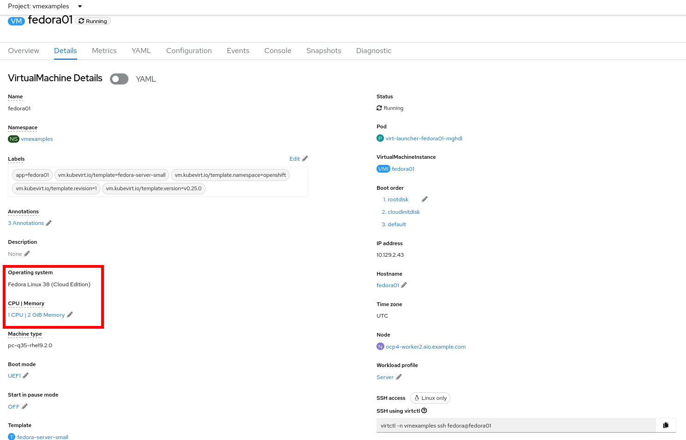

== Access the virtual machine console

. Click the *Console* tab to access the VM's console:
+
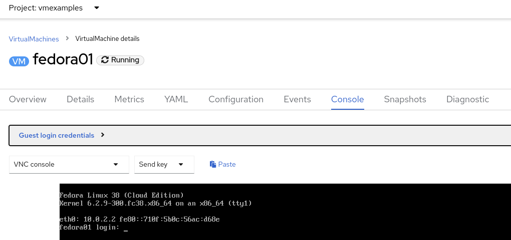

. Click *Guest login credentials* to see the password generated for the `fedora` user. This is only visible when the VM has been customized, which is done by default with this template, using OpenShift Virtualization to set the password using cloud-init.
+
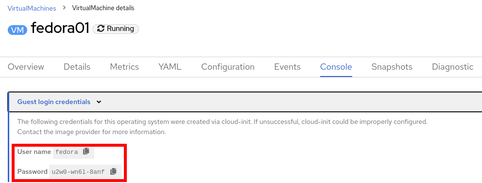

. Log in to the VM using the `fedora` user and the indicated password.
+
[IMPORTANT]
You can click on `Paste` to paste the password after copying it.
+
[IMPORTANT]
If the `Paste` functionality is not working, take into consideration that the console input is using US keymap. One small trick is to write in the login the password to ensure you are writing the proper characters (specifically that the `-` character is correct).

. After you log in, run the `ip a` command to display the interfaces and IP addresses:
+
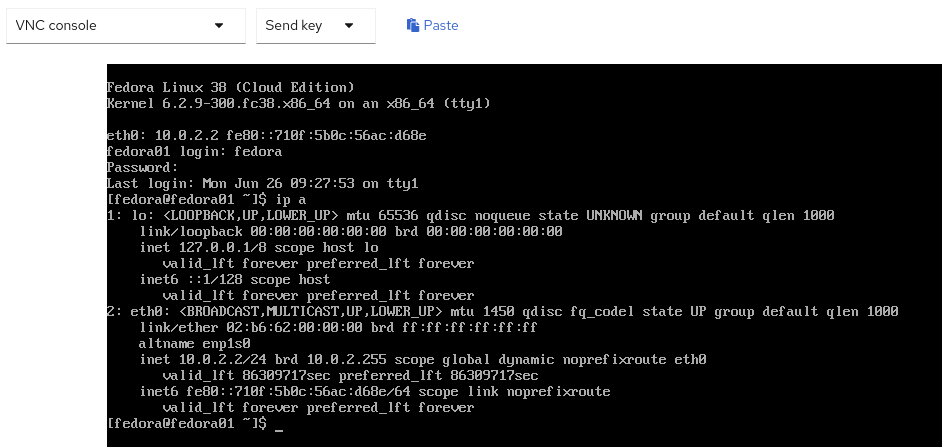
+
Since this network adapter is connected to the SDN, the IP address assigned is an internal IP address used by the _KVM hypervisor_ and is not an externally accessible IP. This IP will not change even if the VM is live migrated to a different node and the external IP where the VM is connected to the SDN changes.

. Run `lsblk` to display the list of disks and their capacities and free space:
+
image::images/Create_VM_PVC/16_Fedora_Disk.png[]
+
* `/dev/vda` is the disk created during the VM creation and is the size specified at creation time.
* `/dev/vdb` is used for `cloud-init` required data (for example, to configure the `fedora` user password). This disk can be removed after the VM has been created.

. Examine the number of CPUs and amount of memory associated with the VM (which match the `flavor` specified during creation), using the `nproc` and `free -m` commands:
+
image::images/Create_VM_PVC/17_Fedora_CPU_Memory.png[]

. To review the guest customization, mount the `cloud-init` disk:
+
image::images/Create_VM_PVC/21_Fedora01_Cloud_Init.png[]

. The instance is running the guest agent to surface information about the guest OS to the hypervisor, along with coordinating tasks such as disk quiescing for snapshots.
+
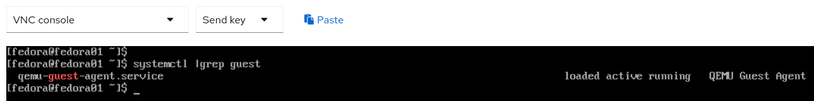

. Click the *Overview* tab to show the information obtained from the guest VM, such as the disk utilization, along with seeing resource utilization information:
+
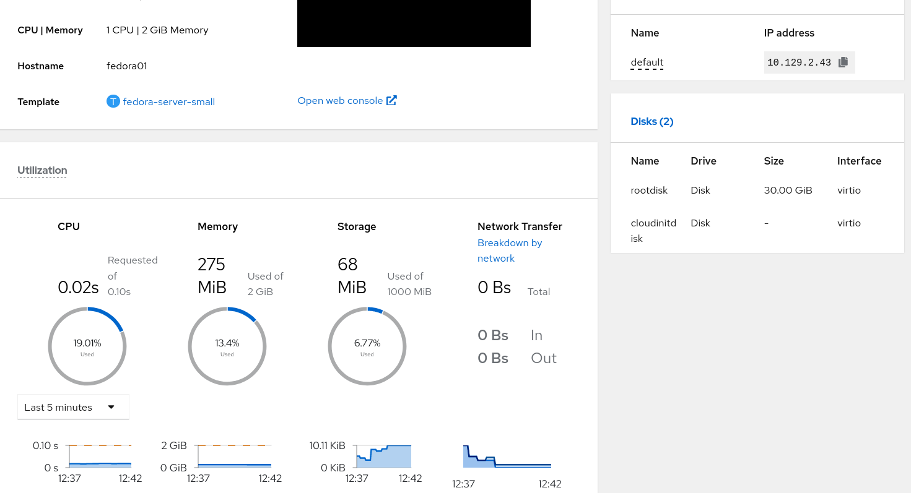
+
* Hostname
* Operating system version and timezone information
* Active users
* Utilization: CPU, Memory, Storage and Network.

. You can navigate to the *Metrics* tab to obtain more information about the usage, including being able to specify the time range.
+
image::images/Create_VM_PVC/19_Fedora_Metrics.png[]

== Live migrate a virtual machine

In this section, we will migrate the VM from one OpenShift node to another without shutting down the VM. Live migration requires `ReadWriteMany` (RWX) storage so that the VM disks can be mounted on both the source and destination nodes at the same time. OpenShift Virtualization, unlike other virtualization solutions, does not use monolithic datastores mounted to each cluster member that hold many VM disks for many different VMs. Instead, each VM disk is stored in its own volume that is only mounted when and where it's needed. 

. Navigate to the *Details* tab to see where the worker node is running:
+
image::images/Pods_Migration/17_VM_Info_Node.png[]

. Using the menu *Actions*, press *Migrate*
+
image::images/Pods_Migration/19_VM_Dialog_Migrate.png[]

. After a few seconds, the VM will change the status to `Migrating`. A few seconds later, it will return to the `Running` status, but on a different node. The VM has been successfully live migrated!
+
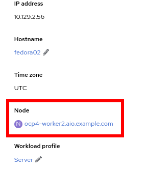

== [Optional] Controlling virtual machine state

As a user with permission to access virtual machines, you can stop, start, restart, pause, and unpause virtual machines from the web console.

. In the left menu, go back to *Virtualization* -> *VirtualMachines*:

. Select the _Virtual Machine_ `fedora02` from the list.

. Press the top-right dropdown, *Actions*, to list the available 
options:
+
image::images/Pods_Migration/30_VM_Actions_List.png[]
+
.. *Stop*: Starts a graceful shutdown of the _Virtual Machine_.
.. *Restart*: This will send a signal to the operating system to reboot the _Virtual Machine_. Guest integrations are needed for this to work properly.
.. *Pause*: The process is frozen without further access to CPU resources and I/O, but the memory used by the VM at the hypervisor level will stay allocated.

. Press *Stop* and wait till the _Virtual Machine_ is in state `Stopped`.
+
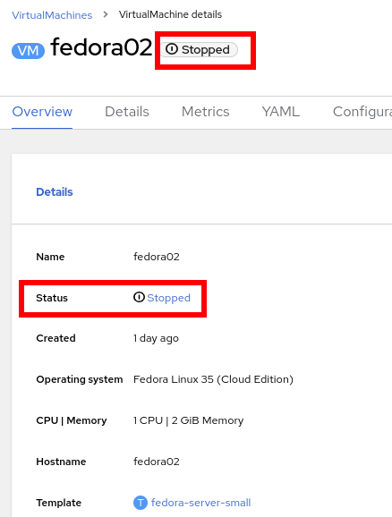
. Clicking on *Actions*, the option *Start* appears, and the options *Restart* and *Pause* are greyed out. 
+
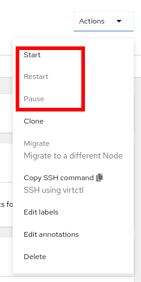

. Press *Start*, and wait for the `Running` status.

. Using the *Actions* menu, press the *Pause* option. The _Virtual Machine_ state will change to `Paused`.
+
image::images/Pods_Migration/33_VM_Actions_Paused.png[]

. Unpause the _Virtual Machine_ using *Actions* and the option *Unpause*.

== [Optional] Virtualization Overview dashboard

The overview dashboard provides a cluster-level view of virtual machines and resources used, along with status information for the health of OpenShift Virtualization and virtual machines. It is a useful starting point for administrators who want a quick and high-level view of what's happening with OpenShift Virtualization.

. From the left navigation menu, browse to *Virtualization* -> *Overview* and select *Project:* -> *All projects*
+
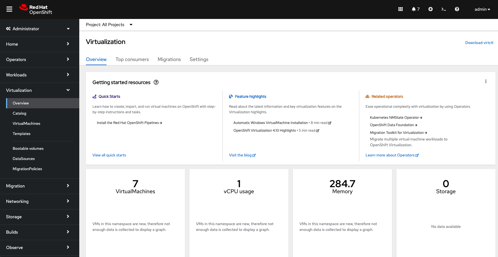
+
This overview page provides the OpenShift Virtualization administrator a global overview of the virtual machines in the cluster. A normal user would only see the VMs in his/her own project.
+
[NOTE]
====
Don't forget to check out the `Getting started resources` panel and click the "View all quick starts" link there to access more information about OpenShift virtualization, including Quick Starts which provide many guided walkthroughs including how to create a VM and upload a custom boot source for your virtual machines. 

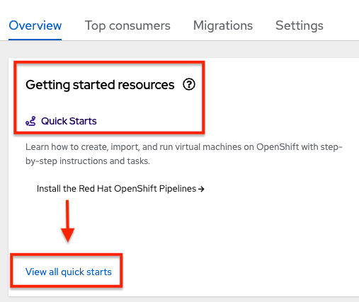
====

. Review the top consumers
+
Use the tabs across the top to view more about the virtualization resources in the cluster. For instance, the "Top consumers" tab shows the VMs which are "top consumers" of various resources, including CPU, memory, and storage. Note that in a newly created cluster, there are no consumers, so there is little to see in the beginning. You might also want to dig deeper into metrics by clicking on "View virtualization dashboard" link. That brings you to the KubeVirt Metrics Dashboard with more data and graphs.
+
[IMPORTANT]
If you don't see any resources here, no VMs have been started in your lab. Revisit this page after this segment to see the overview details.
+
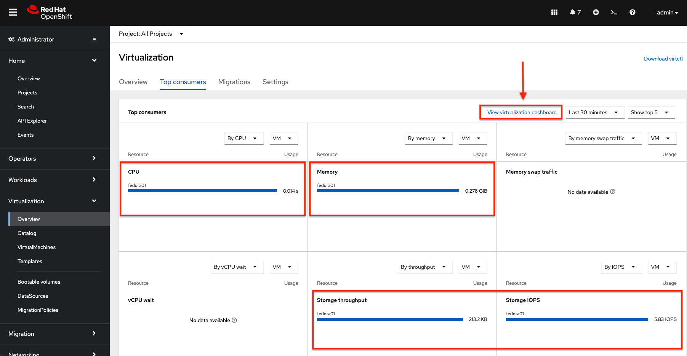
