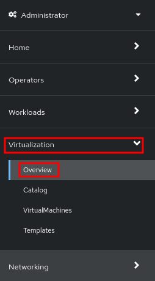
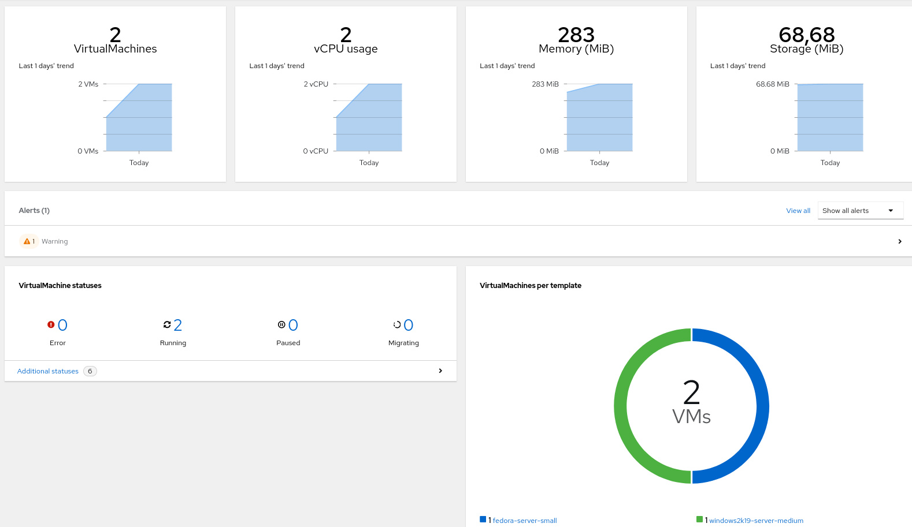

:scrollbar:
:toc2:

== Virtual Machine Customization Lab

:numbered:

== Introduction to Virtual Machine Customization

In this lab, you create and customize a new virtual machine (VM) from a QEMU copy-on-write (QCOW2) image hosted at a URL.

.Goals
* Create VM from a QCOW2 image
* Customize a VM using the Create Virtual Machine wizard

== Create Virtual Machine

You have already created a Fedora VM in the previous lab. This time you will customize the VM with a few different settings - for example you will set a custom password for the `fedora` user.

. Navigate to *Virtualization* -> *Overview*:
+

* Expect to see information about the VMs running:
+

. In the left menu go back to *Virtualization* -> *VirtualMachines*:
+
image::images/Create_VM_URL/00_VMs.png[]

. In the top right dropdown, select *Create* -> *From template*:
+
image::images/Create_VM_URL/00_Create.png[]

. From the pre-defined templates, select the *Fedora VM* tile:
+
image::images/Create_VM_URL/00_Catalog.png[]

. In the dialog that opens, click *Customize VirtualMachine*:
+
image::images/Create_VM_URL/00_Fedora.png[]

. Customize Virtual Machine
.. Specify the name `fedora02`
.. Under *Storage* section 
... *Disk source*: `URL (creates PVC)`
... *URL*: `http://192.168.123.100:81/Fedora35.qcow2`
... *Disk size*: 30 GiB
. Press *Next*
+
image::images/Create_VM_URL/01_Create_VM_Boot_Source.png[]

. Review *Overview* tab with the default configuration from the template
+
image::images/Create_VM_URL/02_Wizard_General.png[]

. Navigate to *Scheduling* tab and review the options available without modifying them
+
image::images/Create_VM_URL/02_Wizard_Scheduling.png[]

. Navigate to *Network interfaces* tab and notice by default a Virtual Machine is connected to the `Pod networking` (which is just OpenShift internal networking)
+
image::images/Create_VM_URL/03_Wizard_Networking.png[]

. Click the three vertical dots icon to edit `default`, and review the default options:
+
image::images/Create_VM_URL/03_Wizard_Networking_Options.png[]

. Press *Cancel* and navigate to *Disks* tab
+
image::images/Create_VM_URL/04_Wizard_Storage.png[]
+
It is possible to add new disks before creating the VM. You can also modify the storage class and the boot source -- for example, to boot from an ISO -- and you can define the disk interface instead of using the default `virtio` interface.

. Click the three vertical dots icon to edit `rootdisk`, and review the default options:
+
image::images/Create_VM_URL/04_Wizard_Storage_settings.png[]

. Press *Cancel* and navigate to *Scripts* tab
+
image::images/Create_VM_URL/05_Wizard_Scripts.png[]

. Press *Edit* in the *Cloud-init* section to specify the password `ocpVirtIsGre@t` for the user `fedora`
+
image::images/Create_VM_URL/05_Wizard_Scripts_Password.png[]

. Press *Create VirtualMachine* ensuring the option *Start this VirtualMachine after creation* is checked
+
image::images/Create_VM_URL/06_Wizard_Review.png[]

. Once the Virtual Machine is running feel free to connect to it using the *Console* tab. Remember that the user is `fedora` and the password is now the one that you specified before (for example `ocpVirtIsGre@t`).

////
== Virtual Machine Templates

Preconfigured Red Hat virtual machine templates are listed in the *Virtualization* -> *Templates* page. These templates are available for different versions of Red Hat Enterprise Linux, Fedora, Microsoft Windows 10, and Microsoft Windows Server. Each Red Hat virtual machine template is preconfigured with the operating system image, default settings for the operating system, flavor (CPU and memory), and workload type (server).

The *Templates* page displays four types of virtual machine templates:

* *Red Hat Supported* templates are fully supported by Red Hat.
* *User Supported* templates are *Red Hat Supported* templates that were cloned and created by users.
* *Red Hat Provided* templates have limited support from Red Hat.
* *User Provided* templates are *Red Hat Provided* templates that were cloned and created by users.

. Navigate to *Virtualization* -> *Templates* and select *All projects*
+
image::images/Create_VM_URL/09_Template_List.png[]

. Press *Create Template* and review auto filled YAML code
+
image::images/Create_VM_URL/10_Template_YAML.png[]
+
[NOTE]
This default template is using a container disk to run a VM. The data will be ephemeral.

. Scroll down and check the parameters for the template
+
image::images/Create_VM_URL/11_Template_YAML_parameters.png[]

. Press *Create* and review the template details
+
image::images/Create_VM_URL/12_Template_details.png[]

. Navigate to *Virtualization* -> *Catalog* and filter by keyword `example`. Select the project `vmexamples`
+
image::images/Create_VM_URL/13_Catalog.png[]

. Press *Customize VirtualMachine* and specify the name `fedora03` and the password `r3dh4t1!`. Press *Next*
+
image::images/Create_VM_URL/14_Catalog_Create_VM.png[]

. Press *Create VirtualMachine* in the next screen.
+
image::images/Create_VM_URL/15_Catalog_Create_VM_Review.png[]

. Navigate to *Console* and login with the password defined before.

. Navigate to tab *Configuration* and subtab *Disks*. Review the VM was created with a container disk as the template defined
+
image::images/Create_VM_URL/16_Ephemeral_Disk.png[]

. Using the *Actions* menu, delete the VM.
////

= Summary

In this lab, you created and customized a new VM from a QCOW2 image hosted at a URL. You also specified a custom password for the user `fedora` and explored other customization options.

You may continue to the next lab, _VM Management Lab_.
