:scrollbar:
:toc2:

= Introduction to virtual machine customization

:numbered:

In this lab, we will customize a virtual machine at creation, including using a customized template disk hosted on an external web server, setting resource properties, and specifying the password configured by `cloud-init`.

.Goals
* Create VM from a QCOW2 image
* Customize a VM using the Create Virtual Machine wizard

[IMPORTANT]
====
This section will customize a virtual machine at creation time, however if you're interested in modifying virtual machine configuration after creation, the same procedure and dialogs apply to existing virtual machines.

However, not all resources can be modified while the VM is powered on, i.e. "hot add/remove". Refer to the documentation for details about each resource type and whether it can be modified while the VM is running. Alternatively, the user interface will notify you if the VM needs to be restarted for a change to take effect.
====

== Customizing a virtual machine at creation

You have already created a Fedora VM in the previous lab. This time you will customize the VM with a few different settings - for example, you will set a custom password for the `fedora` user.

[NOTE]
The `fedora` user is the default user configured by the https://fedoraproject.org/cloud/[Fedora Cloud image] used in this workshop. Templates created and used by your organization may use a different username or might use cloud-init or SysPrep to automatically join the guest operating system to an identity provider.

. In the left menu, go back to *Virtualization* -> *VirtualMachines*:
+
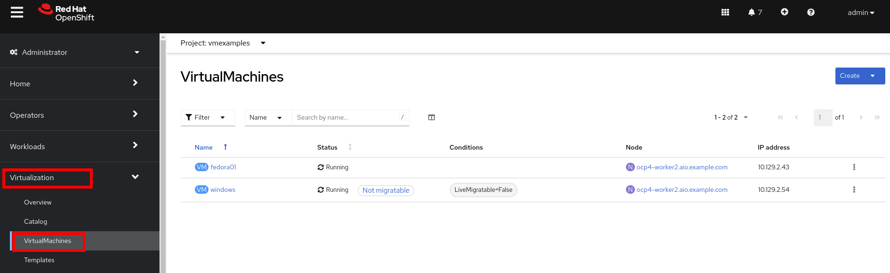
+
[NOTE]
If you do not see the VMs created on the previous page, double-check to make sure you're looking at the `vmexamples` project in the upper left corner of the panel.

. In the top right dropdown, select *Create* -> *From template*:
+
image::images/Create_VM_URL/00_Create.png[]

. From the pre-defined templates, select the *Fedora VM* tile:
+
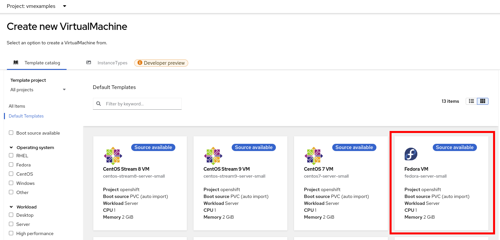

. In the dialog that opens, click *Customize VirtualMachine*. 
+
image::images/Create_VM_URL/00_Fedora.png[]

. Customize Virtual Machine
+
Even though this template has a disk already available, we want to import a different disk from the external web server. This is one option for deploying VMs from a library of disks, though it may be slower than relying on the storage provider to offload a PVC clone for the disk. The QCOW2 disk image used here could also be imported to a PVC and used as a source disk for VM clones. See https://docs.openshift.com/container-platform/4.13/virt/virtual_machines/importing_vms/virt-importing-virtual-machine-images-datavolumes.html[the documentation] for more details on how to do this.
+
.. Specify the name `fedora02`
.. Under *Storage* section 
... *Disk source*: `URL (creates PVC)`
... *URL*: `http://192.168.123.100:81/Fedora35.qcow2`
... *Disk size*: 30 GiB

+
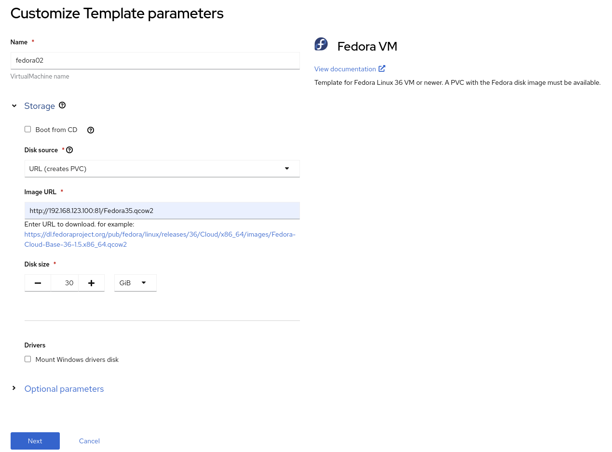
+
Press *Next*

. Review the *Overview* tab with the default configuration from the template
+
image::images/Create_VM_URL/02_Wizard_General.png[]

. Click the link under *CPU | Memory* to adjust the resource allocation for the virtual machine. Change the number of CPUs to 2 and the memory to 4 GiB.

. Navigate to the *Scheduling* tab and review the options available without modifying them
+
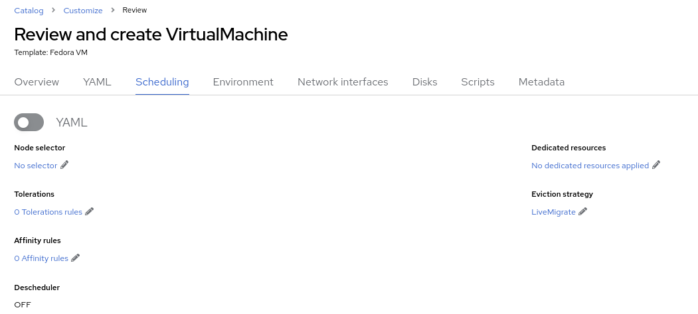
+
* A *node selector* is used to specify one or more cluster nodes that the VM is allowed to run on. These can be selected by name, label, or annotation.
* *Tolerations* are used when a cluster node has a https://docs.openshift.com/container-platform/4.13/nodes/scheduling/nodes-scheduler-taints-tolerations.html[taint] applied. Taints are an indicator that only specific workloads, those with a toleration for the taint, should be allowed to run on the node. They are helpful when you have, for example, some nodes that have GPUs where you only want VMs that use a GPU to run on those nodes.
* An *affinity rule* is used to indicate that a VM should be scheduled with, or not with in the case of an anti-affinity rule, other workloads.
* The *dedicated resources* function is used when you want to, for example, assign a PCIe device to the virtual machine or allocate specific CPU cores to the VM.
* By default, all VMs will use the _Live Migrate_ *eviction strategy*, which means that when a node is cordoned and drained for maintenance purposes, such as applying updates, the VM will be non-disruptively migrated to a different node. Alternatively, VMs can be configured to shutdown and do a cold migration or simply not migrate at all.
* The *descheduler* is a feature of OpenShift that will periodically evaluate the VM and the host it's running on to determine if it should be migrated to another host. This could be for resource optimization reasons or because an affinity rule is being violated.

. Navigate to the *Network interfaces* tab and notice by default, a Virtual Machine is connected to the `Pod networking` (which is just OpenShift internal networking).
+
image::images/Create_VM_URL/03_Wizard_Networking.png[]

. Click the three vertical dots icon to edit `default`, and review the default options:
+
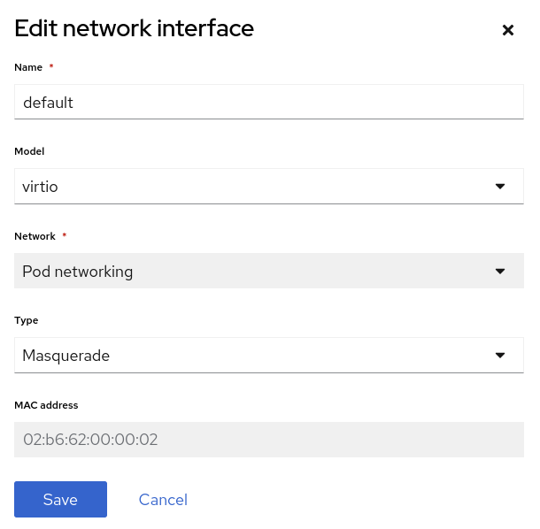
+
* The *model* indicates the type of network adapter that will be used. VirtIO is the paravirtual NIC, whereas e1000 and others are emulated devices.
* *Network* is greyed out because there are no other networks available. In a future module of this workshop, we'll add an additional network for the VMs and use it.
* *Type* indicates how the VM should be connected to the network. For the SDN, or _Pod networking_, this is set to `Masquerade`. For a VLAN network the `Bridge` setting is used.
* For a newly created NIC, you have the option of customizing the *MAC address* assigned to it. It's greyed out here because we're editing an already created NIC.
+
Since there are no other networks avaialble at this time, press *Cancel* to exit the dialog.
+
[NOTE]
If you would like to add/manage networks for virtual machines and see how to connect a virtual machine to a layer 2 (VLAN) network, choose the optional Network Management module from the workshop navigation menu.

. Navigate to the *Disks* tab to see the devices allocated to the VM.
+
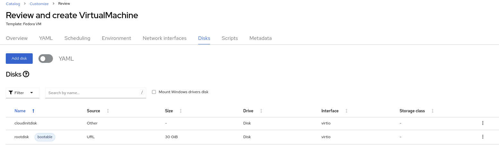
+
It is possible to add new and modify the default disks before creating the VM. You can also modify the storage class and the boot source -- for example, to boot from an ISO -- and you can define the disk interface instead of using the default `virtio` interface.

. Click the three vertical dots icon to edit `rootdisk`, and review the default options:
+
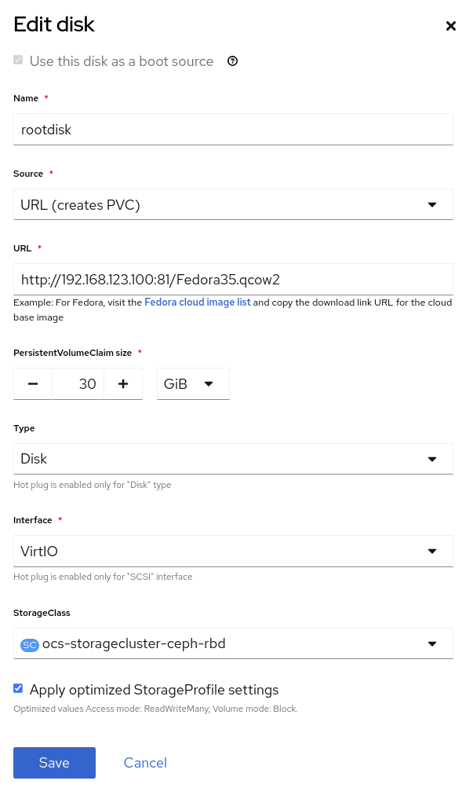
+
* The *PersistentVolumeClaim Size* will be the size of the disk attached to the VM. If the source of the disk is another PVC, it cannot be smaller than the source, otherwise, you want to make sure it is at least large enough to hold the QCOW2 or ISO that is being imported.
* The *type* of the disk can be changed to be, for example, a CD-ROM device.
* Each disk connects to the VM using an *interface*. The `VirtIO` interface is the KVM paravirtualized interface type.
* The *StorageClass* indicates the type of storage that is backing the VM disk. This will be different for each storage provider, and some storage providers can have multiple storage classes representing different features, performance, and other capabilities.
* *Optimized StorageProfile Settings* indicate to use the clone strategy and volume mode indicated for the storage type. These are provided by Red Hat for many CSI providers, but can also be customized for your use cases.
+
[NOTE]
If you would like to learn more about virtual machine storage, choose the optional Storage Management module from the workshop navigation menu.

. Navigate to the *Scripts* tab. This tab is used to apply guest OS customization, such as cloud-init or Sysprep, at deployment time.
+
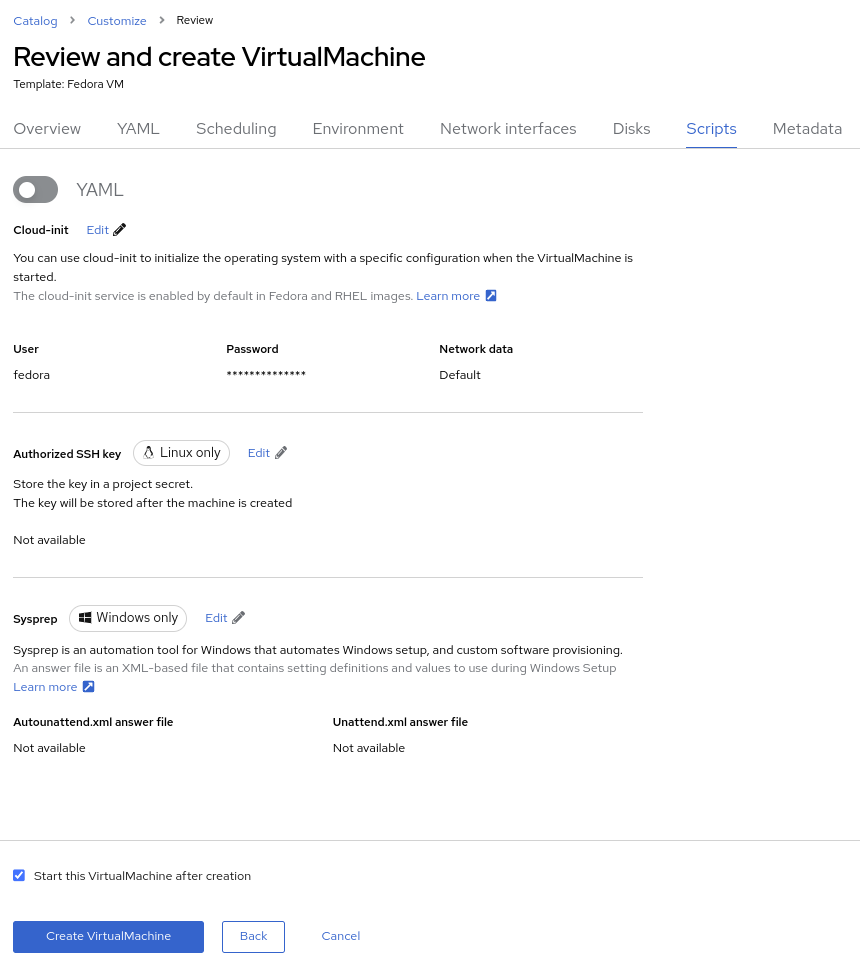
+
* *cloud-init* can be configured using the GUI dialog or using a standard YAML script for more advanced configuration. In the next step, we'll customize this information
* An *Authorized SSH key* may, optionally, be provided to allow one or more users to connect to the VM without a password. This SSH key can be stored as a `Secret` and automatically applied to new Linux VMs if desired.
* *Sysprep* is the Microsoft Windows tool for automatically configuring new OS deployments, including setting configurations like hostname, default `Administrator` passwords, and joining an Active Directory domain.
+
[NOTE]
If you want to learn more about how to customize and deploy Windows virtual machines, choose the optional Windows Virtual Machines module from the workshop navigation menu.

. Since this is a Fedora VM, press *Edit* in the *Cloud-init* section to specify the password `ocpVirtIsGre@t` for the user `fedora`. Click *Apply* when done.
+
Notice that we can also specify network configuration information here by checking the appropriate box. This is useful when, for example, you're connecting the VM directly to a VLAN network and want to configure a static IP address.
+
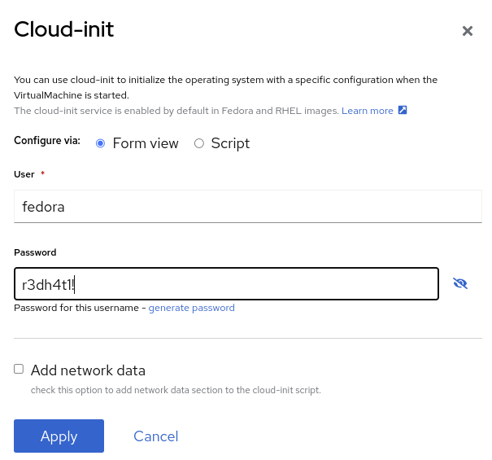

. Press *Create VirtualMachine* ensuring the option *Start this VirtualMachine after creation* is checked.
+
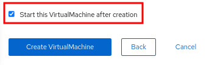
+
[NOTE]
If you forget to check the _Start this VirtualMachine after creation_ box, after the VM has been created and is in the `Stopped` status, click the *Actions* drop-down in the upper right of the panel and select *Start*.

. Once the Virtual Machine is running feel free to connect to it using the *Console* tab. Remember that the user is `fedora` and the password is now the one that you specified before (for example `ocpVirtIsGre@t`).

////
== Virtual Machine Templates

Preconfigured Red Hat virtual machine templates are listed in the *Virtualization* -> *Templates* page. These templates are available for different versions of Red Hat Enterprise Linux, Fedora, Microsoft Windows 10, and Microsoft Windows Server. Each Red Hat virtual machine template is preconfigured with the operating system image, default settings for the operating system, flavor (CPU and memory), and workload type (server).

The *Templates* page displays four types of virtual machine templates:

* *Red Hat Supported* templates are fully supported by Red Hat.
* *User Supported* templates are *Red Hat Supported* templates that were cloned and created by users.
* *Red Hat Provided* templates have limited support from Red Hat.
* *User Provided* templates are *Red Hat Provided* templates that were cloned and created by users.

. Navigate to *Virtualization* -> *Templates* and select *All projects*
+
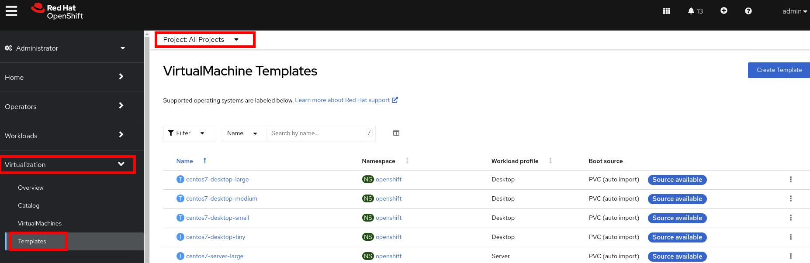

. Press *Create Template* and review auto filled YAML code
+
image::images/Create_VM_URL/10_Template_YAML.png[]
+
[NOTE]
This default template is using a container disk to run a VM. The data will be ephemeral.

. Scroll down and check the parameters for the template
+
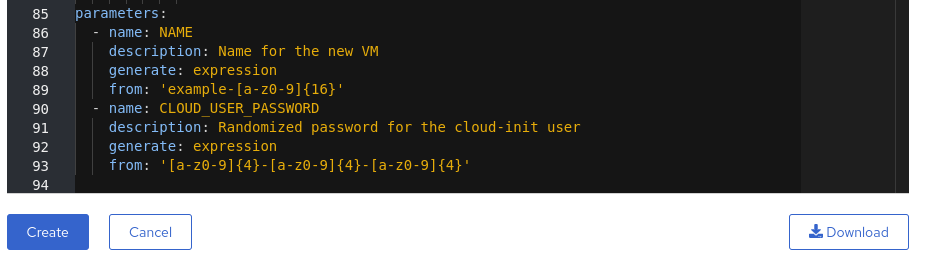

. Press *Create* and review the template details
+
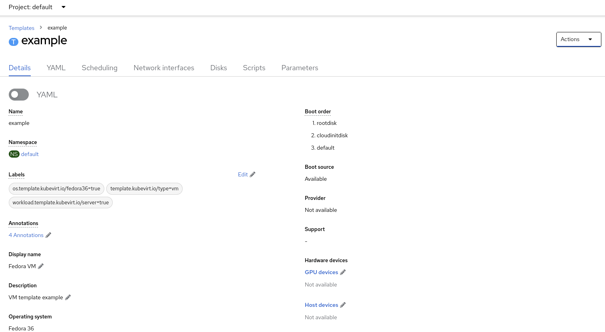

. Navigate to *Virtualization* -> *Catalog* and filter by keyword `example`. Select the project `vmexamples`
+
image::images/Create_VM_URL/13_Catalog.png[]

. Press *Customize VirtualMachine* and specify the name `fedora03` and the password `r3dh4t1!`. Press *Next*
+
image::images/Create_VM_URL/14_Catalog_Create_VM.png[]

. Press *Create VirtualMachine* in the next screen.
+
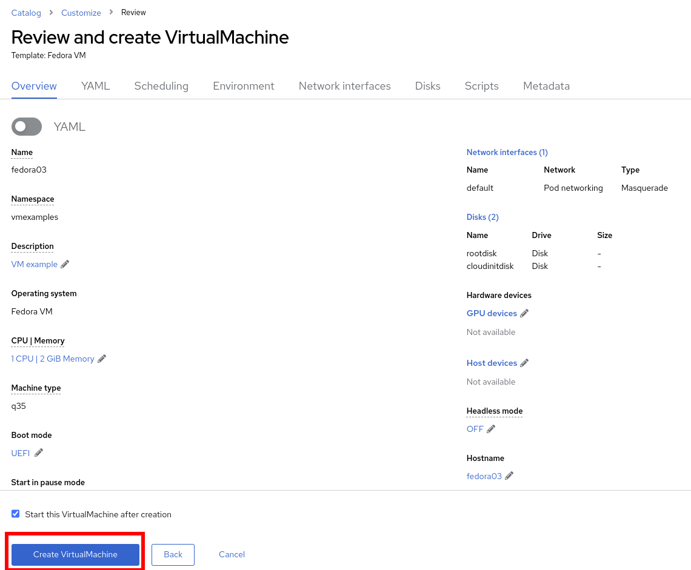

. Navigate to *Console* and login with the password defined before.

. Navigate to tab *Configuration* and subtab *Disks*. Review the VM was created with a container disk as the template defined
+
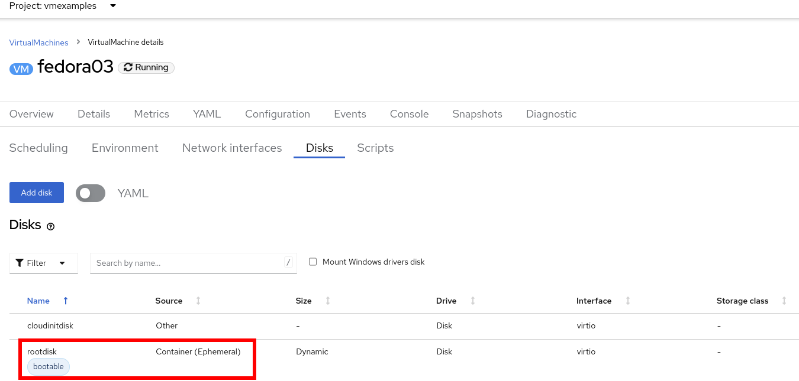

. Using the *Actions* menu, delete the VM.
////
