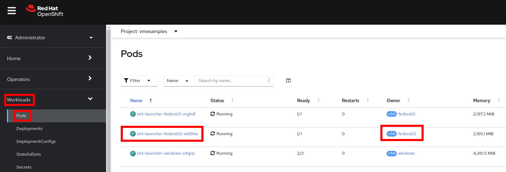
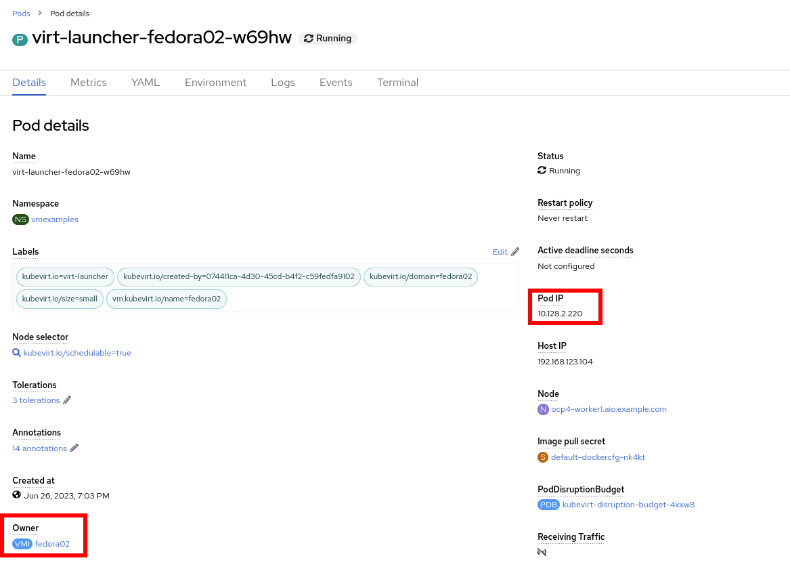
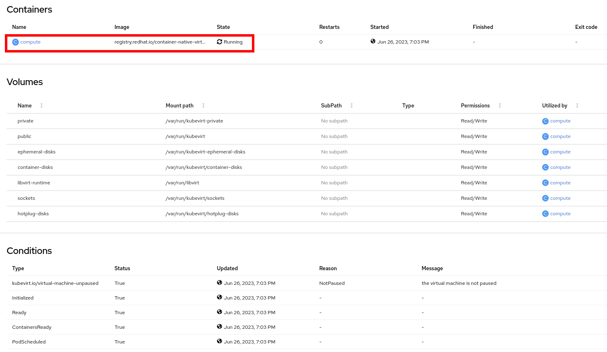
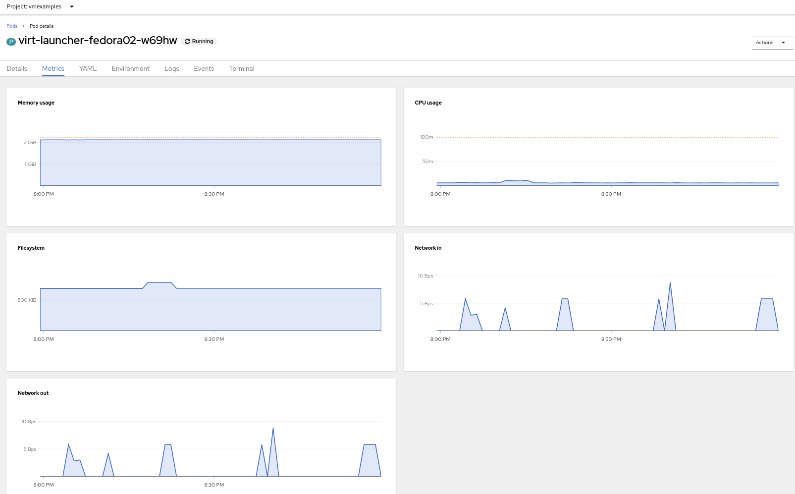
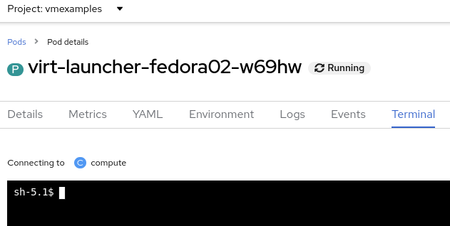

:scrollbar:
:toc2:

= Pod and Virtual Machine Management Lab

:numbered:

== Introduction to Pod and Virtual Machine Management

In this lab, you explore the Pod associated with the virtual machine (VM) and you run commands inside the container to explore the associated storage and network.
You will learn how to manage the Virtual Machine, using the GUI and the CLI.

.Goals
* Examine the Pods associated with a VM
* Gain experience with VM management using GUI and CLI

=== Explore Pods Related to Virtual Machine

. In the Red Hat^(R)^ OpenShift^(R)^ Container Platform web console, navigate to *Workloads* -> *Pods* and expect to see a list of the Pods associated with this VM:
+

. Select the Pod prefixed with `virt-launcher-fedora02-`.

. Review the information shown on the *Details* tab--especially the information included for *Owner* and *Pod IP*:
+

+
The IP address corresponds to the accessible VM's IP address.
+
Notice the the owner of the *POd* i a `VirtualMachineInstance (VMI)` resource. A `VirtualMachineInstance` resource indicates a running _Virtual Machine_.

. Scroll down further to see information about the containers in the Pod:
+

+
The VM is running inside the `compute` container.

. Navigate to *Metrics* tab to see what metrics are available:
+

+
This metrics are related to the *Pod*. They are a good overview about the resource used by the _Virtual Machine_.

. Navigate to the *YAML* tab and review the Pod definition:
+
image::images/Pods_Migration/12_Pod_YAML.png[]
+
As described before, resources on Kubernetes are defined in _YAML_ format.

. Navigate to the *Terminal* tab and see that you can connect to the container:
+

. Using the `virsh` command, list the VMs:
+
[source,sh]
----
sh-4.4# virsh list
----
+
.Sample Output
[source,texinfo]
----
 Id   Name                  State
-------------------------------------
 1    vmexamples_fedora02   running
----
+
[IMPORTANT]
A _Pod_ is running only one _Virtual Machine_.

. List the disks associated with the VM:
+
[source,sh]
----
sh-4.4# virsh domblklist 1
----
+
.Sample Output
[source,texinfo]
----
 Target   Source
---------------------------------------------------------------------------------------------
 Target   Source
---------------------------------------------------------------------------------------------
 vda      /dev/rootdisk
 vdb      /var/run/kubevirt-ephemeral-disks/cloud-init-data/vmexamples/fedora02/noCloud.iso
----

. List the network interface associated with the VM:
+
[source,sh]
----
sh-4.4# virsh domiflist 1
----
+
.Sample Output
[source,texinfo]
----
 Interface   Type       Source   Model                     MAC
------------------------------------------------------------------------------
 tap0        ethernet   -        virtio-non-transitional   02:62:c3:00:00:03
----

=== Virtual Machine Management with the GUI

==== Controlling virtual machine state

You can stop, start, restart, and unpause virtual machines from the web console.

. In the left menu go back to *Virtualization* -> *VirtualMachines*:

. Select the _Virtual Machine_ `fedora02` from the list.

. Press the top-right dropdown *Actions* to list the available 
options:
+
image::images/Pods_Migration/30_VM_Actions_List.png[]
+
.. *Stop*: Starts a graceful shutdown of the _Virtual Machine_.
.. *Restart*: It sends a signal to the operating system to reboot the _Virtual Machine_.
.. *Pause*: The process is frozen without further access to CPU resources and I/O but the memory used by the domain at the hypervisor level will stay allocated.
. Press *Stop* and wait till the _Virtual Machine_ is in state `Stopped`.
+
image::images/Pods_Migration/31_VM_Stopped.png[]
. Clicking on *Actions* the option *Start* appears and the options *Restart* and *Pause* are greyed out. 
+
image::images/Pods_Migration/32_VM_Actions_List_Stopped.png[]

. Press *Start*, and wait for the `Running` status.

. Using the *Actions* menu, press the *Pause* option. The _Virtual Machine_ state will change to `Paused`.
+
image::images/Pods_Migration/33_VM_Actions_Paused.png[]

. Unpause the _Virtual Machine_ using *Actions* and the option *Unpause*.

==== Live Migrate Virtual Machine

In this section, you migrate the VM from one worker node to another without shutting down.

. Navigate to the *Details* tab to see where the worker node is running:
+
image::images/Pods_Migration/17_VM_Info_Node.png[]

. Using the menu *Actions* press *Migrate*
+
image::images/Pods_Migration/19_VM_Dialog_Migrate.png[]

. The VM will change the status to `Migrating`. After some seconds ensure it was moved correctly
+
image::images/Pods_Migration/21_Migrated.png[]

=== Resize a Virtual Machine

It is possible to change the resources, CPU and Memory, associated to a _Virtual Machine_ after it is created. 

. In the *Details* tab press in the configuration under `CPU | Memory`
+
image::images/Pods_Migration/35_VM_Resources.png[]

. A dialog will appear to specify new values for the _CPU_ and _Memory_.
+
image::images/Pods_Migration/36_VM_Resources_Dialog.png[]

. Update the _CPU cores_ to `2` and the _Memory_ to `3 GiB` and press *Save*.

. Scrolling up, the _Virtual Machine_ will show this message indicating it has to be rebooted to apply the changes.
+
image::images/Pods_Migration/37_VM_Resources_Warning.png[]

. Using the *Actions* menu, press *Restart* to reboot the instance.

=== Virtual Machine Management with the CLI

Using the terminal available in the right part, you will learn to use the command line tool `virtctl`. The `virtctl`` client is a command-line utility for managing *OpenShift Virtualization* resources. It is available for Linux, macOS, and Windows distributions.

==== Information commands

You use virtctl information commands to view information about the `virtctl` client.

. Obtain client and version information
+
[source, bash]
----
[~] $ virtctl version                                 
----
+
.Sample Output
+
[source, bash]
----
Client Version: version.Info{GitVersion:"v0.59.2", GitCommit:"60c2b5f73fe610635c992bd1005df1bfb324dbf0", GitTreeState:"clean", BuildDate:"2023-06-20T16:35:57Z", GoVersion:"go1.19.2", Compiler:"gc", Platform:"linux/amd64"}
Server Version: version.Info{GitVersion:"v0.59.1-10-g51d74a121", GitCommit:"51d74a121437d2c11c6b81ee7ac6a4bec98229d6", GitTreeState:"clean", BuildDate:"2023-06-07T21:06:58Z", GoVersion:"go1.19.9", Compiler:"gc", Platform:"linux/amd64"}  
----

. List the available commands for the `virtctl` tool
+
[source, bash]
----
[~] $ virtctl help
----
+
.Sample Output
+
[source, bash]
----
virtctl controls virtual machine related operations on your kubernetes cluster.                                     
                                                                                                                    
Available Commands:                                                                                                 
  addvolume         add a volume to a running VM                                                                    
  completion        Generate the autocompletion script for the specified shell                                      
  console           Connect to a console of a virtual machine instance.                                             
  create            Create a manifest for the specified Kind.                                                       
  expose            Expose a virtual machine instance, virtual machine, or virtual machine instance replica set as a new service.                                                                                                       
  fslist            Return full list of filesystems available on the guest machine.                                 
  guestfs           Start a shell into the libguestfs pod                                                           
  guestosinfo       Return guest agent info about operating system.                                                 
  help              Help about any command                                                                          
  image-upload      Upload a VM image to a DataVolume/PersistentVolumeClaim.                                        
  memory-dump       Dump the memory of a running VM to a pvc                                                        
  migrate           Migrate a virtual machine.                                                                      
  migrate-cancel    Cancel migration of a virtual machine.                                                          
  pause             Pause a virtual machine                                                                         
  permitted-devices List the permitted devices for vmis.                                                            
  port-forward      Forward local ports to a virtualmachine or virtualmachineinstance.                              
  removevolume      remove a volume from a running VM                                                               
  restart           Restart a virtual machine.                                                                      
  scp               SCP files from/to a virtual machine instance.                                                   
  soft-reboot       Soft reboot a virtual machine instance                                                          
  ssh               Open a SSH connection to a virtual machine instance.                                            
  start             Start a virtual machine.                                                                        
  stop              Stop a virtual machine.                                                                         
  unpause           Unpause a virtual machine                                                                       
  usbredir          Redirect a usb device to a virtual machine instance.                                            
  userlist          Return full list of logged in users on the guest machine.                                       
  version           Print the client and server version information.                                                
  vmexport          Export a VM volume.                                                                             
  vnc               Open a vnc connection to a virtual machine instance.                                            
                                                                                                                    
Use "virtctl <command> --help" for more information about a given command.                                          
Use "virtctl options" for a list of global command-line options (applies to all commands).                                    
----

. List the global command-line options
+
[source, bash]
----
[~] $ virtctl options                                                                                               
----
+
.Sample Output
+
[source, bash]
----
The following options can be passed to any command:

    --as string                      Username to impersonate for the operation                                    
    --as-group stringArray           Group to impersonate for the operation, this flag can be repeated to specify multiple groups.                                                                                           
    --as-uid string                  UID to impersonate for the operation                                         
    --certificate-authority string   Path to a cert file for the certificate authority                            
    --client-certificate string      Path to a client certificate file for TLS                                    
    --client-key string              Path to a client key file for TLS                                            
    --cluster string                 The name of the kubeconfig cluster to use                                    
    --context string                 The name of the kubeconfig context to use                                    
    --insecure-skip-tls-verify       If true, the server's certificate will not be checked for validity. This will
make your HTTPS connections insecure                                                                               
    --kubeconfig string              Path to the kubeconfig file to use for CLI requests.                         
-n, --namespace string               If present, the namespace scope for this CLI request                         
    --password string                Password for basic authentication to the API server                          
    --request-timeout string         The length of time to wait before giving up on a single server request. Non-zero values should contain a corresponding time unit (e.g. 1s, 2m, 3h). A value of zero means don't timeout requests. (default "0")                                                                                                      
-s, --server string                  The address and port of the Kubernetes API server                            
    --tls-server-name string         If provided, this name will be used to validate server certificate. If this i
s not provided, hostname used to contact the server is used.                                                        
    --token string                   Bearer token for authentication to the API server                            
    --user string                    The name of the kubeconfig user to use                                       
    --username string                Username for basic authentication to the API server                          
-v, --v string                       log level for V logs (default "2")
----
. Switch to the project `vmexamples`
+
[source,bash]
----
[~] $ oc project vmexamples                                                                                         
----
+
.Sample Output
+
[source,bash]
----
Now using project "vmexamples" on server "https://172.30.0.1:443".                                                  
----

. List the _Virtual Machines_ using the command `oc`
+
[source,bash]
----
[~] $ oc get vm                                                                                                     
----
+
.Sample Output
+
[source,bash]
----
NAME       AGE   STATUS    READY                                                                                    
fedora01   2d    Running   True                                                                                     
fedora02   40h   Running   True                                                                                     
windows    45h   Running   True  
----

. List the _Virtual Machine Instances_ using the command `oc`
+
[source,bash]
----
[~] $ oc get vmi                                                                                                    
----
+
.Sample Output
+
[source,bash]
----
NAME       AGE   PHASE     IP            NODENAME                       READY                                       
fedora01   2d    Running   10.129.2.43   ocp4-worker2.aio.example.com   True                                        
fedora02   12h   Running   10.128.3.88   ocp4-worker1.aio.example.com   True                                        
windows    45h   Running   10.129.2.54   ocp4-worker2.aio.example.com   True
----

. Stop the _Virtual Machine_ named `fedora02` using the command `virtctl`
+
[source,bash]
----
[~] $ virtctl stop fedora02                                                                                         
----
+
.Sample Output
+
[source,bash]
----
VM fedora02 was scheduled to stop                                                                                   
----
. List again the _Virtual Machines_ using the command `oc`
+
[source,bash]
----
[~] $ oc get vm                                                                                                     
----
+
.Sample Output
+
[source,bash]
----
NAME       AGE   STATUS    READY
fedora01   2d    Running   True
fedora02   40h   Stopped   False
windows    45h   Running   True
----

. List the _Virtual Machine Instances_ using the command `oc`
+
[source,bash]
----
[~] $ oc get vmi                                                                                                    
----
+
.Sample Output
+
[source,bash]
----
NAME       AGE   PHASE     IP            NODENAME                       READY
fedora01   2d    Running   10.129.2.43   ocp4-worker2.aio.example.com   True
windows    45h   Running   10.129.2.54   ocp4-worker2.aio.example.com   True
----
+
[NOTE]
When a _Virtual Machine_ is stopped, the _VirtualMachineInstance_ associated is deleted.

. Start the VM `fedora02` again
+
[source,bash]
----
[~] $ virtctl start fedora02                                                                                        
----
+
.Sample Output
+
[source,bash]
----
VM fedora02 was scheduled to start                                                                                  
----

. Confirm the _Virtual Machine Instance_ exists now.
+
[source,bash]
----
[~] $ oc get vmi fedora02                                                                                           
----
+
.Sample Output
+
[source,bash]
----
NAME       AGE   PHASE     IP             NODENAME                       READY                                      
fedora02   42s   Running   10.128.3.151   ocp4-worker1.aio.example.com   True    
----

. Attach to the console of the `fedora02` VM. Press enter after the message appears. Login with `fedora` and the password `r3dh4t1!`
+
[source,bash]
----
[~] $ virtctl console fedora02
----
+
.Sample Output
+
[source,bash]
----
Successfully connected to fedora02 console. The escape sequence is ^]

fedora02 login: fedora
Password:
[fedora@fedora02 ~]$
----

. Enable the password authentication, as SSH public key was not set during the VM creation
+
[source,bash]
----
[fedora@fedora02 ~]$ sudo sed -i 's/PasswordAuthentication no/PasswordAuthentication yes/' /etc/ssh/sshd_config     
[fedora@fedora02 ~]$ sudo systemctl restart sshd
----

. Press the escape sequence ^] to disconnect from the console.

. Connect to the instance using SSH
+
[source,bash]
----
[~] $ virtctl ssh --local-ssh=true fedora@fedora02                                                                  
----
+
.Sample Output
+
[source,bash]
----
fedora@vmi/fedora02.vmexamples password:                                                                          
Last login: Wed Jun 28 09:04:48 2023                                                                                
                                                                                                                    
[fedora@fedora02 ~]$
----

. Logout from the node 
+
[source,bash]
----
[fedora@fedora02 ~]$ exit                                                                                           
----
+
.Sample Output
+
[source,bash]
----
logout                                                                                                              
Connection to vmi/fedora02.vmexamples closed.  
----

. Get OS information from the guest, if the VM has the agent installed
+
[source,bash]
----
[~] $ virtctl guestosinfo fedora02
----
+
.Sample Output
+
[source,json]
----
{                                                                                                                   
  "guestAgentVersion": "6.1.0",                                                                                     
  "supportedCommands": [                                                                                            
  <<OMITTED>>                                                                                                        
  ],                                                                                                                
  "hostname": "fedora02",                                                                                           
  "os": {                                                                                                           
    "name": "Fedora Linux",                                                                                         
    "kernelRelease": "5.14.10-300.fc35.x86_64",                                                                     
    "version": "35 (Cloud Edition)",                                                                                
    "prettyName": "Fedora Linux 35 (Cloud Edition)",                                                                
    "versionId": "35",                                                                                              
    "kernelVersion": "#1 SMP Thu Oct 7 20:48:44 UTC 2021",                                                          
    "machine": "x86_64",                                                                                            
    "id": "fedora"                                                                                                  
  },                                                                                                                
  "timezone": "UTC, 0",                                                                                             
  "userList": [                                                                                                     
    {                                                                                                               
      "userName": "fedora",                                                                                         
      "loginTime": 1687943088.819394                                                                                
    }                                                                                                               
  ],                                                                                                                
  "fsInfo": {                                                                                                       
    "disks": [                                                                                                      
      {                                                                                                             
        "diskName": "vda3",                                                                                         
        "mountPoint": "/boot/efi",                                                                                  
        "fileSystemType": "vfat",                                                                                   
        "usedBytes": 10227712,                                                                                      
        "totalBytes": 104607744                                                                                     
      },                                                                                                            
      {                                                                                                             
        "diskName": "vda2",                                                                                         
        "mountPoint": "/boot",                                                                                      
        "fileSystemType": "ext4",                                                                                   
        "usedBytes": 48873472,                                                                                      
        "totalBytes": 466569216                                                                                     
      }                                                                                                             
    ]                                                                                                               
  },                                                                                                                
  "fsFreezeStatus": "thawed"                                                                                        
}                                                       
----

. List only the filesystems from the guest (requires the agent to be running)
+
[source,bash]
----
[~] $ virtctl fslist fedora02                                                                                
----
+
.Sample Output
+
[source,json]
----
{                                                                                                            
  "metadata": {},                                                                                            
  "items": [                                                                                                 
    {                                                                                                        
      "diskName": "vda3",                                                                                    
      "mountPoint": "/boot/efi",                                                                             
      "fileSystemType": "vfat",                                                                              
      "usedBytes": 10227712,                                                                                 
      "totalBytes": 104607744                                                                                
    },                                                                                                       
    {                                                                                                        
      "diskName": "vda2",                                                                                    
      "mountPoint": "/boot",                                                                                 
      "fileSystemType": "ext4",                                                                              
      "usedBytes": 48873472,                                                                                 
      "totalBytes": 466569216                                                                                
    }                                                                                                        
  ]                                                                                                          
}
----

. List the users logged in on the system
+
[source,bash]
----
[~] $ virtctl fslist fedora02                                                                                
----
+
.Sample Output
+
[source,json]
----
{                                                                                                            
  "metadata": {},                                                                                            
  "items": [                                                                                                 
    {                                                                                                        
      "userName": "fedora",                                                                                  
      "loginTime": 1687943088.819394                                                                         
    }                                                                                                        
  ]                                                                                                          
}
----

. You can try the commands `migrate`, `soft-reboot`, `pause` and `unpause`.

== Summary

In this lab, you explored the Pods associated with the VM and you ran commands inside the container to explore the associated storage and network interfaces. Finally, you ran a migration test on the VM that you previously created to watch it move from one worker node to another without shutting down (live migration).
