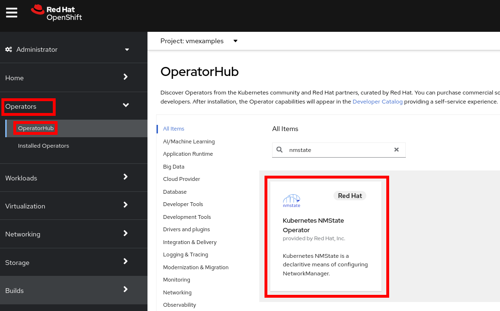
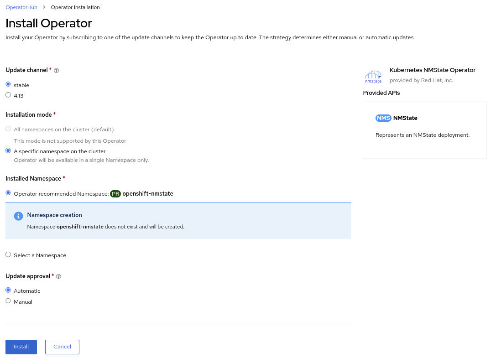
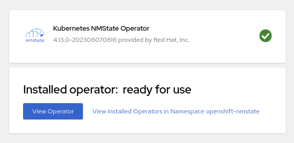
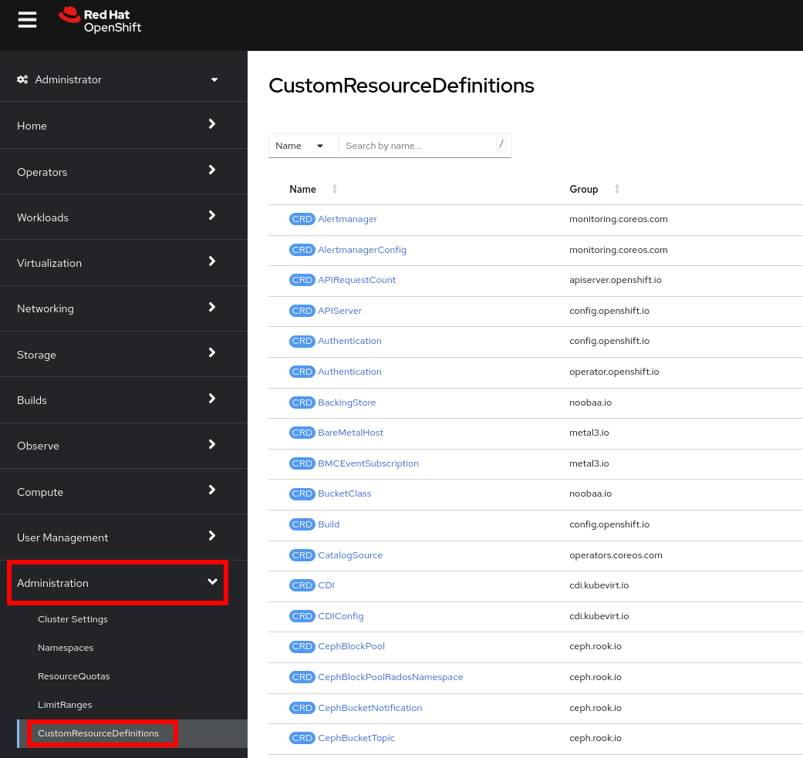
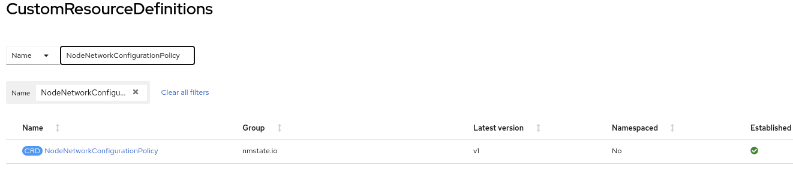

:scrollbar:
:toc2:
:preinstall_operators: %preinstall_operators%

= Network Management Lab

:numbered:

== Introduction to Network Management

By default, the virtual machines (VMs) are attached to Pod networking, enabling access from Pods and other VMs.

In this lab, you connect a VM to a physical network so that it is accessible outside the cluster of Red Hat^(R)^ OpenShift^(R)^ Container Platform.

.Goals
* Create a Linux^(R)^ Bridge on worker nodes
* Create a network attachment definition

ifeval::["{preinstall_operators}" == "False"]

== Install NMstate operator

The Kubernetes NMState Operator provides a Kubernetes API for performing state-driven network configuration across the OpenShift Container Platform cluster’s nodes with NMState. The Kubernetes NMState Operator provides users with functionality to configure various network interface types, DNS, and routing on cluster nodes. Additionally, the daemons on the cluster nodes periodically report on the state of each node’s network interfaces to the API server.

. Navigate to *Operators* -> *OperatorHub* and filter for `nmstate`
+

. Press on the tile and perform the installation pressing *Install*
+
image::images/Networking/00_Operator_Install.png[]
. Review default options and press *Install*
+

. After installation, press *View Operator* 
+

. Create a new instance for the *NMState* pressing `Create instance`
+
image::images/Networking/00_Operator_Create_Instance.png[]

. Review the options available and press *Create* without modify any.
+
image::images/Networking/00_Operator_Create_Instance_Wizard.png[]

endif::[]

== Create Linux Bridge on Worker Nodes

Worker nodes have an extra network interface that is connected to a physical network.
To configure the physical network, you need to create a new custom resource whose _kind_ is `NodeNetworkConfigurationPolicy`.

. In the OpenShift Container Platform web console, navigate to *Administration* -> *CustomResourceDefinitions*:
+

. In the *Search by name* field, type `NodeNetworkConfigurationPolicy`:
+

. Click `NodeNetworkConfigurationPolicy` and navigate to the *Instances* tab:
+
image::images/Networking/12_nodenetworkconfigurationpolicies.png[]

. Click *Create NodeNetworkConfigurationPolicy*:
+
image::images/Networking/13_Create_NNCP.png[]

. Copy and paste the following content into the editor:
+
[source,yaml]
----
apiVersion: nmstate.io/v1
kind: NodeNetworkConfigurationPolicy
metadata:
  name: br-flat
spec:
  nodeSelector:
    node-role.kubernetes.io/worker: ""
  desiredState:
    interfaces:
      - name: br-flat
        description: Linux bridge with enp3s0 as a port
        type: linux-bridge
        state: up
        ipv4:
          dhcp: false
          enabled: false
        bridge:
          options:
            stp:
              enabled: false
          port:
            - name: enp3s0
----
+
This configuration uses the `enp3s0` interface on the Worker Nodes to create a Linux Bridge called `br-flat`.

. Click *Create*.

. Watch the *Conditions* section until the *Available* status changes to `True`:
+
image::images/Networking/14_Status_NNCP.png[]

== Create Network Attachment Definition

. Navigate to *Networking* -> *Network Attachment Definitions* and click *Create network attachment definition*:
+
image::images/Networking/01_NAD_Dashboard.png[]

. IMPORTANT: Select project `vmexamples`

. Complete the form for the `vmexamples` project as follows, then click *Create network attachment definition*:
* *Name*: `flatnetwork`
* *Network Type*: `CNV Linux Bridge`
* *Bridge Name*: `br-flat`
+
image::images/Networking/02_NAD_Create.png[]
+
[NOTE]
As you can observe in this form, it is possible to configure VLAN networks.

. Examine the details of the network attachment definition:
+
image::images/Networking/03_NAD_Created.png[]

. Navigate to *Virtualization* -> *VirtualMachines*, select the `fedora02` VM. Click *Configuration* tab and then click the *Network Interfaces* subtab:
+
image::images/Networking/04_VM_Network_Tab.png[]

. Click *Add Network Interface*, complete the form as shown, then click *Save*:
+
image::images/Networking/05_VM_Network_Attach.png[]

. Use the *Actions* menu to restart the VM. After is rebooted, navigate to *Console* tab:
+
image::images/Networking/06_VM_Network_Console.png[]
+
The `eth1` interface obtains an IP address from the flat network (192.168.3.x/24). That network has a DHCP server providing IPs to that network.

. Using the available console in the right part, you can confirm you have direct access to the VM through a flat network
+
[%nowrap]
----
[~] $ curl 192.168.3.118:22                           
----
+
[NOTE]
Replace the IP which the IP assigned to the node.
+
.Sample Output
+
[%nowrap]
----
SSH-2.0-OpenSSH_8.7     
----

== Summary

In this lab, you connected a VM to a physical network using a Linux Bridge so that it is accessible outside the cluster of the Red Hat OpenShift Container Platform.