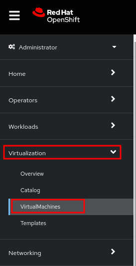
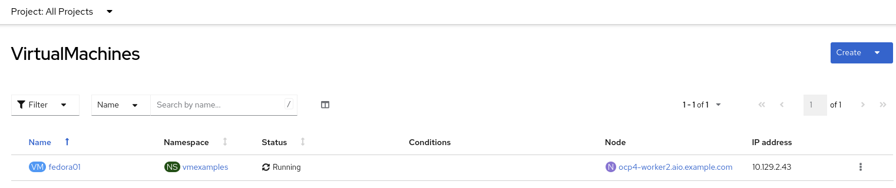
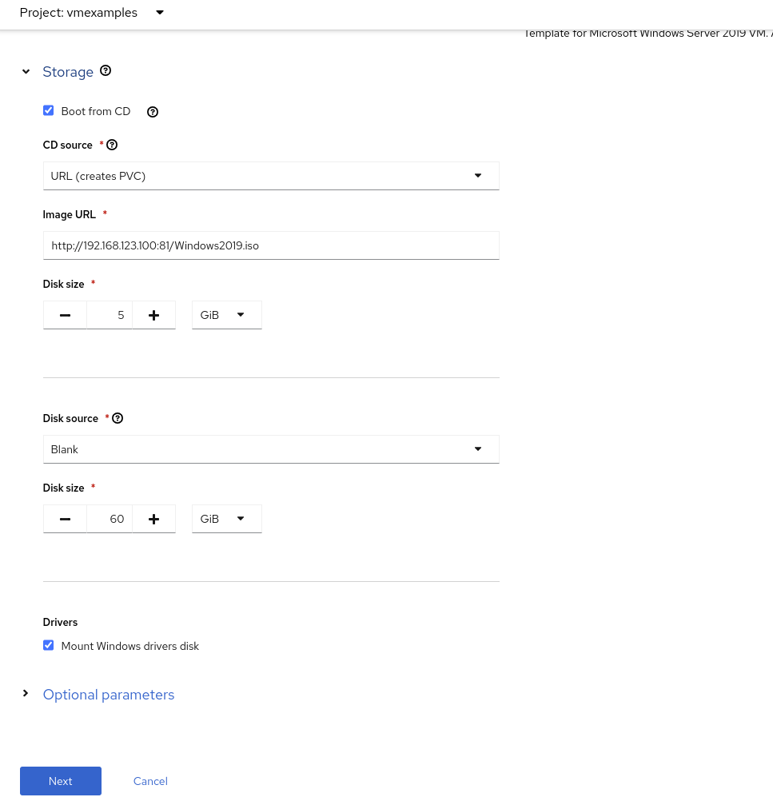
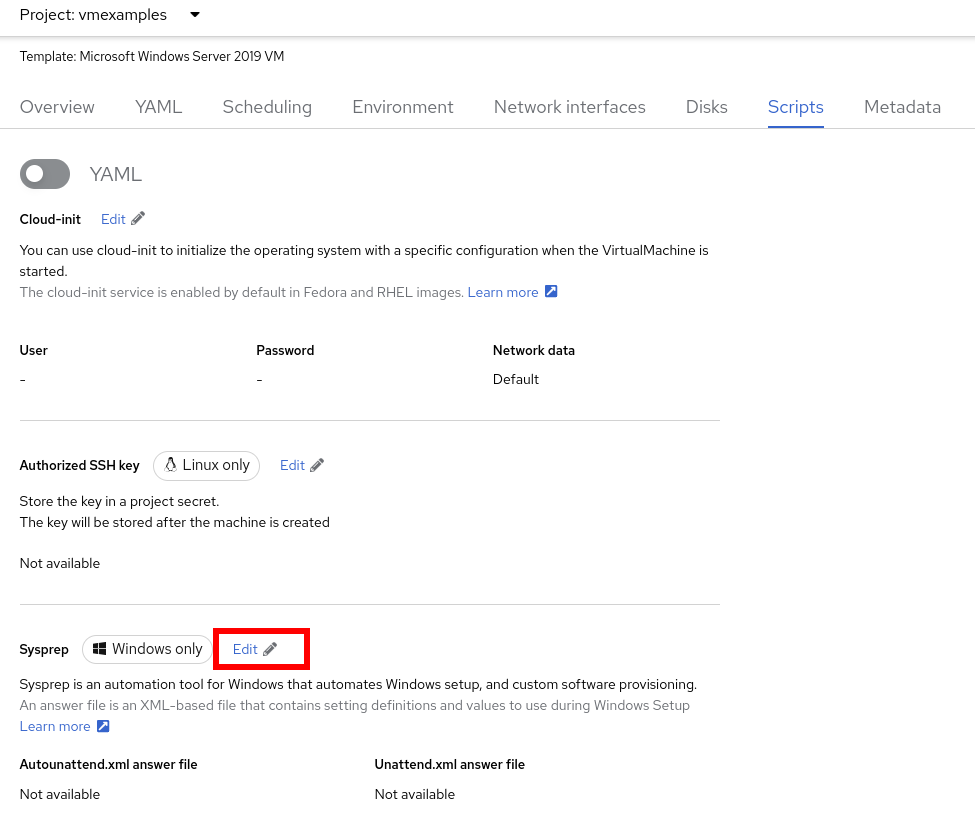
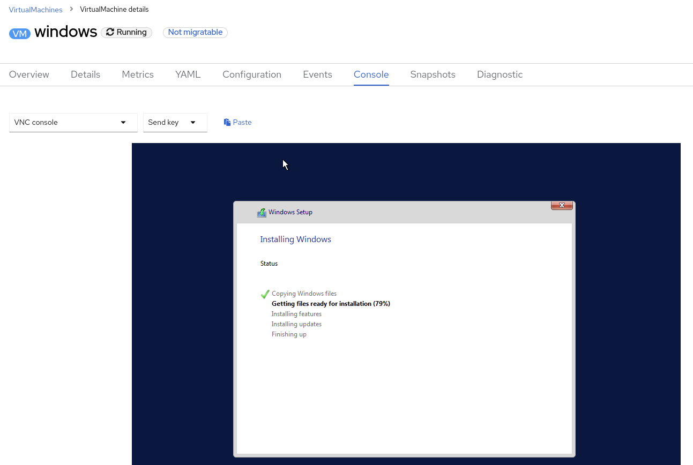

:scrollbar:
:toc2:

= Windows Virtual Machines with OpenShift Virtualization

:numbered:

This lab will introduce you to the basics of creating and managing Microsoft Windows VMs in OpenShift Virtualization. This process is very similar to creating and managing Linux-based virtual machines, be sure to return to the OpenShift Virtualization Basics module and go through the exercises for reviewing resources and configuration.

.Goals
* Create a new Windows virtual machine
* Customize the OS using sysprep

== Create a Windows virtual machine

In this segment, we will install Microsoft Windows Server 2019 using an ISO hosted on a web server. This represents one way to install an operating system to a virtual machine that takes advantage of the ability to source disks from many locations, including a web server, object storage, or other persistent volumes in the cluster.

This process can be streamlined after the initial operating system installation by creating a template from the virtual machine. The specific process for preparing the guest operating system to be used as a template will vary, be sure to follow your organization's guidelines and requirements when preparing a template OS.

. From the left menu, navigate to *Virtualization* -> *VirtualMachines*:
+

. It will list the VMs running in the current project.
+

. Press on the top-right the button *Create* and select *From template*
+
image::images/Create_VM_PVC/26_From_Template.png[]
. Scroll down and select *Microsoft Windows Server 2019 VM* tile.
+
image::images/Create_VM_PVC/27_Windows_2k9_Tile.png[]

. A dialog will appear showing the default configuration related to the template.
+
image::images/Create_VM_PVC/28_Windows_2k9_Dialog.png[]

. Press *Customize VirtualMachine* to specify the parameters to be used for the provisioning.
+
image::images/Create_VM_PVC/29_Windows_2k9_Parameters.png[]

. In this dialog:
.. Specify the name `windows`
.. Enable the checkbox *Boot from CD* and specify the url: http://192.168.123.100:81/Windows2019.iso
. Reduce the CD disk size to *5 GiB*.
. Keep the `Disk source` size disk to the default value *60 GiB*
. Ensure the `Mount Windows drivers disk` is enabled. This is required to install Windows systems, which will provide the drivers for VirtIO.

. Press *Next* after filling in the parameters.
+

. Switch to the *Scripts* tab and press *Edit* on the `Sysprep` section
+

. Fill the `autounattend.xml` form with the following code
+
[source,xml,role=copy]
----
<?xml version="1.0" encoding="utf-8"?>
<unattend xmlns="urn:schemas-microsoft-com:unattend" xmlns:wcm="http://schemas.microsoft.com/WMIConfig/2002/State" xmlns:xsi="http://www.w3.org/2001/XMLSchema-instance" xsi:schemaLocation="urn:schemas-microsoft-com:unattend">
  <settings pass="windowsPE">
    <component name="Microsoft-Windows-Setup" processorArchitecture="amd64" publicKeyToken="31bf3856ad364e35" language="neutral" versionScope="nonSxS">
      <DiskConfiguration>
        <Disk wcm:action="add">
          <CreatePartitions>
            <CreatePartition wcm:action="add">
              <Order>1</Order>
              <Extend>true</Extend>
              <Type>Primary</Type>
            </CreatePartition>
          </CreatePartitions>
          <ModifyPartitions>
            <ModifyPartition wcm:action="add">
              <Active>true</Active>
              <Format>NTFS</Format>
              <Label>System</Label>
              <Order>1</Order>
              <PartitionID>1</PartitionID>
            </ModifyPartition>
          </ModifyPartitions>
          <DiskID>0</DiskID>
          <WillWipeDisk>true</WillWipeDisk>
        </Disk>
      </DiskConfiguration>
      <ImageInstall>
        <OSImage>
          <InstallFrom>
            <MetaData wcm:action="add">
              <Key>/IMAGE/NAME</Key>
              <Value>Windows Server 2019 SERVERSTANDARD</Value>
            </MetaData>
          </InstallFrom>
          <InstallTo>
            <DiskID>0</DiskID>
            <PartitionID>1</PartitionID>
          </InstallTo>
        </OSImage>
      </ImageInstall>
      <UserData>
        <AcceptEula>true</AcceptEula>
        <FullName>Administrator</FullName>
        <Organization>My Organization</Organization>
      </UserData>
      <EnableFirewall>false</EnableFirewall>
    </component>
    <component name="Microsoft-Windows-International-Core-WinPE" processorArchitecture="amd64" publicKeyToken="31bf3856ad364e35" language="neutral" versionScope="nonSxS">
      <SetupUILanguage>
        <UILanguage>en-US</UILanguage>
      </SetupUILanguage>
      <InputLocale>en-US</InputLocale>
      <SystemLocale>en-US</SystemLocale>
      <UILanguage>en-US</UILanguage>
      <UserLocale>en-US</UserLocale>
    </component>
  </settings>
  <settings pass="offlineServicing">
    <component name="Microsoft-Windows-LUA-Settings" processorArchitecture="amd64" publicKeyToken="31bf3856ad364e35" language="neutral" versionScope="nonSxS">
      <EnableLUA>false</EnableLUA>
    </component>
  </settings>
  <settings pass="specialize">
    <component name="Microsoft-Windows-Shell-Setup" processorArchitecture="amd64" publicKeyToken="31bf3856ad364e35" language="neutral" versionScope="nonSxS">
      <AutoLogon>
        <Password>
          <Value>R3dh4t1!</Value>
          <PlainText>true</PlainText>
        </Password>
        <Enabled>true</Enabled>
        <LogonCount>999</LogonCount>
        <Username>Administrator</Username>
      </AutoLogon>
      <OOBE>
        <HideEULAPage>true</HideEULAPage>
        <HideLocalAccountScreen>true</HideLocalAccountScreen>
        <HideOnlineAccountScreens>true</HideOnlineAccountScreens>
        <HideWirelessSetupInOOBE>true</HideWirelessSetupInOOBE>
        <NetworkLocation>Work</NetworkLocation>
        <ProtectYourPC>3</ProtectYourPC>
        <SkipMachineOOBE>true</SkipMachineOOBE>
      </OOBE>
      <UserAccounts>
        <LocalAccounts>
          <LocalAccount wcm:action="add">
            <Description>Local Administrator Account</Description>
            <DisplayName>Administrator</DisplayName>
            <Group>Administrators</Group>
            <Name>Administrator</Name>
          </LocalAccount>
        </LocalAccounts>
      </UserAccounts>
      <TimeZone>Eastern Standard Time</TimeZone>
    </component>
  </settings>
  <settings pass="oobeSystem">
    <component name="Microsoft-Windows-International-Core" processorArchitecture="amd64" publicKeyToken="31bf3856ad364e35" language="neutral" versionScope="nonSxS">
      <InputLocale>en-US</InputLocale>
      <SystemLocale>en-US</SystemLocale>
      <UILanguage>en-US</UILanguage>
      <UserLocale>en-US</UserLocale>
    </component>
    <component name="Microsoft-Windows-Shell-Setup" processorArchitecture="amd64" publicKeyToken="31bf3856ad364e35" language="neutral" versionScope="nonSxS">
      <AutoLogon>
        <Password>
          <Value>R3dh4t1!</Value>
          <PlainText>true</PlainText>
        </Password>
        <Enabled>true</Enabled>
        <LogonCount>999</LogonCount>
        <Username>Administrator</Username>
      </AutoLogon>
      <OOBE>
        <HideEULAPage>true</HideEULAPage>
        <HideLocalAccountScreen>true</HideLocalAccountScreen>
        <HideOnlineAccountScreens>true</HideOnlineAccountScreens>
        <HideWirelessSetupInOOBE>true</HideWirelessSetupInOOBE>
        <NetworkLocation>Work</NetworkLocation>
        <ProtectYourPC>3</ProtectYourPC>
        <SkipMachineOOBE>true</SkipMachineOOBE>
      </OOBE>
      <UserAccounts>
        <LocalAccounts>
          <LocalAccount wcm:action="add">
            <Description>Local Administrator Account</Description>
            <DisplayName>Administrator</DisplayName>
            <Group>Administrators</Group>
            <Name>Administrator</Name>
          </LocalAccount>
        </LocalAccounts>
      </UserAccounts>
      <TimeZone>Eastern Standard Time</TimeZone>
    </component>
  </settings>
</unattend>
----

. Click *Save* on the dialog
+
image::images/Create_VM_PVC/30_Windows_2k9_Sysprep.png[]

. Press *Create VirtualMachine*
+
image::images/Create_VM_PVC/31_Windows_2k9_Create.png[]

. The Virtual Machine will start the provisioning process by downloading the ISO image, configuring, and starting the instance.
+
image::images/Create_VM_PVC/32_Windows_2k9_Provisioning.png[]

. After a few minutes, the Virtual VM will be in `Running` status. Switch to the *Console* tab:
+

+
[NOTE]
It is not necessary for this workshop to wait for the installation to complete. You can continue to the next module.
+
[IMPORTANT]
The VM is marked as "Not migratable" because a CD-ROM disk is attached. 

