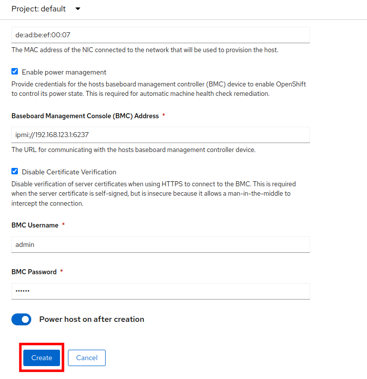

:scrollbar:
:toc2: 

:numbered:

== Introduction

In this lab, you will review the physical environment used during this workshop, including an overview of OpenShift deployed to bare metal hosts. This evironment runs on bare metal hosts in the Equinix cloud. This review will help provide you with an understanding of how the nodes are configured in the cluster, and what their current hardware capabilities are. You will then be tasked with adding an additional machine and scaling the number of cluster nodes using the Red Hat OpenShift web console.

.Goals
* Explore the nodes and machines in your *Red Hat OpenShift Container Platform* cluster
* Scale the baremetal cluster using the web console

=== Supported Platforms

Today, OpenShift virtualization is fully supported in the following environments that provide bare metal resources:

* Self-managed _bare metal servers_ on-premises or at a hosted site that provides bare metal resources. The lab you're using today is an OpenShift cluster deployed to an Equinix colocation facility.

* Amazon Web Services (AWS) bare metal instances, as well as ROSA (Red Hat OpenShift Services on AWS) with bare metal instances, are fully supported. See link:https://www.redhat.com/en/blog/managing-virtual-machines-and-containers-as-code-with-openshift-virtualization-on-red-hat-openshift-service-on-aws[OpenShift Virtualization on ROSA]. 

* IBM Cloud Bare Metal Servers are tech preview. See link:https://access.redhat.com/articles/6738731[Deploy OpenShift Virtualization on IBM Cloud Bare Metal Nodes for details].

[NOTE]
Installing OpenShift Virtualization on IBM Cloud Bare Metal Servers is a Technology Preview feature only. Technology Preview features are not supported with Red Hat production service level agreements (SLAs) and might not be functionally complete. Red Hat does not recommend using them in production. Technology previews provide early access to upcoming product features, enabling customers to test functionality and provide feedback during the development process.

=== Requirements for OpenShift Virtualization

Before you install OpenShift Virtualization for Red Hat OpenShift Container Platform, make sure that your Red Hat OpenShift Container Platform cluster meets the following requirements.

* CPU requirements
** Supported by Red Hat Enterprise Linux (RHEL) 8/9
** Support for Intel 64 or AMD64 CPU extensions
** Intel VT or AMD-V hardware virtualization extensions enabled
** NX (no execute) flag enabled

* Storage requirements
** Supported by OpenShift
** A CSI provisioner is strongly encouraged
** `ReadWriteMany` (RWX) PVCs are required for live migration
** A CSI provisioner that supports accelerated volume creation via CSI clones or snapshots makes creating VMs from templates much faster. If one is not available, OpenShift Virtualization will fallback to using a host copy

* OpenShift cluster node requirements
** Red Hat Enterprise Linux CoreOS (RHCOS) installed on worker nodes
** CPU, memory, and network capacity sufficient to host your virtual machine workload

Review https://docs.openshift.com/container-platform/4.15/virt/install/preparing-cluster-for-virt.html[the documentation] for specific requirements and guidance on hardware for use with OpenShift Virtualization.

[NOTE]
If your cluster uses worker nodes with different CPUs, e.g. Intel and AMD, live migration failures can occur because different CPUs have different capabilities. 

== Review Red Hat OpenShift Cluster

When deployed using the installer provisioned infrastructure (IPI) method, OpenShift uses https://metal3.io/[Metal3] to manage the hardware using the out-of-band management controller. This results in the hardware being represented in three different ways in the cluster:

. https://docs.openshift.com/container-platform/4.13/nodes/index.html[`Node`] - The node is viewed and used by the Kubernetes scheduler. This is the object which represents the usable resources in the cluster.
. https://docs.openshift.com/container-platform/4.13/machine_management/index.html[`Machine`] - An object managed by an infrastructure provider. In this lab, and when using OpenShift Virtualization, this is a physical server that is abstracted by the Metal3 Operator. These are grouped and managed as a set via the `MachineSet` paradigm.
. `BareMetalHost` - This is the lowest level and direct interaction with the management of the physical server.

=== Review Nodes and Machines

Almost every interaction with Red Hat OpenShift can be done in the OpenShift Console. The console is a full-featured web application that allows administrators and users alike to use the platform in a guided manner. Wizards are provided for most tasks which makes it easy to administer the system.

// WKTBD: Replace with actual password from variable
. Navigate to %ocp_url% and login with user `admin` and the password `%ocp_password%`.

. From the navigation menu, select *Compute* -> *Nodes*:
+
image::images/Install/Compute_Nodes.png[]
+
There are three control plane nodes and three worker nodes in the OpenShift 4 Cluster. In addition, the `ipmi` (Intelligent Platform Management Interface) is being used to manage the bare metal nodes.
+
A node is a virtual or bare metal machine in an OpenShift cluster. Worker nodes host virtual machines and other workloads. The control plane nodes run services that are required to control and manage the OpenShift cluster.

. Click on one of the worker nodes to obtain resource information about the node:
+
image::images/Install/Worker0_Information.png[]
+
The *Overview* tab is showing useful information about the utilization of the resources, such as CPU and memory. It also shows all the applications (*Pods*) that are running inside on this node.

[NOTE]
At least one physical node is required for OpenShift Virtualization, "nesting" and emulation are not supported. However, other nodes in the cluster can be virtual machines, for example control plane and infrastructure nodes.

. Navigate to the tab *Details* to obtain more information about the operating system.
+
image::images/Install/Worker0_Details.png[]

=== Review Bare Metal Hosts

When using `Baseboard Management Console (BMC)` it is possible to manage the nodes using the *Red Hat OpenShift* console. 

. Select *Compute* -> *Bare Metal Hosts*:
+
image::images/Install/BMHosts.png[]
+
During installation, the *Control Plane* nodes are provisioned by the OpenShift Container Platform installation program (that is why the status is `Externally provisioned`) and when the control plane is ready, the *Worker* nodes are provisioned by cluster itself (hence the status `Provisioned`) and joined to the cluster. While not a part of this lab, it is possible to scale up the cluster by adding new hosts using the *Add Host* button.

. Click on any of the worker nodes to obtain information about the physical (bare metal) node:
+
image::images/Install/Worker0_BMhost.png[]
+
The information shown is similar to the *Nodes* one, with the exception is providing information related to the hardware and the physical status of the bare metal node. Using the *Actions* menu, it is possible to manage aspects of the bare metal host, such as restarting or stopping the system using `BMC`.

. Explore the other tabs in the interface to see more details about the hosts, including the network interfaces and disks. Additionally, the host can be *Deprovisioned*, which will result in it being removed from the cluster, RHCOS removed, and the machine marked as ready to configure.

=== Scaling The Cluster With A New Bare Metal Host

In many cases it becomes necessary to add additonal physical nodes to a cluster to meet workload demands. In a virtual deployment of OpenShift, this is as simple as clicking on the appropriate machine set and choosing the scale the number of nodes available, and the hypervisor responds by cloning a VM template and spinning up new workers. In a bare metal environment there are a few more steps involved, but it's still a fairly simple process if you have the hardware available and access to the servers through a BMC that supports the IPMI protocol.

To begin this process we are going to return to the bare metal hosts screen we reviewed earlier:

. Select *Compute* -> *Bare Metal Hosts*:
+
image::images/Install/BMHosts.png[]
+
. Click on the *Add Host* button in the upper right corner, and select the *New with Dialog* option.
+

+
. The dialog menu to add a bare metal host will ask you for the following information:
+
* Host Name: *worker4*
* Boot MAC Address: *de:ad:be:ef:00:07* 
* BMC Address: *ipmi://192.168.123.1:6237*
* BMC Username: *admin*
* BMC Password: *redhat* 
+
. With this information filled out, click the *Create* button at the bottom of the dialog page.
+

+
. You will then be presented with the summary screen for *worker4*, and you will see the status update as it attempts to contact the machine and make it available as a host.
+

+
[NOTE]
This step may take several minutes to update as it powers up the host, and collects hardware information.
+
. When host discovery and hardware inspection is complete you will see that it shows it's status as *Available*.
+

+
. Once a host has been physically discovered the next step is to add it as a machine to be used by OpenShift. Click on the menu for *MachineSets* on the left under *Compute*.
+

+
. Click on the *three-dot* menu on the top-right side, and select *Edit Machine count* from the dropdown menu.
+

+
. A new menu will appear showing the current machine count of *3*, click the plus (+) sign to increase the machine count to *4*.
+

+
. You will be returned to the MachineSets page, and you can now see that the count of machines is 3/4 machines.
+

+
. Next, click on the *Machines* button on the left to see a list of all the machines, and you should see worker4 in the *Provisioning* state. 
+

+
. One provisioning is complete you will see the node listed with the Phase set to *Provisioned as node*.
+

+
. Since our new host has now been added to the machineset and provisioned as a node, we can click on the *Nodes* menu on the left.
+

+
. We can also click directly on *worker-4* under the *Name* column to see it's current status.
+

+
. The details screen for worker-4 is now populated with hardware information including CPU and Memory utilization, as well as the number of Pods assigned to our new worker node.

== Summary

In this lab, you became familiar with your Red Hat OpenShift Container Platform cluster and the hardware that makes up this environment. You also used the web console to expand your cluster by discovering an additional bare metal node, and adding it to the cluster machineset used to scale the worker nodes available.
