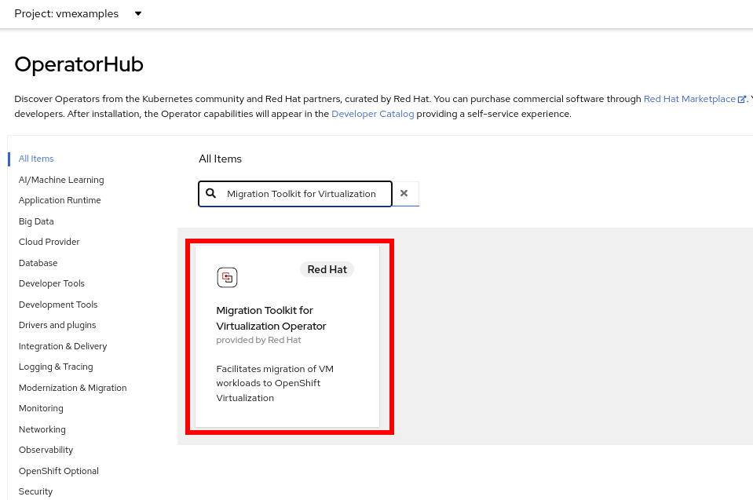
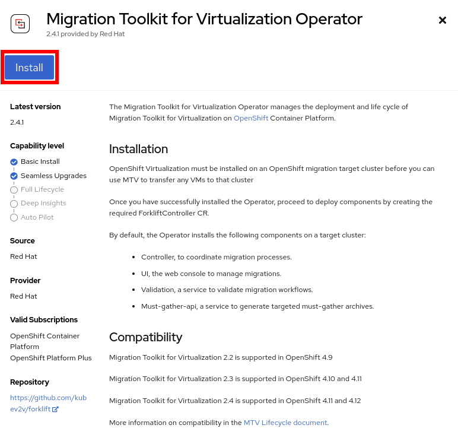
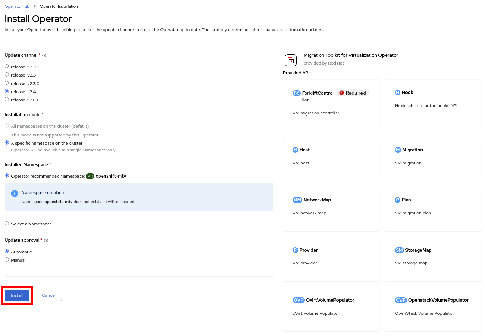
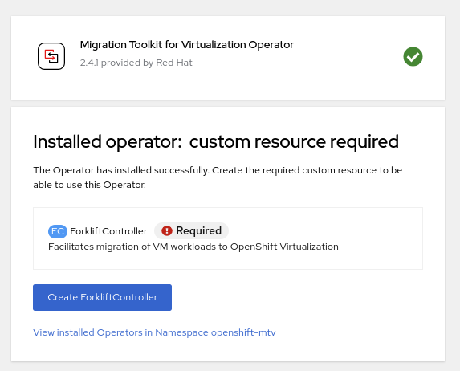
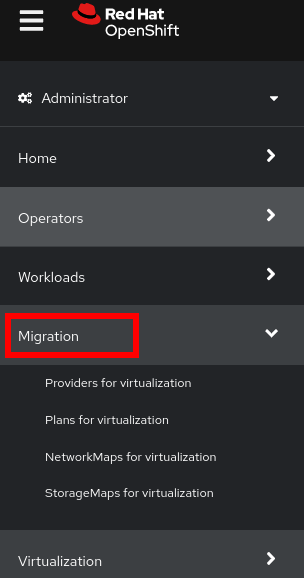
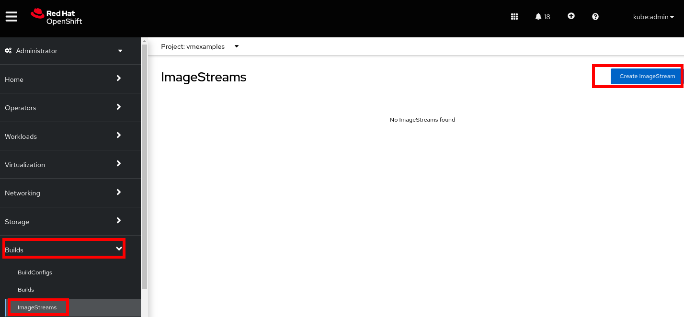
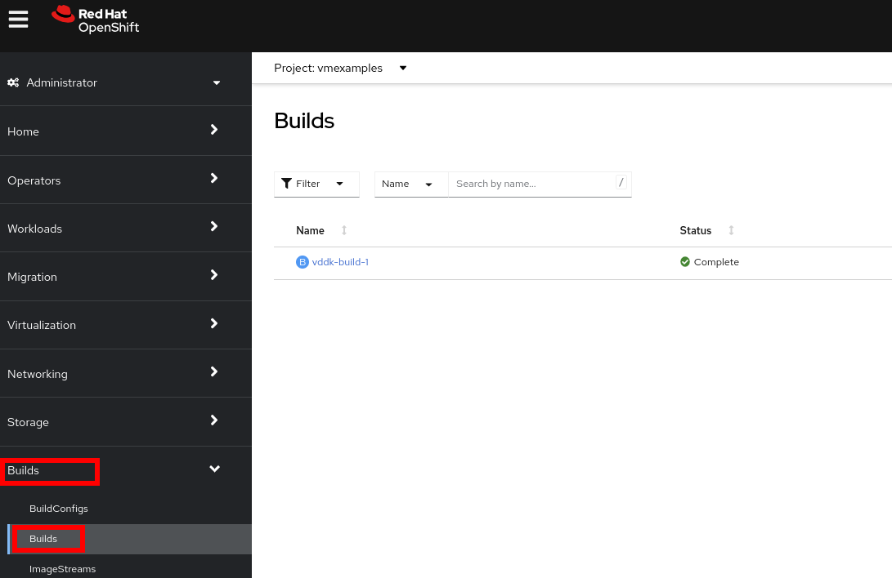

:scrollbar:
:toc2:
:preinstall_operators: %preinstall_operators%

=  Migration Toolkit Virtualization

ifeval::["{preinstall_operators}" == "False"]
In this lab, you will install the Operator to perform migrations from VMware.

.Goals
* Install Operator 
* Connect to provider VMWare
* Configure Network and Storage Mapping
* Create migration plan
* Perform migration
endif::[]

ifeval::["{preinstall_operators}" == "True"]
In this lab, you will review the Operator to perform migrations from VMware.

.Goals
* Review Operator 
* Connect to provider VMWare
* Configure Network and Storage Mapping
* Create migration plan
* Perform migration
endif::[]

== Introduction

You can migrate virtual machines from VMware vSphere or Red Hat Virtualization to OpenShift Virtualization with the Migration Toolkit for Virtualization (MTV).

. MTV supports cold migration from Red Hat Virtualization (RHV) and warm migration from VMware vSphere and from RHV.

. Cold migration: the default migration type. The source virtual machines are shut down while the data is copied.

. Warm migration: Most of the data is copied during the precopy stage while the source virtual machines (VMs) are running. Then the VMs are shut down and the remaining data is copied during the cutover stage.

More information in the following link: https://access.redhat.com/documentation/en-us/migration_toolkit_for_virtualization/2.4/html-single/installing_and_using_the_migration_toolkit_for_virtualization/index#about-mtv

== Prerequisites for VMWare Provider

You must install compatible versions of OpenShift Container Platform and OpenShift Virtualization.

The firewalls must enable traffic over the following ports:

. Network ports required for migrating from VMware vSphere
+
[cols="1,1,1,1,1"]
|===
|*Port*|*Protocol*|*Source*|*Destination*|*Purpose*
|443|TCP|OpenShift nodes|VMware vCenter|VMware provider inventory
Disk transfer authentication
|443|TCP|OpenShift nodes|VMware ESXi hosts|Disk transfer authentication
|902|TCP|OpenShift nodes|VMware ESXi hosts|Disk transfer data copy
|===

The following prerequisites apply to all migrations:

* ISO/CDROM disks must be unmounted.
*  Each NIC must contain one IPv4 and/or one IPv6 address.
*  The VM operating system must be certified and supported for use as a link:https://access.redhat.com/articles/973163#ocpvirt[Guest operating system with OpenShift Virtualization].
*  VM names must contain only lowercase letters (a-z), numbers (0-9), or hyphens (-), up to a maximum of 253 characters. The first and last characters must be alphanumeric. The name must not contain uppercase letters, spaces, periods (.), or special characters.
*  VM names must not duplicate the name of a VM in the OpenShift Virtualization environment.

*Migration Toolkit for Virtualization* automatically assigns a new name to a VM that does not comply with the rules. *Migration Toolkit for Virtualization* makes the following changes when it automatically generates a new VM name:

* Excluded characters are removed.
* Uppercase letters are switched to lowercase letters.
* Any underscore (_) is changed to a dash (-).

This feature allows a migration to proceed smoothly even if someone entered a VM name that does not follow the rules.

Prerequisites for VMWare are described in the following link:https://access.redhat.com/documentation/en-us/migration_toolkit_for_virtualization/2.4/html-single/installing_and_using_the_migration_toolkit_for_virtualization/index#vmware-prerequisites_mtv[link]

ifeval::["{preinstall_operators}" == "False"]

== Install and configure the MTV Operator

. Navigate to *Operators* -> *OperatorHub* and filter for `Migration Toolkit for Virtualization`
+

. Click the tile appeared and press *Install*
+

. Review the _Custom Resources Definition_ which are going to be created and without modify any option press *Install*
+

+
[IMPORTANT]
Select version `release-v2.4`

. Like others Operators after the installation is required to create a Controller. Press *Create ForkliftController* for that purpose.
+

. In the next screen press *Create* without modify any value
+
image::images/MTV/05_ForkliftController.png[]

. Ensure the `Status` is `Running,Successful`
+
image::images/MTV/06_ForkliftController_Status.png[]

. Refresh web console when the banner appears
+
image::images/MTV/06_ForkliftController_Webconsole.png[]

. A left menu called *Migration* will appear
+

endif::[]

== Migrating from VMWare

Current environment is configured as the following:

* One proxy system redirecting traffic to the web servers
* Two Windows Servers with IIS + PHP Application connecting to the database
* One Linux system running a MariaDB database

Application is access from the following link:
http://webapp.vc.opentlc.com/

=== Review VMware environment

. Navigate to link:https://portal.vc.opentlc.com/ui/app/folder;nav=v/urn:vmomi:Folder:group-v16081:ee1bef3e-6179-4c1f-9d2a-004c7b0df4e5/vms/vms[https://portal.vc.opentlc.com^]

. Login with the user `ocpvirtroadshow@vc.opentlc.com` and the password `%vcenter_password%`

. Review the existing VMs
+
image::images/MTV/100_vSphere_VM_List.png[]
+
[NOTE]
The VMs with suffix `_running` are the active ones. As for the migration have to be stopped, a clone of the VMs were created for the migration. Those VMs are the ones without that suffix.

. Review Segment navigating link:https://portal.vc.opentlc.com/ui/app/dvportgroup;nav=n/urn:vmomi:DistributedVirtualPortgroup:dvportgroup-1916:ee1bef3e-6179-4c1f-9d2a-004c7b0df4e5/ports[to this link^]
+
image::images/MTV/101_vSphere_Network.png[]

. Review storage navigating link:https://portal.vc.opentlc.com/ui/app/datastore;nav=s/urn:vmomi:Datastore:datastore-48:ee1bef3e-6179-4c1f-9d2a-004c7b0df4e5/vms/vms[to this link^]
+
image::images/MTV/102_vSphere_Datastore.png[]

=== Add VMWare Provider

The *Migration Toolkit for Virtualization* (*MTV*) uses the VMware Virtual Disk Development Kit (*VDDK*) SDK to transfer virtual disks from VMware vSphere.

You must download the *VMware Virtual Disk Development Kit* (*VDDK*), build a VDDK image, and push the VDDK image to your image registry. You need the VDDK init image path in order to add a VMware source provider.

[IMPORTANT]
Storing the VDDK image in a public registry might violate the VMware license terms.

. Navigate to *Builds* -> *ImageStreams*
. Press *Create ImageStream*
+

. Replace the YAML content with the following code:
+
[source,yaml]
----
apiVersion: image.openshift.io/v1
kind: ImageStream
metadata:
  name: vddk
  namespace: vmexamples
----

. Navigate to *Builds* -> *BuildConfigs*
. Press *Create BuildConfig* and select *YAML View*
+
image::images/MTV/40_Create_BC.png[]
. Replace the YAML content with the following code
+
[source, yaml,%nowrap]
----
kind: BuildConfig
apiVersion: build.openshift.io/v1
metadata:
  name: vddk-build
  namespace: vmexamples
spec:
  output:
    to:
      kind: ImageStreamTag
      name: 'vddk:latest'
  strategy:
    type: Docker
    dockerStrategy:
      from:
        kind: ImageStreamTag
        namespace: openshift
        name: 'tools:latest'
  source:
    type: Dockerfile
    dockerfile: |
      FROM registry.access.redhat.com/ubi8/ubi-minimal 
      RUN curl -L -O www.opentlc.com/download/ocp4_baremetal/VMware-vix-disklib-7.0.3-20134304.x86_64.tar.gz
      RUN tar -xzf VMware-vix-disklib-7.0.3-20134304.x86_64.tar.gz
      RUN mkdir -p /opt
      ENTRYPOINT ["cp", "-r", "/vmware-vix-disklib-distrib", "/opt"]
  triggers:
    - type: ImageChange
      imageChange: {}
    - type: ConfigChange
----

. Navigate to *Builds* -> *Builds* and wait till the build process is completed
+

. Navigate in the left menu to *Migration* -> *Providers for virtualization*
. Select project `openshift-mtv`
+
image::images/MTV/91_MTV_Providers.png[]

. By default, there is a provider called `host` which represents the *OpenShift Virtualization* as a target platform
+
image::images/MTV/92_MTV_Provider_list.png[]

. Press *Create Provider* button in the top right. A dialog it will appear.
+
image::images/MTV/93_MTV_Create_Provider.png[]

. Select *VMware* on the *Provider type* dropdown and fill the following data:
.. *Name*: `vmware`
.. *vCenter host name or IP address*: `portal.vc.opentlc.com`
.. *vCenter user name*: `ocpvirtroadshow@vc.opentlc.com`
.. *vCenter password*: `%vcenter_password%`
.. *VDDK init image*: `image-registry.openshift-image-registry.svc:5000/vmexamples/vddk:latest`
.. Check `Skip certificate validation (if checked, the provider's certificate won't be validated)`
.. *SHA-1 fingerprint*: `70:2D:52:D2:D1:A5:A2:75:58:8F:3D:07:D5:7E:E9:73:81:BC:88:A2`
+
image::images/MTV/94_MTV_Fill_Dialog.png[]
.  Press *Create* and wait till the *Status* column is changed to `Ready`
+
image::images/MTV/95_MTV_Provider_Added.png[]

=== Create Storage and Network Mapping

. Navigate in the left menu to *Migration* -> *NetworkMaps for virtualization* and press *Create NetworkMap*
+
image::images/MTV/96_MTV_NetworkMaps.png[]

. Fill the following information in the appeared dialog
.. *Name*: `mapping-segment`
.. *Source provider*: `vmware`
.. *Target provider*: `host`
.. *Source networks*: `segment-migrating-to-ocpvirt`
.. *Target network*: `Pod network (default)`
. Press *Create*
+
image::images/MTV/97_Add_VMWARE_Mapping_Network.png[]
. Ensure the created mapping has the correct *Status*
+
image::images/MTV/98_List_VMWARE_Mapping_Network.png[]

. Navigate in the left menu to *Migration* -> *StorageMaps for virtualization* and press *Create StorageMap*
+
image::images/MTV/99_MTV_StorageMaps.png[]

. Fill the following information:
.. *Name*: `mapping-datastore`
.. *Source provider*: `vmware`
.. *Target provider*: `host`
.. *Source storage*: `WorkloadDatastore`
.. *Target storage classs*: `ocs-storagecluster-ceph-rbd (default)`
. Press *Create*
+
image::images/MTV/100_Add_VMWARE_Mapping_Storage.png[]

. Ensure the created mapping has the correct *Status*
+
image::images/MTV/101_List_VMWARE_Mapping_Storage.png[]

=== Create Migration Plan

. Navigate in the left menu to *Migration* -> *Plans for virtualization* and press *Create plan*
+
image::images/MTV/102_Create_VMWARE_Plan.png[]

. On the wizard fill the following information on the *General settings* step
.. *Plan name*: `move-webapp-vmware`
.. *Source provider*: `vmware`
.. *Target provider*: `host`
.. *Target namespace*: `vmexamples`
. Press *Next*
+
image::images/MTV/52_General_VMWARE_Plan.png[]
. On the next step, select `All datacenters`  and press *Next*
+
image::images/MTV/53_VM_Filter_VMWARE_Plan.png[]
. On the next step select the VMs `winweb01`, `winweb02` and `database`. Press *Next*:
+
image::images/MTV/54_VM_Select_VMWARE_Plan.png[]

. On the *Network mapping* step select `mapping-segment` and press *Next*
+
image::images/MTV/55_Network_VMWARE_Plan.png[]
. On the *Storage mapping* step select `mapping-datastore` and press *Next*
+
image::images/MTV/56_Storage_VMWARE_Plan.png[]
. Press *Next* on the steps *Type* and *Hooks*
. Review the configuration specified and press *Finish*
+
image::images/MTV/57_Finish_VMWARE_Plan.png[]

. Ensure the status for the plan is *Ready*
+
image::images/MTV/58_Ready_VMWARE_Plan.png[]

. Press *Start* to begin the migration of the three VMs.

. After around 10 minutes the migration is completed
+
image::images/MTV/59_Completed_VMWARE_Plan.png[]
+
[IMPORTANT]
Having many participantes doing the same task in parallel can cause this task would be slowest than in a real environment. Be patient.
+
[NOTE]
You can check the pods on *Workloads* -> *Pods* meantime the process is running.

=== Review VirtualMachines migrated

. Return to the OpenShift Console to configure the VMs.

. Navigate to *Virtualization* -> *VirtualMachines* and ensure the migrated VMs are there
+
image::images/MTV/60_VMWARE_VMs_List.png[]
+
[NOTE]
Ensure you select the project vmexamples

. Access to the `winweb01` and navigate to the *YAML* tab
. Find the `spec:` section and under the `template.metadata` add the following lines to label the VM resources:
+
[%nowrap]
----
      labels:
        env: webapp
----
. *IMPORTANT*: Repeat the process for `winweb02`
+
image::images/MTV/61_VMWARE_VMs_YAML.png[]
+
[IMPORTANT]
Labels affected by the `Service` are not the `VirtualMachine` objects but the `Pods`. That is why is needed to add inside `spec.template.metadata`

. Start the _Virtual Machines_ `database`, `winweb01` and `winweb02`
.. Ensure the VMs are properly working, accessing to the Console tab of each VM.

. Navigate to *Networking* -> *Services* and press *Create service*
. Replace the YAML with the following definition
+
[source,yaml]
----
apiVersion: v1
kind: Service
metadata:
  name: webapp
  namespace: vmexamples
spec:
  selector:
    env: webapp
  ports:
    - protocol: TCP
      port: 80
      targetPort: 80
----
. Press *Create* and navigate to *Routes* in the left menu
. Press *Create Route* and fill the following information:
.. *Name*: `route-webapp`
.. *Service*: `webapp`
.. *Target port*: `80 -> 80 (TCP)`
. Press *Create*
+
[NOTE]
Don't enable TLS.
+
image::images/MTV/63_VMWARE_VMs_Create_Route.png[]
. Navigate to the address shown in *Location* field
+
image::images/MTV/64_VMWARE_VMs_URL.png[]
+
[IMPORTANT]
The web servers nodes are not able to resolv the internal name `database`

. Creating a service, allows resolve internally the DNS inside the namespace.
. Navigate to *Networking* -> *Services* and press *Create service*
. Replace the YAML with the following definition
+
[source,yaml]
----
apiVersion: v1
kind: Service
metadata:
  name: database
  namespace: vmexamples
spec:
  selector:
    vm.kubevirt.io/name: database
  ports:
    - protocol: TCP
      port: 3306
      targetPort: 3306
----
+
[NOTE]
This service is using the selector of VM's name

. Reload the webapp URL and expect to get the proper result
+
image::images/MTV/65_VMWARE_VMs_URL.png[]

== Summary 
In this module you have learn how to migrate from VMware. You have migrated an web application containing two windows systems and a Linux system. You used the OpenShift features to provide access to the application and you learned to create services to provide access internal in the project.