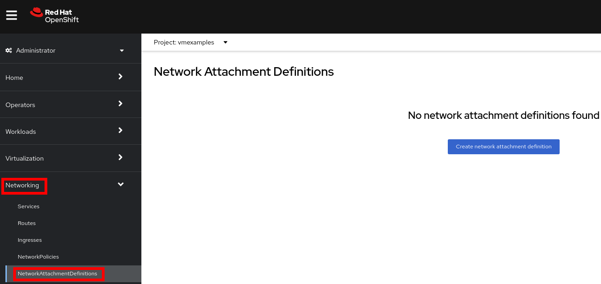
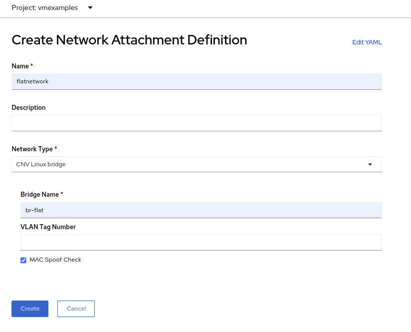
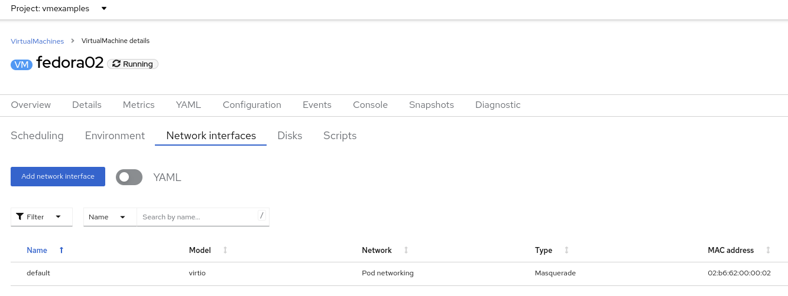

:scrollbar:
:toc2:

= Network Management Lab

:numbered:

== Introduction to Network Management

By default, all virtual machines are attached to the OpenShift software-defined network (SDN), which enables access from other workloads on the OpenShift cluster, including other VMs and any OpenShift native applications.

* The SDN provides additional features for abstracting, connecting, and exposing applications in a controlled manner, whether deployed as VMs or Pods in the cluster. These include the `Service` and `Route` features of OpenShift.
* OpenShift's network policy engine allows the VM user or administrator to create rules which allow or deny network traffic to and from individual VMs or entire projects/namespaces.

However, virtual machines may also connect directly to one or more external networks, such as VLANs, when needed. This is in addition to the SDN, which means that, for example, the administrator can connect to the VM from an external IP address, but the application communicates across the SDN with other VMs hosted by OpenShift Virtualization.

At a high level, this is done by configuring the host networking, such as creating a mode 4 (LACP) bond and a Linux bridge on top. This workshop segment will walk through the next step in that process, creating a network attachment definition to allow VMs to connect to that bridge and, therefore, directly to the external network. 

// WKTBD: Maybe add some NetworkPolicy (there is a web console wizard available now in 4.13).

[NOTE]
The OpenShift environment has already been configured with a Linux Bridge on each compute node your virtual machines will connect to, thus allowing for easy connectivity with/from outside network resources.

.Goals
* Create a network attachment definition
* Connect a VM to the external network

== Create Network Attachment Definition

In order to use the Linux Bridge with your VM you need to create a *Network Attachment Definition*. This is what tells OpenShift about the network and allows the virtual machines to connect to it. Network Attachment Definitions are specific to the project/namespace they're created in, unless they're created in the `default` project. This gives you, the administrator, the ability to control which networks are and aren't available to users who have access to manage their own Vms. Once the Network Attachment Definition has been created, it can then be used by virtual machines when configuring their network adapters.

[NOTE]
A network attachment definition instructs openshift to utilise an existing network device. In our case that device was previously created and is named br-flat. You must use that name or OpenShift won’t be able to place your VM on any compute nodes as it can only utilise nodes with that specifically named network device on it.

How is this done?

To manage an OpenShift node's network configuration you use a tool, available as an operator, called nmstate. With nmstate you can create network interfaces on OpenShift compute nodes using Kubernetes constructs. You can do this following naming that suits your needs and network requirements. For more info about nmstate, and to learn more about the host networking and how to view and manage the configuration, see the ([nmstate documentation](https://docs.openshift.com/container-platform/latest/networking/k8s_nmstate/k8s-nmstate-observing-node-network-state.html)) or speak with your lab proctors."

. Navigate to *Networking* -> *Network Attachment Definitions* and click *Create network attachment definition*:
+

+
[IMPORTANT]
====
Select project `vmexamples`.
====

. Complete the form for the `vmexamples` project as follows, then click *Create network attachment definition*:
* *Name*: `flatnetwork`
* *Network Type*: `CNV Linux Bridge`
* *Bridge Name*: `br-flat`
+

+
[NOTE]
The form above has an input for `VLAN Tag Number`, which is used when connecting to a network that needs to have a VLAN tag assigned. This lab uses an untagged network, so no VLAN number is required here.
+
A single Linux Bridge on the host can have many different VLANs. In this scenario, you only need to create a Network Attachment Definiton for each one, not a separate host interface and bridge.

. Examine the details of the network attachment definition. Because this was created in the `vmexamples` project, it will not be available in other projects.
+
image::images/Networking/03_NAD_Created.png[]

== Connect a virtual machine to the external network

. Navigate to *Virtualization* -> *VirtualMachines*, select the `fedora02` VM. Click *Configuration* tab and then click the *Network Interfaces* subtab:
+

. Click *Add Network Interface*, complete the form as shown, then click *Save*.
+
Because this is a bridge connecting to the external network, we don't need to rely on any OpenShift features or capabilities to enable access, such as masquerade (NAT) for the virtual machines using the network. As a result, *type* should be `Bridge` here.
+
image::images/Networking/05_VM_Network_Attach.png[]

. Use the *Actions* menu to restart the VM. After rebooting, navigate to the *Console* tab:
+
image::images/Networking/06_VM_Network_Console.png[]
+
The `eth1` interface obtains an IP address from the flat network (`192.168.3.x/24`). That network has a DHCP server providing IPs to that network. 
+

. (Optional) Verify external connectivity of the VM using the OpenShift web termianl.
+
.. Open a terminal by pressing the right-top icon:
+
image::images/OCP_Terminal_Icon.png[]

.. A console in the bottom part of the screen will appear
+
image::images/OCP_Terminal.png[]

.. Type the following command replacing the IP
+
[%nowrap]
----
bash-4.4 ~ $ curl 192.168.3.118:22                           
----
+
[NOTE]
Replace the IP which the IP assigned to the node.
+
.Sample Output
+
[%nowrap]
----
SSH-2.0-OpenSSH_8.7
----
