:scrollbar:
:toc2:

= Storage Management  Lab

:numbered:

== Introduction to Storage Management 

Red Hat OpenShift supports multiple types of storage, both for on-premises and cloud providers. OpenShift Virtualization can use any supported container storage interface (CSI) provisioner in the environment you're running on. For example, OpenShift Data Foundation, NetApp, Dell/EMC, Fujitsu, Hitachi, Pure Storage, Portworx, and many others support on-premises, CSI provisioned, ReadWriteMany (RWX) volumes with OpenShift Virtualization.

This workshop segment will explore Persistent Volume Claims (PVCs), which are used to request storage from the provider and store a VM disk. Many storage providers also support snapshots and clones of their devices, be sure to check with your vendor to verify the features supported by the CSI driver and storage device.

Notably, there are no restrictions on storage protocol (e.g. NFS, iSCSI, FC, etc.) specific to OpenShift Virtualization. The only requirement is that the RWX access mode is available for live migration. Otherwise, the storage that best meets the needs of your VMs and applications is always the right choice.

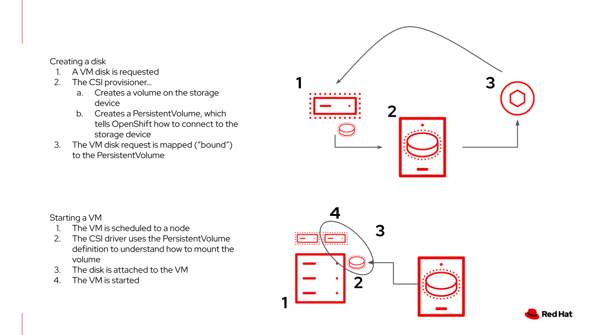

== OpenShift Virtualization Default Boot Sources

Persistent virtual machines require persistent storage. This lab environment has OpenShift Data Foundation deployed to provide access to shared persistent volumes to host application data and virtual machine disks. During the installation of the OpenShift Virtualization Operator, some `PersistentVolumeClaims` were automatically created to hold template disks for various Linux distributions. These include:

* Red Hat Enterprise Linux 8
* Red Hat Enterprise Linux 9
* Fedora
* CentOS 7
* CentOS Stream 8
* CentOS Stream 9

Using these OS images is optional, and the creation + download can be disabled via the appropriate setting in the Operator. However, they are a quick and convenient way to get started provisioning virtual machines with OpenShift Virtualization since they use the "cloud" image for each of the respective distributions. This image includes cloud-init and, often, is a reduced OS footprint optimized for virtualization. Additionally, Red Hat provided boot images are automatically updated when new templates are released.

In this section, we will examine the PVCs created by the Operator along with PVCs used by a virtual machine.

The project `openshift-virtualization-os-images` contains all available boot sources and is automatically enabled when *OpenShift Virtualization* is installed.

. Navigate to *Storage* -> *PersistentVolumeClaims*:
+
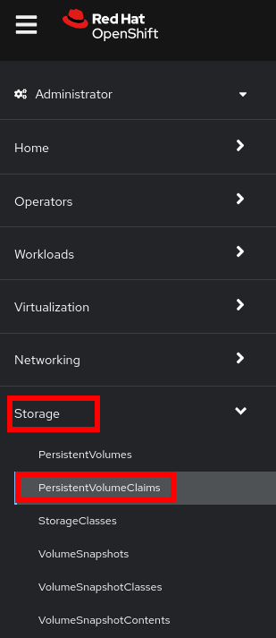

. Press in the dropdown for the projects, enable `Show default projects`, and select the project `openshift-virtualization-os-images`
+
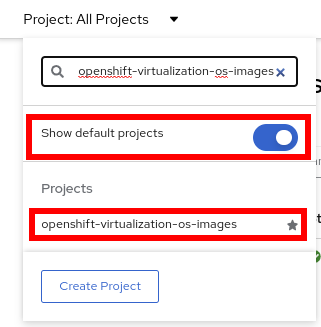

. List the boot sources that OpenShift Virtualization automatically created.
+
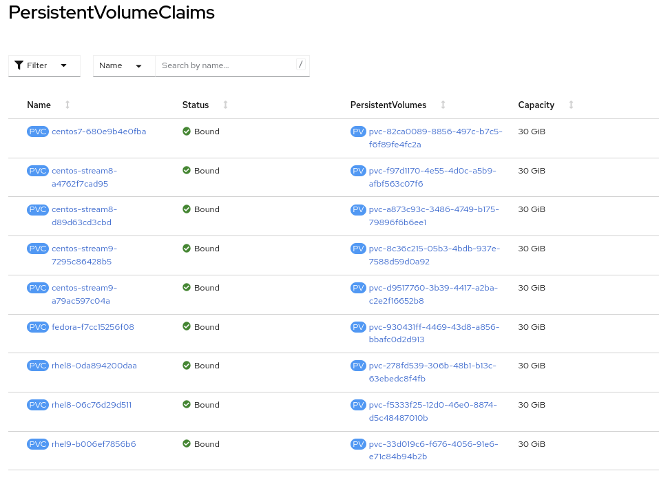

. Select one from the list, for example, `fedora-XX`, to obtain detailed information.
+
In this lab, each of the PVCs will come from the `ocs-storagecluster-ceph-rbd` storage class provided by OpenShift Data Foundation. The details of the PVC show that it is a `ReadWriteMany` PVC, which is required for live migration and is using `block` mode. The mode can be `block` or `file`, depending on the storage vendor, and either will work equally well so long as `RWX` mode is available.
+
The capacity should be large enough to hold the base operating system and any packages/software installed that will be used by any VMs created from this template disk. VMs created by cloning the disk can increase the size of the disk but cannot shrink it.
+
image::images/Storage/03_PVC_Info.png[]

. When a VM is created, the _Boot Source_ image is cloned, and a new disk is created. Switch to the project `vmexamples` and review the list of the _PVCs_ (disks). You will see a PVC for each of the disks for VMs in this project and a PVC for the Microsoft Windows Server 2019 disk image created in an earlier section of this workshop. This PVC, with the Microsoft Windows ISO, can be reused by other virtual machines to install the operating system if desired.
+
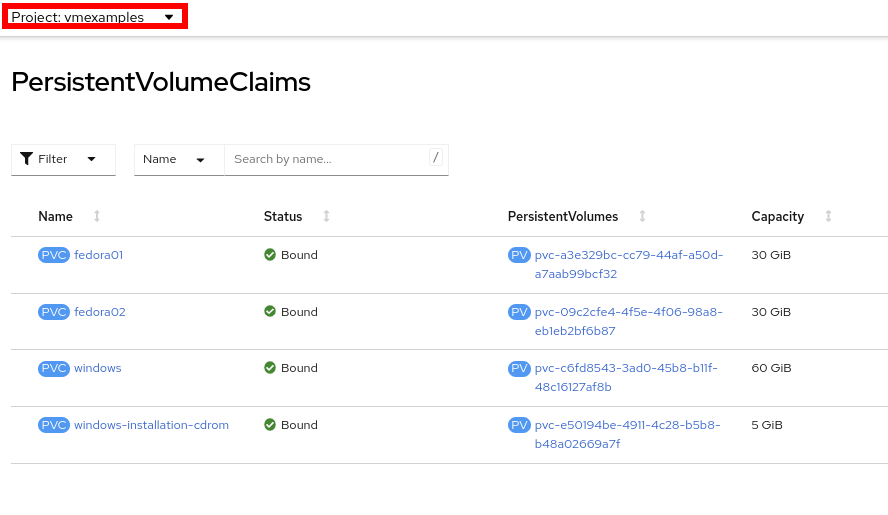

. Select the `fedora02` to obtain information
+
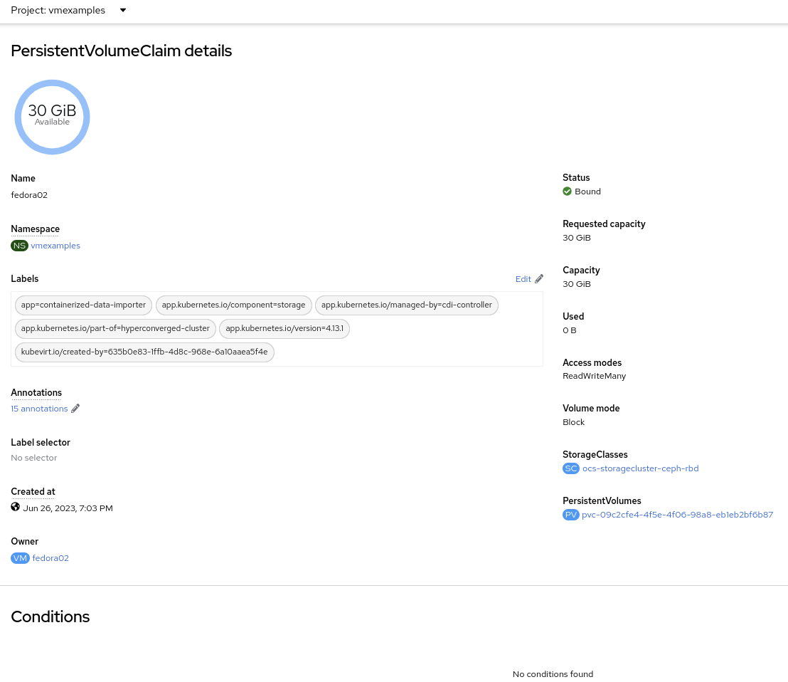

. A _Persistent Volume Claim_ will claim to a specific _storage class_ or to the default one to provision a _volume_. Navigate to *Storage* -> *PersistentVolumes* to obtain a list. Sort by *Claim*.
+
image::images/Storage/07_PV_List.png[]

. Now navigate to *Virtualization* -> *Bootable volumes* to obtain a list of the available volumes
+
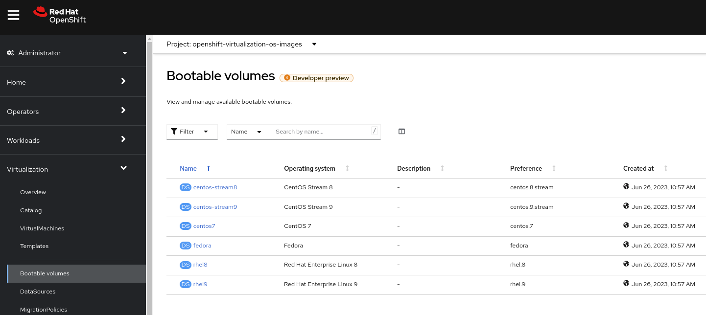

== Snapshots

=== Introduction

OpenShift Virtualization relies on the CSI storage provider's snapshot capability to create disk snapshots for the virtual machine, which can be taken "online" while the VM is running or "offline" while the VM is powered off. If the KVM integrations are installed to the VM, you will also have the option of quiescing the guest operating system (quiescing ensures that the snapshot of the disk represents a consistent state of the guest file systems, e.g., buffers are flushed and the journal is consistent).

Since disk snapshots are dependent on the storage implementation, abstracted by CSI, performance impact and capacity used will depend on the storage provider. Work with your storage vendor to determine how the system will manage PVC snapshots and the impact they may or may not have.

[IMPORTANT]
====
Snapshots, by themselves, are not a backup or disaster recovery capability. The data needs to be protected in other ways, such as one or more copies stored in a different location, to recover from the storage system failing.

In addition to the OpenShift API for Data Protection (OADP), partners such as Kasten by Veeam, Trilio, and Storware support the ability to backup and restore virtual machines to the same cluster or other clusters as needed.
====

// AC - Perhaps a comment about advanced snapshot or cloning features provided by storage class and CSI drivers?

With the VM snapshots feature, cluster administrators and application developers can:

* Create a new snapshot
* List all snapshots attached to a specific VM
* Revert a VM to a snapshot
* Delete an existing VM snapshot

=== Creating and using Snapshots

. Navigate back to *Virtualization* -> *VirtualMachines* and select a virtual machine, for example `fedora02` in the project `vmexamples`.
+
image::images/Storage/09_VM_Overview.png[]

. Navigate to the *Snapshots* tab
+
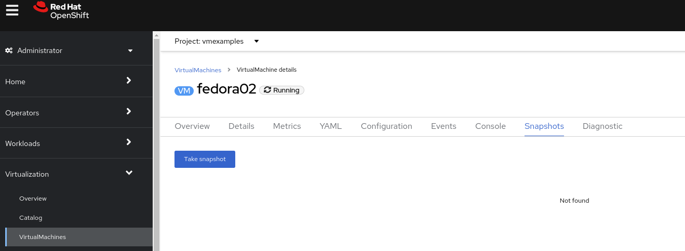

. Press *Take snapshot* and a dialog will open
+
[NOTE]
There is a warning about the `cloudinitdisk` not being included in the snapshot. This is expected and happens because it is an ephemeral disk.
+
image::images/Storage/11_VM_Snapshot_Dialog.png[]

. Press *Save* and wait till the _Snapshot_ has been created and the *status* shows as `Succeeded`
+
image::images/Storage/12_VM_Snapshot_Taken.png[]

. Press the three dots and check that the *Restore* option is greyed out because the VM is running
+
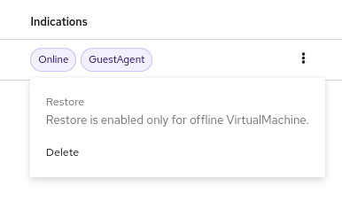

. Switch to the *Console* tab to perform a modification to your running VM. This small modification will break your VM, and it won't be able to boot anymore.
+
Log in with the user `fedora` and password `ocpVirtIsGre@t` (or whatever you used in the previous module). Execute the command:
+
[source,sh]
----
[fedora@fedora02 ~]$ sudo rm -rf /boot/grub2; sudo shutdown -r now
----

. The _Virtual Machine_ will not be able to boot. 
+
[IMPORTANT]
In the previous step, the operating system was shutdown from within the guest. However, OpenShift Virtualization will restart it automatically by default. This behavior can be changed globally or on a per-VM basis.
+
image::images/Storage/14_VM_Crashed.png[]

. Using the *Actions* dropdown menu, stop the _Virtual Machine_. Wait until the VM is stopped.

. Navigate back to the *Snapshots* tab and press *Restore* on the previously created snapshot.
+
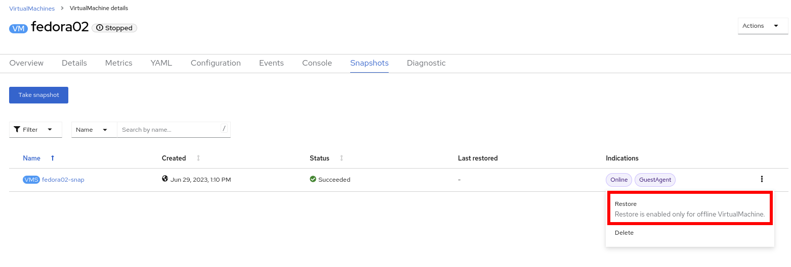

. In the dialog shown, press *Restore*
+
image::images/Storage/16_VM_Restore_Dialog.png[]

. Wait until the VM is restored, and then start the VM 
+
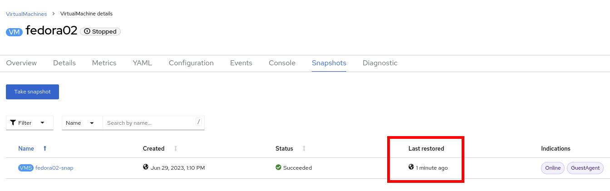

. Verify that the VM is booting correctly again.
+
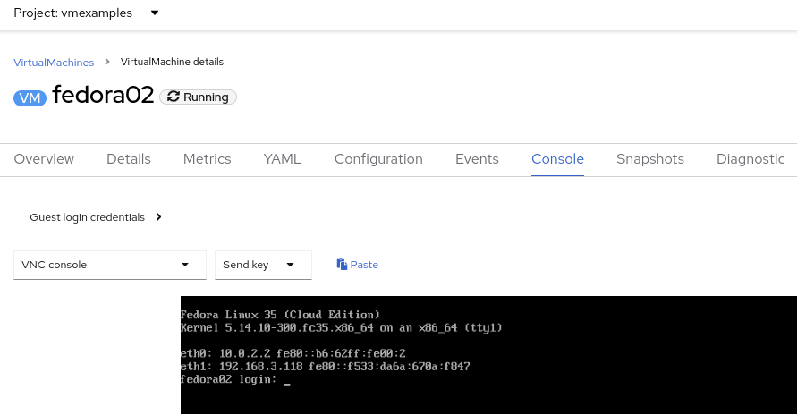

== Clone a Virtual Machine

Cloning creates a new VM that uses its disk image for storage, but most of the clone's configuration and stored data is identical to the source VM.

. Press *Clone* from the *Actions* menu, and a dialog will open
+
image::images/Storage/19_VM_Clone_Dialog.png[]
+
[NOTE]
Notice the VM, if is powered on, it will be stopped to perform the clone. If you have a snapshot of the VM, you can also create a clone from the snapshot without powering off the VM.

. A new VM is created, the disks are cloned and automatically the portal will redirect you to the new VM.
+
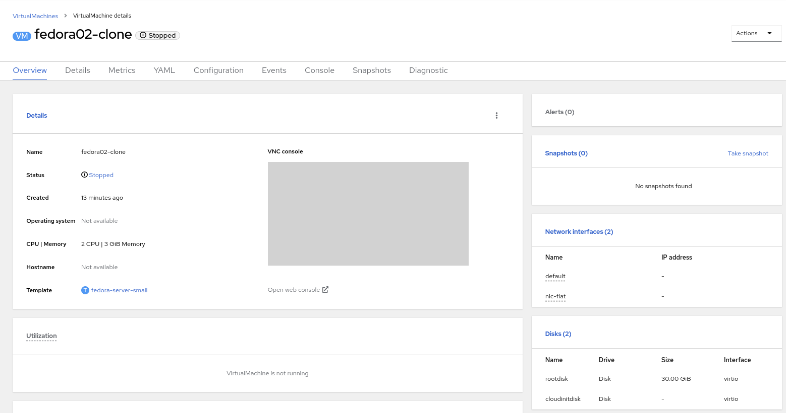
+
[IMPORTANT]
The cloned VM will have the same identity as the source VM, which may cause conflicts with applications and other clients interacting with the VM. Use caution when cloning a VM connected to an external network or in the same project.

=== Glossary of terms

*Container Storage Interface (CSI)*: An API specification for the management of container storage across different container orchestration (CO) systems. An OpenShift cluster can have many CSI provisioners from different vendors, and each VM can use storage from multiple vendors without conflicts.

*Dynamic Provisioning*: The storage framework allows you to create  volumes on-demand, eliminating the need for cluster administrators to pre-provision persistent storage. Each VM disk is stored in a dynamically created storage volume at a 1:1 ratio.

*Persistent volumes (PV)*: OpenShift Virtualization uses the Kubernetes persistent volume (PV) framework to allow cluster administrators to provision persistent storage for a cluster. VMs use a _PVC_ to request PV resources without having specific knowledge of the underlying storage infrastructure.

*Persistent volume claims (PVCs)*: A _PVC_ is a request for storage capacity and, when bound to a PV, how the system knows which storage volume to mount for the VM. As a VM user, you're able to use the storage without knowing the details of the underlying infrastructure environment.

*Storage class*: A _storage class_ provides a way for administrators to describe the classes of storage they offer, for example, "gold," "silver," and "bronze". Different classes might map to quality of service levels, backup policies, and arbitrary policies determined by the cluster administrators. These will be specific to your storage vendor.