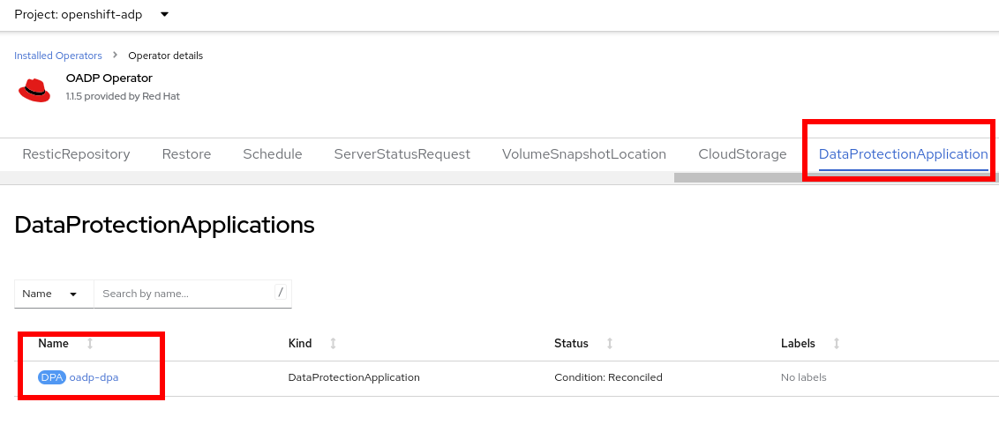
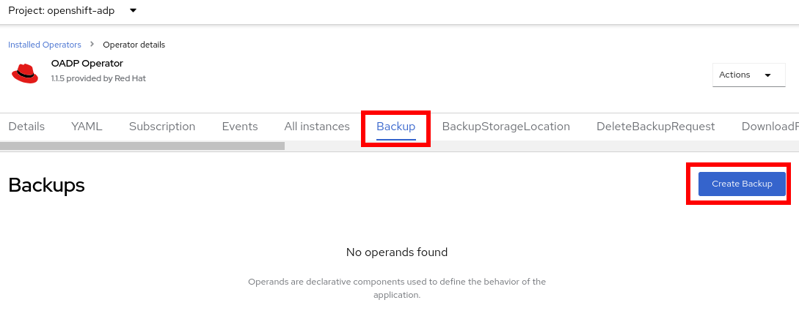
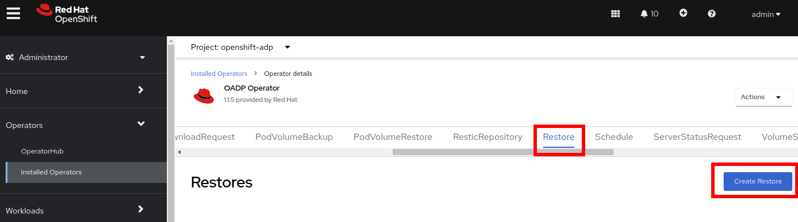
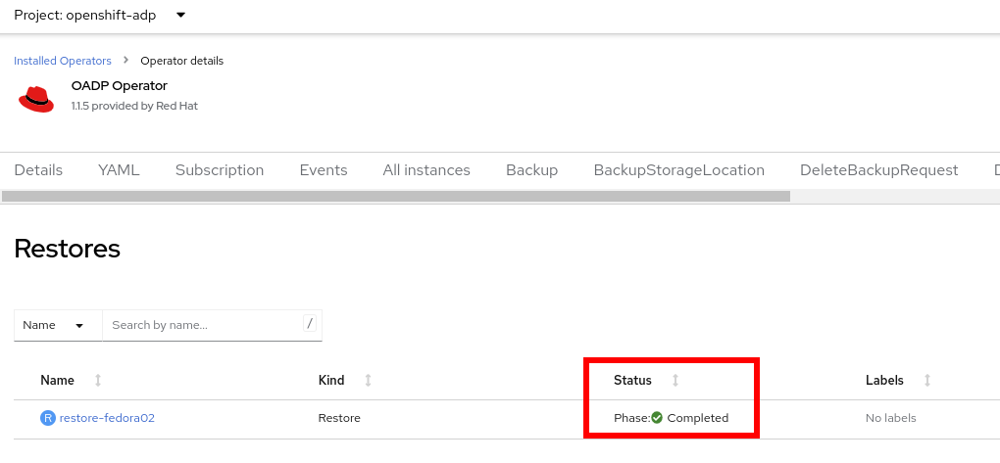

:scrollbar:
:toc2:
:preinstall_operators: %preinstall_operators%

=  Backup and Restore

In this lab, you will review the OADP operator and perform a backup and restore.

.Goals
* Review Operator 
* Perform a backup
* Perform a restore

== Introduction

There are multiple solutions to perform Backup and Restore on OpenShift Virtualization. Some popular options are:

* *OADP (OpenShift APIs for Data Protection)*: is an operator that Red Hat has created to create backup and restore APIs in the OpenShift cluster.
* *Trilio for Kubernetes*: link:https://docs.trilio.io/kubernetes/appendix/backup-and-restore-virtual-machine-running-on-openshift-virtualization[documentation^]
* *Storware Backup and Recovery*: link:https://storware.eu/solutions/containers-backup-and-recovery/red-hat-openshift-backup-restore/[documentation^]

=== Review Operator

. Navigate in the left menu to *Operators* -> *Installed Operators* and ensure `All projects` is selected. Select `OADP Operator`
+
image::images/Backup/00_Left_Menu.png[]

. Review the *Provided APIs* available. In this module the `Backup` and `Restore` will be used
+
image::images/Backup/01_Overview.png[]

. Navigate to the tab *DataProtectionApplication*
+

. Select `oadp-dpa` and review the _YAML_ definition
+
image::images/Backup/03_OADP_YAML.png[]
+
*OADP* was configured enabling the `kubevirt` plugin and configured to use the internal object bucket provided by *Red Hat Storage*.

=== Create a backup

You will perform a backup of the VM `fedora02`. The selection of the objects to be backed up are defined by the labels `app` and `vm.kubevirt.io/name`

. Go backup to the Operator

. Navigate to *Backup* tab and press *Create Backup*
+

. Switch to the YAML view and replace the content with the following one:
+
[source,yaml]
----
apiVersion: velero.io/v1
kind: Backup
metadata:
  name: backup-fedora02
  labels:
    velero.io/storage-location: default
  namespace: openshift-adp
spec:
  hooks: {}
  orLabelSelectors:
  - matchLabels:
      app: fedora02
  - matchLabels:
      vm.kubevirt.io/name: fedora02
  includedNamespaces:
  - vmexamples
  storageLocation: oadp-dpa-1
  ttl: 720h0m0s
----

. Wait till the `Status` column changes to `Completed`
+
image::images/Backup/05_Backup_Completed.png[]

=== Restore a backup

. Navigate to *Virtualization* -> *VirtualMachines* and delete the VM `fedora02`

. Go back to *Operators* -> *Installed Operators* and select *OADP Operator*. 

. Switch to the *Restore* tab and press *Create Restore*
+

. Switch to the YAML view and replace the content with the following one:
+
[source,yaml]
----
apiVersion: velero.io/v1
kind: Restore
metadata:
  name: restore-fedora02
  namespace: openshift-adp
spec:
  backupName: backup-fedora02
  includedResources: [] 
  excludedResources:
  - nodes
  - events
  - events.events.k8s.io
  - backups.velero.io
  - restores.velero.io
  restorePVs: true
----

. Wait till the `Status` column changes to `Completed`
+

. Navigate back to *Virtualization* -> *Virtual Machines* and ensure the `fedora02` was restored.
+
image::images/Backup/08_VM_Restored.png[]

== Summary 
Backup and Restore VMs is one of the important tasks for administrators. This module showed you how to perform a backup of a running VM and how to restore it.