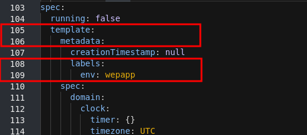
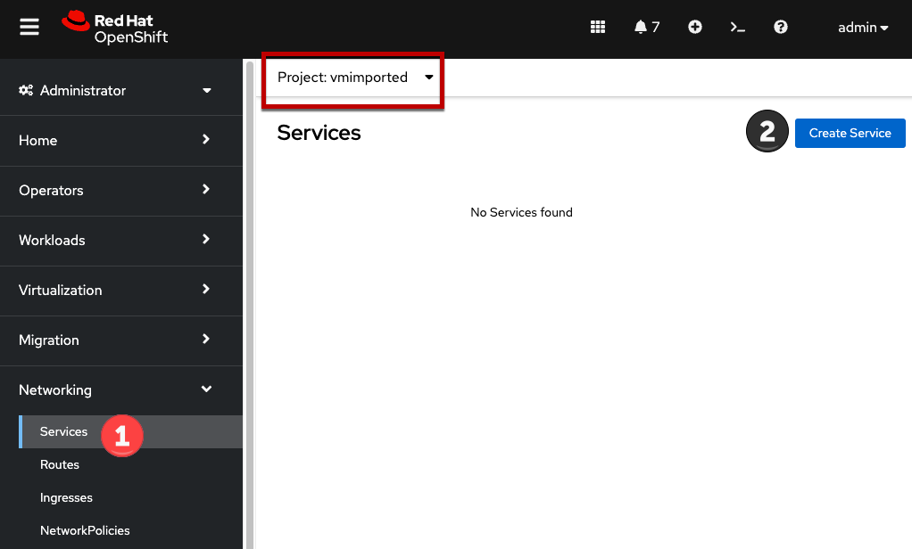
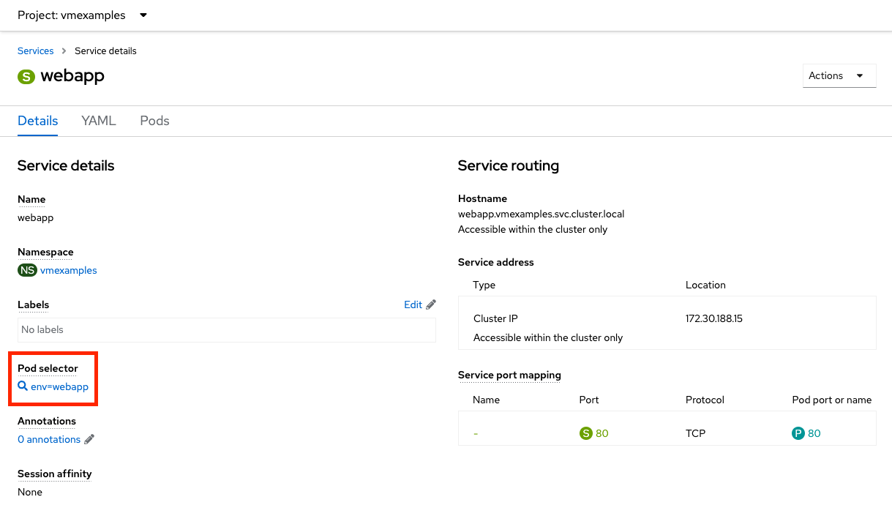
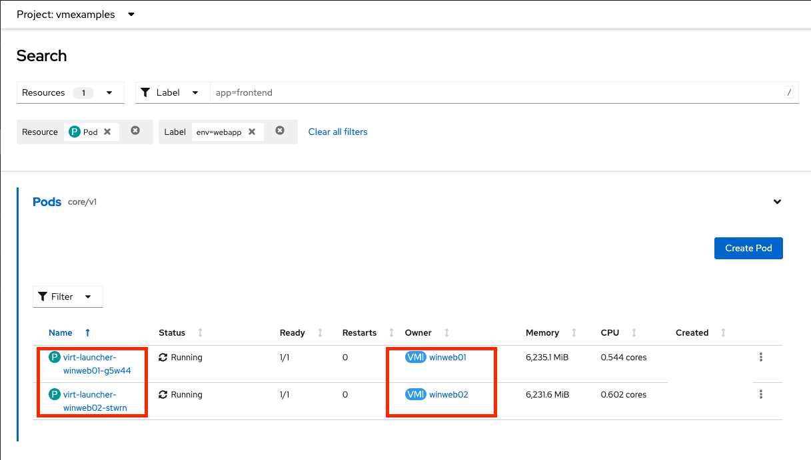
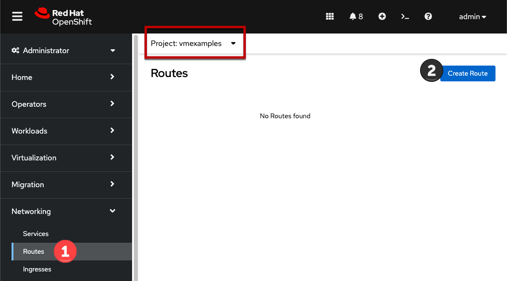
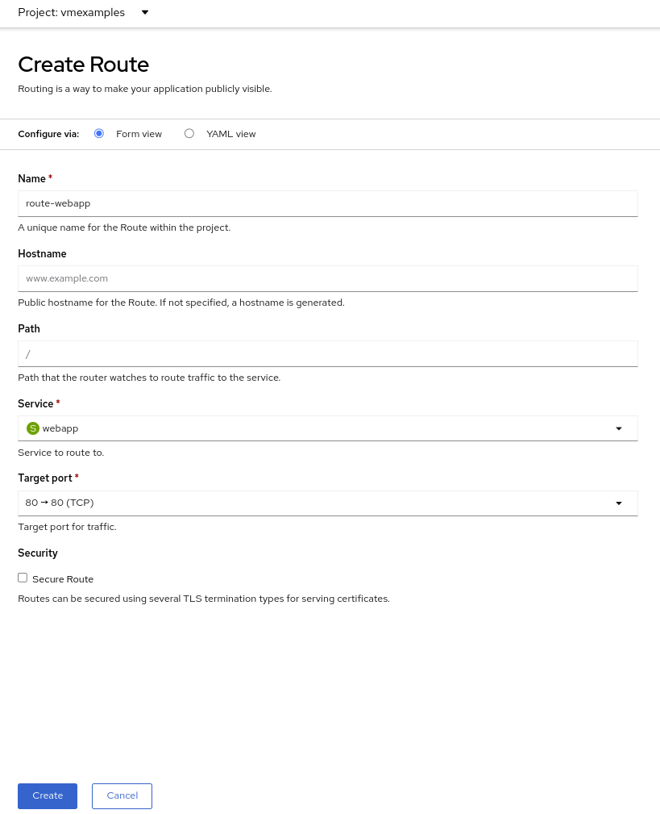
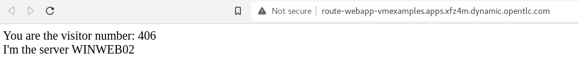

:scrollbar:
:toc2:

=  Migration Toolkit for Virtualization

== Introduction

By default, virtual machines are connected to the SDN, which is a convenient and easy way to give them access to the rest of the network, but can be challenging for the virtual machines, and other Pods in the OpenShift cluster, to find and connect to the virtualized applications. To solve this, we will use a `Service` to balance connections across the two Windows-based web servers, and create a DNS entry for each service discovery, then create a `Route` to allow external clients to access the application hosted within the virtual machines.

[IMPORTANT]
====
If you have not completed the module *Migrating Virtual Machines*, it is recommended that you do that module first. However, you can use pre-existing virtual machines that have been imported automatically in the `vmimported` project. 

If you are using the pre-imported virtual machines, please replace all instances of `vmexamples` namespace with `vmimported`.
====

== Using a Service and Route to expose an application

=== Create the Service

The `Service` identifies the source/target for traffic, and directs clients to, the endpoints based on labels. Currently, the VMs do not have a label assigned yet.

In order to successfully associate the  VMs with the Service, we need to do the following:

* Add a label to the VMs. We will use the same label for both Windows IIS servers because they are both behind the same load balancer.
* Create the service to make the two Windows IIS servers available for other workloads on the cluster. OpenShift will automatically make the load balancer internally accessible using the name of the Service as the DNS name.
* Make the service available outside of OpenShift by creating a *Route*.

To begin, we'll add labels to the virtual machines by modifying their definition in the OpenShift Virtualization GUI.

==== Label the virtual machines

. From the OpenShift console, navigate to *Virtualization* -> *VirtualMachines* and ensure the migrated VMs successfully imported and are running.
+
image::images/MTV/60_VMWARE_VMs_List.png[]
+
[NOTE]
====
Ensure you select the correct project, `vmexamples` if you completed the *Migrating Virtual Machines* module or `vmimported` if you did not.
====

. Select to the `winweb01` VM and navigate to the *YAML* tab.
+
image::images/MTV/204_label_navigation.png[]

. Find the `spec:` section and under the `template.metadata` add the following lines to label the VM resources:
+
[%nowrap]
----
      labels:
        env: webapp
----
+
[IMPORTANT]
====
Make sure to get the indentation exactly right - just like in the screenshot below.
====
+

. *Repeat* the process for the VM `winweb02`.

. Start, or restart if already running, the _Virtual Machines_ `database`, `winweb01` and `winweb02`
.. Ensure the VMs are properly working by accessing to the console tab of each VM.

==== Create the Service

. Navigate to *Networking* -> *Services* and press *Create Service*. 
+

+
Remember the label that you added to your VMs (`env=webapp`)? The Service will use that label in its selector to pick which VMs to route traffic to.
. Replace the YAML with the following definition
+
[source,yaml]
----
apiVersion: v1
kind: Service
metadata:
  name: webapp
  namespace: vmexamples
spec:
  selector:
    env: webapp
  ports:
    - protocol: TCP
      port: 80
      targetPort: 80
----
+
[IMPORTANT]
====
Ensure the namespace with your virtual machines, `vmexamples` or `vmimported`, is the one used in the Service YAML.
====
+
image::images/MTV/201_service_yaml.png[]

. Press *Create*.

. From the details page for the newly created `webapp` Service, locate *Pod selector* link and click it.
+

. Verify the two Windows VMs are properly identified and targeted by the Service.
+

+
[NOTE]
====
What if the VMs are not in this list? There are a few things to verify and double check. At any time, summon a proctor for help if you prefer.

. Ensure that the label applied to the VMs and the selector used by the Service match.
. If the virtual machines were already running, ensure they were restarted after updating the `VirtualMachine` YAML with the label.
. Verify that the label was applied to the correct YAML section in the `VirtualMachine` definition. It should be under `spec.template.metadata`.
. In the left navigation menu, browse to *Workloads -> Pods*, select `virt-launcher` Pod with the virtual machine's name in it. On the ensuing details page, verify the `env=webapp` label is present in the list.
+
image::images/MTV/202_label_troubleshooting_1.png[]
====

=== Create the Route

Now the Windows IIS servers are accessible from within the OpenShift cluster. Other virtual machines are able to access them using the DNS name `webapp.vmexamples`, which is determined by the name of the Service + the namespace. However, since these web servers are the front end to an application we want to be externally accessible, we will expose it using a *Route*.

. Navigate to *Networking* -> *Routes* in the left navigation menu, verify that you're using the correct project name. Press *Create Route*.
+

. Fill the form using the information below, press *Create* when done.
+
.. *Name*: `route-webapp`
.. *Service*: `webapp`
.. *Target port*: `80 -> 80 (TCP)`
+
[NOTE]
====
OpenShift can automatically (re)encrypt traffic entering the cluster via a Route, however, we don't need to use TLS for this application. The *Secure Route* option should not be checked.
====
+

. Navigate to the address shown in *Location* field
+
image::images/MTV/203_route_access.png[]

. When the page loads, you will see an error. This is because the Windows web servers are not able to resolve the internal name `database` to connect to the database VM.
+
image::images/MTV/64_VMWARE_VMs_URL.png[]
+
To fix the connectivity issue, we need to create another Service for the database VM so that it is discoverable by other VMs connected to the SDN. Note that because this database does *not* need to be accessible from outside of the OpenShift environment, you do not need to create a Route for this service.

. Navigate to *Networking* -> *Services* and press *Create service*. Replace the YAML with the following definition:
+
[source,yaml]
----
apiVersion: v1
kind: Service
metadata:
  name: database
  namespace: vmexamples
spec:
  selector:
    vm.kubevirt.io/name: database
  ports:
    - protocol: TCP
      port: 3306
      targetPort: 3306
----
+
[IMPORTANT]
====
Ensure the namespace with your virtual machines, `vmexamples` or `vmimported` is the one used in the Service YAML.
====
+
[NOTE]
====
In this example the service is simply using a selector of the VM's name. This is a default label that is automatically added to all VMs. Since there is only one VM that matches the selector, the service will not load balance to the database, instead we're using the Service for discovery via the internal DNS name.
====

. Reload the webapp URL and expect to get the proper result
+
