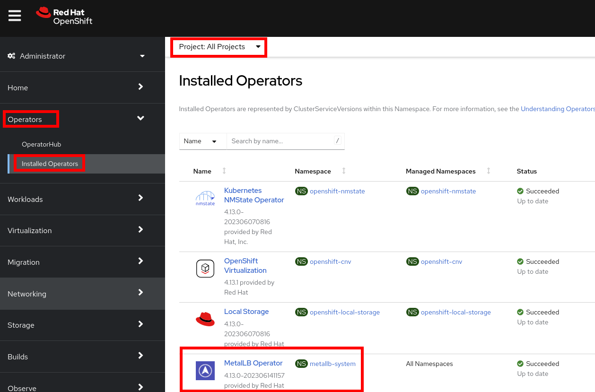
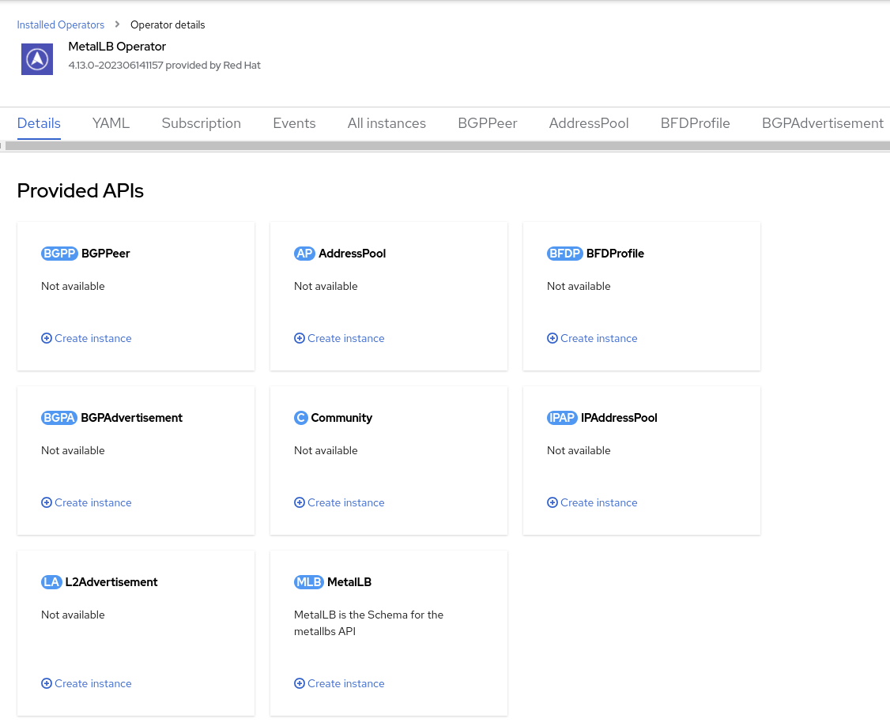
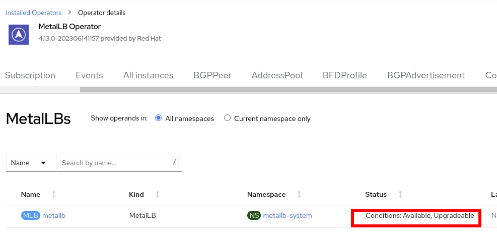
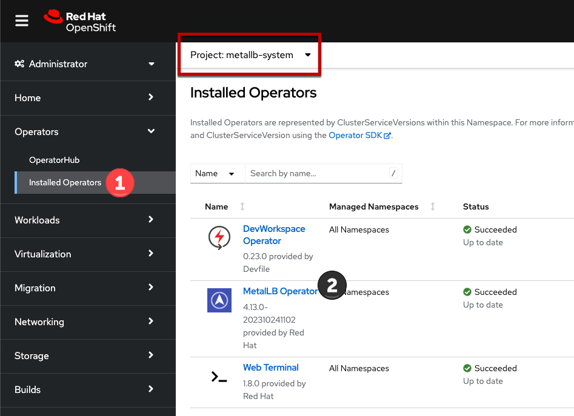
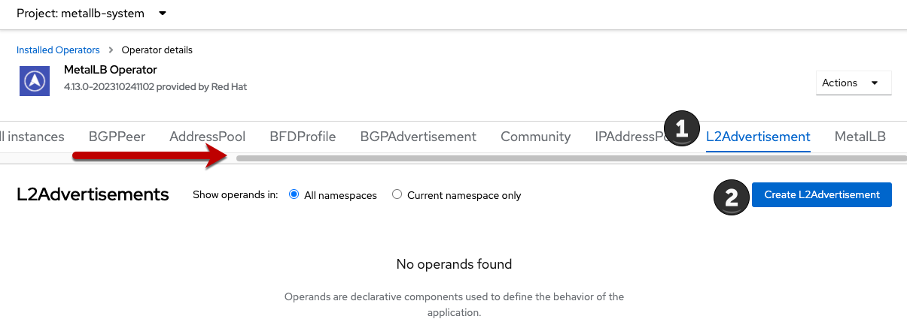
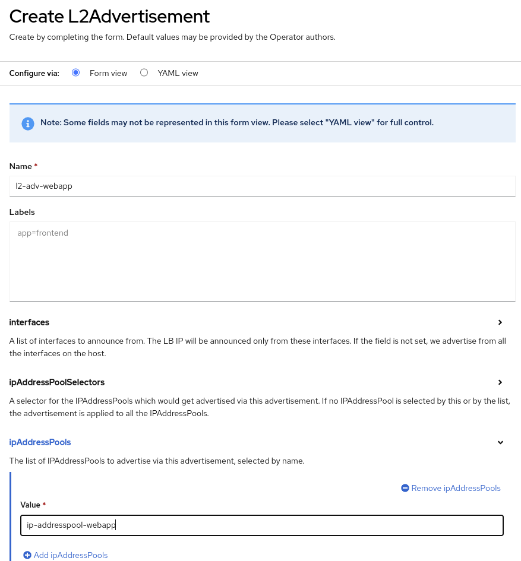
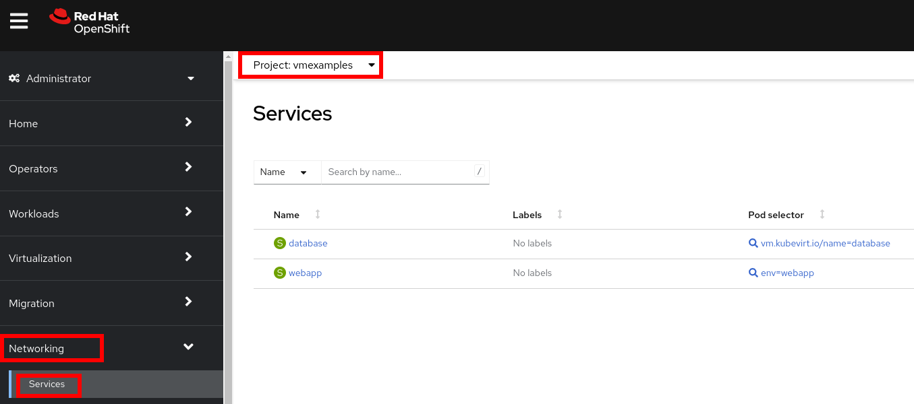
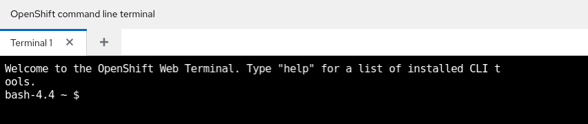

:scrollbar:
:toc2:
:preinstall_operators: %preinstall_operators%
:numbered:

In this lab, you will review the MetalLB operator and expose virtual machine hosted applications outside of the cluster.

==  MetalLB concepts

Using MetalLB is valuable when you have a bare-metal cluster or a virtual infrastructure that is treated like bare-metal, and you want to ensure fault-tolerant access to an application through an external IP address.

For MetalLB to meet this need, you must configure your networking infrastructure to ensure that the network traffic for the external IP address is routed from clients to the host network for the cluster. 

It can operate in two modes:

* *MetalLB operating in layer2 mode* provides support for failover by utilizing a mechanism similar to IP failover. However, instead of relying on the virtual router redundancy protocol (VRRP) and keepalived, MetalLB leverages a gossip-based protocol to identify instances of node failure. When a failure is detected, another node assumes the role of the leader node, and a gratuitous ARP message is dispatched to broadcast this change.
* *MetalLB operating in layer3 or border gateway protocol (BGP) mode* delegates failure detection to the network. The _BGP_ router or routers that the *OpenShift Container Platform* nodes have established a connection with will identify any node failure and terminate the routes to that node.

Using MetalLB instead of IP failover is preferable for ensuring high availability of pods and services.

=== Layer2 mode

In layer 2 mode, the speaker pod on one node announces the external IP address for a service to the host network. From a network perspective, the node appears to have multiple IP addresses assigned to a network interface.

In layer 2 mode, all traffic for a service IP address is routed through one node. After traffic enters the node, the service proxy for the CNI network provider distributes the traffic to all the pods for the service.

When a node becomes unavailable, failover is automatic. The speaker pods on the other nodes detect that a node is unavailable, and a new speaker pod on a surviving node will take ownership of the service IP address from the failed node.

image::images/MetalLB/00_layer2.png[]

=== Layer 3 (BGP) mode

In BGP mode, by default, each speaker pod advertises the load balancer IP address for a service to each BGP peer. It is also possible to advertise the IPs coming from a given pool to a specific set of peers by adding an optional list of BGP peers. BGP peers are commonly network routers that are configured to use the BGP protocol. When a router receives traffic for the load balancer IP address, the router picks one of the nodes with a speaker pod that advertised the IP address. The router sends the traffic to that node. After traffic enters the node, the service proxy for the CNI network plugin distributes the traffic to all the pods for the service.

If a node becomes unavailable, the router then initiates a new connection with another node that has a speaker pod that is advertising the load balancer IP address.

image::images/MetalLB/00_bgp.png[]

////
== Review Operator

. Navigate to *Operators* -> *Installed Operators*. Select *All Projects* and select *MetalLB*
+

. Review the *Provided APIs* on the Details tab
+

. Select the tab *MetalLB* to ensure the deployment is installed and configured correctly
+

////

== Define IP AddressPool

For this lab, we will use the same network where the OpenShift Cluster nodes are located (`192.168.123.0/24`) and for this exercise we will reserve the IP range `192.168.123.200-192.168.123.250` to be used for load balanced services in the OpenShift cluster.

. In the left navigation menu, browse to *Operators -> Installed Operators*, switch to project `metallb-system`. Then choose the MetalLB Operator
+

. Switch the tab *IPAddressPool* (you may need to scroll the tabs to the right to see it) and press *Create IPAddressPool*
+
image::images/MetalLB/21_navigation.png[]

. Use the name `ip-addresspool-webapp` and under section _addresses_, remove any existing addresses and enter `192.168.123.200-192.168.123.250` as the address pool. When complete it should look similar to this image:
+
image::images/MetalLB/09_MetalLB_IPAddressPool_Defined.png[]

. Scroll down and press *Create*.

=== Configure Layer2 mode

For this lab we will use MetalLB in layer2 mode, so we need to create the configuration.

. Switch to the *L2Advertisement* tab (you may need to scroll the tab list to the right to see it) and press *Create L2Advertisement*.
+

. Indicate the name `l2-adv-webapp` and under section _ipaddressPools_ specify the value `ip-addresspool-webapp` as is shown:
+

. Press *Create*

== Expose the database node externally

If you completed the *Exposing apps using a Route* module, the VM is currently accessible from inside the cluster using the Service previously created. In this task, we will expose port 3306 outside of the cluster, making the database avaialble to other virtual machines and consumers not hosted in OpenShift.

. Navigate to *Networking* -> *Services* and select the project `vmexamples`
+

+
[IMPORTANT]
====
If you did not complete the module *Migrating Virtual Machines* you can use pre-existing virtual machines in the `vmimported` project. 

If you are using the pre-imported virtual machines, please replace all instances of `vmexamples` namespace with `vmimported`.
====

. Press *Create Service* and fill the form with the following code snippet:
+
[source,yaml]
----
apiVersion: v1
kind: Service
metadata:
  name: database-metallb
  namespace: vmexamples
spec:
  type: LoadBalancer
  selector:
    vm.kubevirt.io/name: database
  ports:
    - protocol: TCP
      port: 3306
      targetPort: 3306
----
+
[NOTE]
Notice the `type` indicated is `LoadBalancer`. Since this cluster has MetalLB installed, it will result in the specified port(s) exposed using that. There are other load balancer options available from partners such as F5, Nginx, and more.

. Press *Create* and review the *Service* created. Notice the IP address assigned to the load balancer is from the range specified earlier in the lab.
+
image::images/MetalLB/12_Service_created.png[]

. To verify connectivity to the database service via the external IP, open the web terminal by clicking the following icon in the right-top part.
+
image::images/OCP_Terminal_Icon.png[]

. A console in the bottom part of the screen appears
+

. Using the right console, try to access the IP assigned and the port 3306
+
[%nowrap]
----
[~] $ curl -s 192.168.123.202:3306 | cut -c1-16       
----
+
.Sample Output
+
[%nowrap]
----
5.5.68-MariaDB
----

== Summary 

MetalLB is a straightforward and simple solution for bare-metal, on-premises deployments to expose applications outside of the cluster, without the need to configure physical networks with NMstate or multus.
