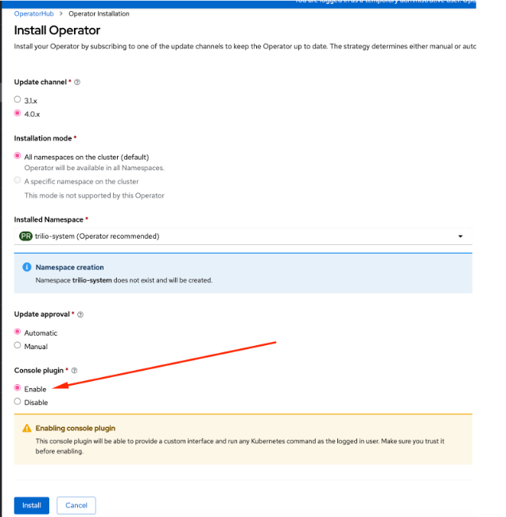
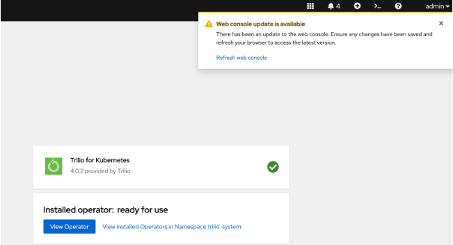
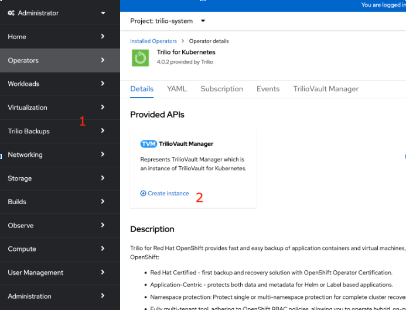
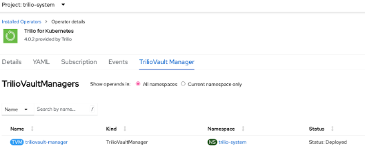
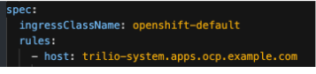
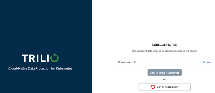
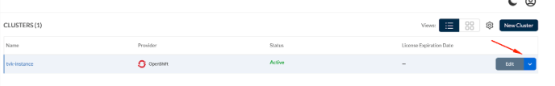

:scrollbar:
:toc2:

=  Trilo Backup and Recovery Lab

== Introduction

In this lab we will be installing the Trilio backup operator and restoring virtual machines on Openshift. 

=== Installing the Operator
Search the Operator hub for the Trilio for kubernetes. 

image::images/Trilio/operator.PNG[]

Default options should work ok. The operator will be installed in the namespace trilio-system, and every workload related to Trilio will run there. This is specially useful so our workloads do not interfere with security restrictions, and quota restrictions on normal namespaces. In order to have Trilio Backups tab in the OpenShift console, please select “Enable” under “Console Plugin”. If you don’t want it/need it, you still have the Trilio UI.



Click on Refresh Web console when the operator is installed



=== Check everything is deployed correctly

If everything is ok, you should see the Trilio Backups tab on the left (1) and you need to click on “Create instance” (2), which will spin up all Trilio necessary workloads:



=== Create Trilio Instance (TVM):

After clicking on “create instance” just accept the defaults:

image::images/Trilio/operator5.PNG[]

=== Check TVM:

After creating the instance this is what you should see:



=== Change the Ingresss
In this Lab the OCP cluster has a Nat forward for external access. This causes apps to default to the internal example.com and we must reroute them. 

We will modify the triliovault under the trilio-system project. 

.Before ingress changes


.After ingress changes
image::images/Trilio/after-ingress.PNG[]

Save the yam and this should correct the ingress route for external access. Under the networking > routes users should be able to hit the route: https://trilio-system.apps.xxxx.dynamic.redhatworkshops.io/login



=== Apply license

Click here to open the menu, and apply the license:



```
xK8NDgwKD3jafZFRa4MwFIXf8ysCew6YTNta8MHZdEidLVX7OtJ4ZYE2StSy/vvZVpho6SFPuYfv5py8pS1gvzIYM0zdJbOWtouZxWwUGBCNKvVKNID/5d2GxOoOQzxXNwceyVsbgNQocUJCNuoCeOJoTAvopCToGg5g6iHFY+hLKN2AFloC/62UuT4e0e92iPWOgvJcCX2dkNN9GIVbssk++D7mKU9IFAY8Tjj55DFZ7zn/7ix+hOL2fASzLbK62z8AEIoSMBcw4WrMjksNKOExfiKvuyc0d8DNLUkKymaEUgDiLhYFKZy5nFFgzJ4Dih6xx3gvPfhZlPYMwV4y7q2ISfnDgnatkT+ihhf/l8iygidR7jk37RGySQf9MBCVkKoZ1+9RqxMOdln9B2irkSQwLAIUKBvlRWZpkEg+yJi46EpfiNjvh4ACFCmtqyXRHoKEmZJcv1PslAKifPIAX02f3
```
image::images/Trilio/lic2.PNG[]

At this point the operator has been configured and is ready to start accepting backups. 

=== Setup s3 backup 

TBD "either Minio or prefab s3 from cloud or ODF is required" It seems all backup/recover I've seen used s3 for kubernetes persistent data. 