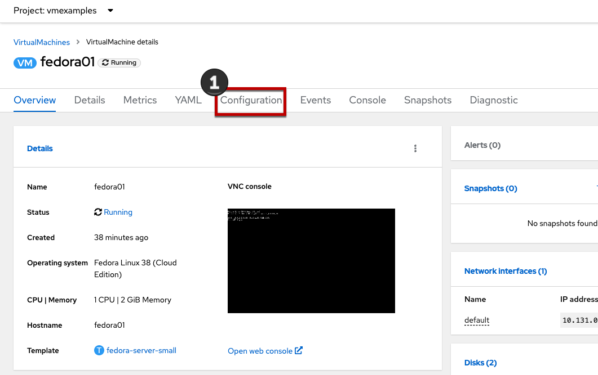
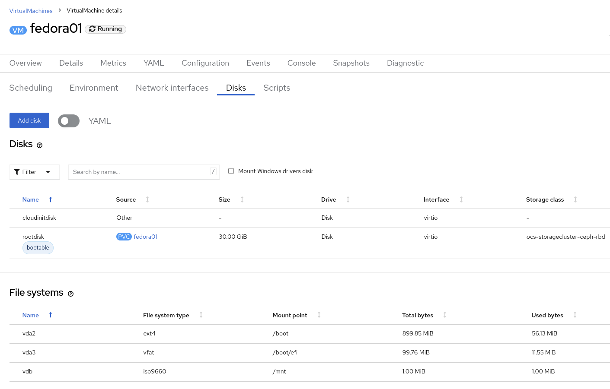
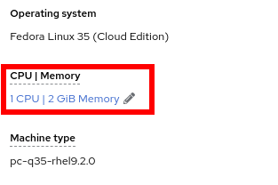
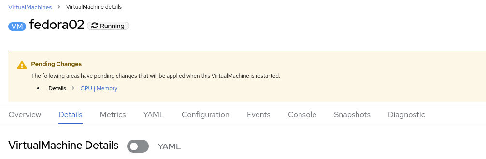

:scrollbar:
:toc2:

:numbered:

= Virtual Machine Management

Administering and using virtual machines is more than simply creating and customizing their configuration. As the platform administrator, we also need to be able to control the VM states and trigger live migrations so that we can balance resources, perform maintenance tasks, and reconfigure nodes.

.Goals

* Review resources for virtual machines
* Understand how VM power states are managed using the OpenShift console

== Examine resources associated with the virtual machine

. From the left navigation menu, browse to *Virtualization* -> *VirtualMachines*. Ensure you're using the correct project, `vmexamples`, then click the name of one of the available virtual machines.
+
image::images/Create_VM_PVC/54_vm_management_navigation.png[]

. Click the *Configuration* tab, this is the entry point to obtain information about the resources of the Virtual Machine. 
+

+
It includes five subtabs:
+
image::images/Create_VM_PVC/56_config_tab_nav_2.png[]
+
* *Scheduling*: It includes advanced configuration indicating where the VM should run and the strategy to follow for eviction. This is used to configure (anti)affinity rules, configure node selectors and tolerations, and other behaviors that affect which cluster nodes the VM can be scheduled to.
* *Environment*: It is possible to attach _ConfigMaps_, _Secrets_, and _Service Accounts_ as extra disks. This is useful when passing configuration data to the application(s) running in the virtual machine.
* *Network interfaces*: It shows the current network interfaces configured for the VM and add new ones.
* *Disks*: It lists the disks attached to the system and allows to add new disks to the system. If the guest is configured with the agent, it lists the filesystems and the utilization.
* *Scripts*: This tab allows us to configure _cloud-init_ for Linux or _sys-prep_ for Microsoft Windows, including setting the commands to be executed on the first boot, such as the injection of SSH keys, installation of applications, network configuration, and more.

. Examine the network interfaces attached to the VM by clicking on the *Network interfaces* subtab:
+
image::images/Create_VM_PVC/20_Network_Tab.png[]
+
When a VM is created, an interface on the `PodNetworking` network of type `masquerade` is created by default. This connects the VM to the SDN and provides access from the VM to outside the OpenShift cluster. Other VMs, and Pods, in the cluster can access the virtual machine using this interface. Furthermore, a VM connected to the SDN can be accessed externally using a Route, or Service with type load balancer. Refer to the MetalLB module of this workshop to see how to configure and expose a VM using this method.

. List the disks associated with the VM:
+

+
In this environment, the default StorageClass, which defines the source and type of storage used for the disk, is called `ocs-storagecluster-ceph-rbd`. This storage is the default type provided by OpenShift Data Foundation (ODF). Each storage provider has different storage classes that define the characteristics of the storage backing the VM disk.

== Controlling virtual machine state

As a user with permission to access Virtualization, you can stop, start, restart, pause, and unpause virtual machines from the web console.

. In the left menu, go back to *Virtualization* -> *VirtualMachines*:

. Select the _Virtual Machine_ `fedora02` from the list.

. Press the top-right dropdown, *Actions*, to list the available 
options:
+
image::images/Pods_Migration/30_VM_Actions_List.png[]
+
.. *Stop*: Starts a graceful shutdown of the _Virtual Machine_.
.. *Restart*: This will send a signal to the operating system to reboot the _Virtual Machine_. Guest integrations are needed for this to work properly.
.. *Pause*: The process is frozen without further access to CPU resources and I/O, but the memory used by the VM at the hypervisor level will stay allocated.

. Press *Stop* and wait till the _Virtual Machine_ is in state `Stopped`.
+
image::images/Pods_Migration/31_VM_Stopped.png[]
. Clicking on *Actions*, the option *Start* appears, and the options *Restart* and *Pause* are greyed out. 
+
image::images/Pods_Migration/32_VM_Actions_List_Stopped.png[]

. Press *Start*, and wait for the `Running` status.

. Using the *Actions* menu, press the *Pause* option. The _Virtual Machine_ state will change to `Paused`.
+
image::images/Pods_Migration/33_VM_Actions_Paused.png[]

. Unpause the _Virtual Machine_ using *Actions* and the option *Unpause*.

== Live Migrate a virtual machine

In this section, we will migrate the VM from one OpenShift node to another without shutting down the VM. Live migration requires `ReadWriteMany` (RWX) storage so that the VM disks can be mounted on both the source and destination nodes at the same time. OpenShift Virtualization, unlike other virtualization solutions, does not use monolithic datastores mounted to each cluster member that hold many VM disks for many different VMs. Instead, each VM disk is stored in its own volume that is only mounted when and where it's needed. 

. Navigate to the *Details* tab to see where the worker node is running:
+
image::images/Pods_Migration/17_VM_Info_Node.png[]

. Using the menu *Actions*, press *Migrate*
+
image::images/Pods_Migration/19_VM_Dialog_Migrate.png[]

. After a few seconds, the VM will change the status to `Migrating`. A few seconds later, it will return to the `Running` status, but on a different node. The VM has been successfully live migrated!
+
image::images/Pods_Migration/21_Migrated.png[]

////
// Removing as per Sully - changing resources requires a VM reboot.

=== Resize a Virtual Machine

It is possible to change the resources such as CPU and Memory associated to a _Virtual Machine_ after it is created. 

. In the *Details* tab press in the configuration under `CPU | Memory`
+

. A dialog will appear to specify new values for the _CPU_ and _Memory_.
+
image::images/Pods_Migration/36_VM_Resources_Dialog.png[]

. Update the _CPU cores_ to `2` and the _Memory_ to `3 GiB` and press *Save*.

. Scrolling up, the _Virtual Machine_ will show this message indicating it has to be rebooted to apply the changes.
+

. Using the *Actions* menu, press *Restart* to reboot the instance.
////

== Summary

In this lab, we explored virtual machine state management tasks and executed a live migration of that VM. Both of these are common and necessary tasks as platform administrators.
